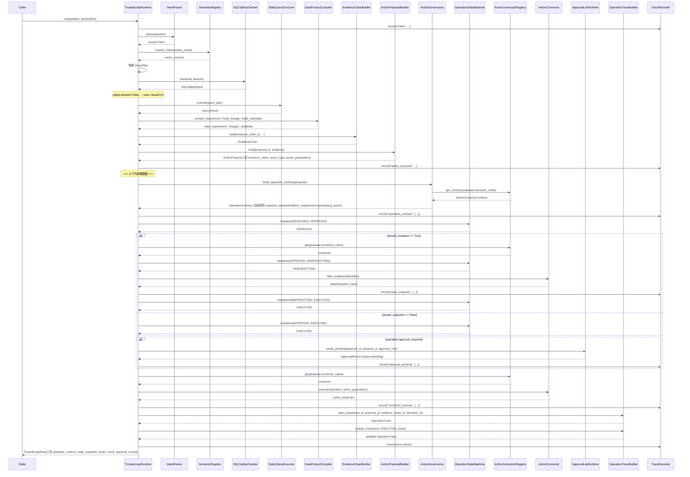
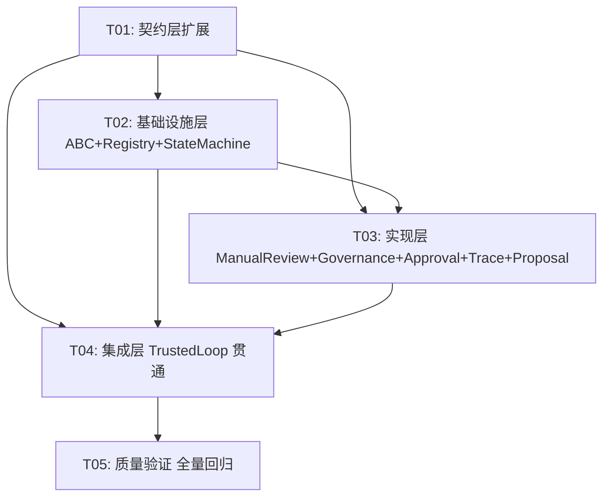

# 回滚基础设施 MVP 系统架构设计

> 版本: 1.0
> 日期: 2026-07-22
> 架构师: 高见远 (Gao)

---

## 1. 实现方案 + 框架选型

### 1.1 总体架构方案

本迭代核心目标：将 Trusted Loop 从"只 propose 的分析工具"升级为"可信执行的业务操作系统"，贯通 `ActionProposal → ActionGovernance → ActionConnector → 执行/审批` 完整链路。

架构采用**契约驱动 + 注册表解耦 + 状态机管控**的三层设计：

```
┌─────────────────────────────────────────────────────────────┐
│                    TrustedLoopRuntime                        │
│  (编排层：协调 Governance / Connector / Approval / Trace)      │
├─────────────────────────────────────────────────────────────┤
│  ActionGovernance │ OperationStateMachine │ OperationTrace   │
│  (治理决策)        │ (状态管控)            │ (生命周期记录)    │
├─────────────────────────────────────────────────────────────┤
│  ActionConnectorRegistry → ActionConnector ABC               │
│  (connector 路由)         (执行抽象)                           │
│       │                                                      │
│       └── ManualReviewConnector (action_connectors/ 外部)     │
├─────────────────────────────────────────────────────────────┤
│  ApprovalLiteRuntime (审批管理)                               │
├─────────────────────────────────────────────────────────────┤
│  contracts 层 (OperationContract, StateSnapshot, ...)         │
└─────────────────────────────────────────────────────────────┘
```

### 1.2 核心设计决策

| 决策 | 选择 | 理由 |
|------|------|------|
| connector 路由方式 | `connector_name` 驱动 + Registry 查找 | 替代硬编码 `target_connector`，支持动态扩展 |
| `target_connector` 字段处理 | 保留为 deprecated，内部与 `connector_name` 同步 | 向后兼容，后续迭代删除 |
| connector 执行失败策略 | 抛异常（KeyError / ValueError） | 与现有 `ValueError("SQL safety check failed")` 模式一致 |
| `OperationStateMachine` 持久化 | MVP 仅内存实现 | 满足 MVP 验证需求，后续迭代加持久化 |
| `ManualReviewConnector.execute()` | 不阻塞，返回 pending 状态 | MVP 不实现审批轮询/webhook，execute 立即返回 |
| `ApprovalLiteRuntime` | 扩展 `approve()` / `reject()` 方法 | 否则审批是死路，链路无法贯通 |
| `action_parameters` schema 校验 | MVP 不做，connector 内部自行校验 | 降低 MVP 复杂度 |
| 快照体积限制 | MVP 不限制，`StateSnapshot.metadata` 预留 `size_bytes` | 后续迭代治理 |

### 1.3 模块依赖关系

```
contracts (纯数据，零依赖)
    ↑
os_core.action_connectors.base (依赖 contracts)
    ↑
os_core.action_connectors.registry (依赖 base + contracts)
    ↑
os_core.action_governance (依赖 contracts + registry)
os_core.operation_state_machine (依赖 contracts)
os_core.approval_lite (依赖 contracts)
os_core.operation_trace (依赖 contracts)
    ↑
os_core.trusted_loop (依赖上述所有)
    ↑ (运行时注入，非 import)
action_connectors/manual_review (依赖 contracts + os_core.action_connectors.base)
```

**关键边界**：`os_core` 不 `import` `action_connectors/manual_review`，通过 `ActionConnectorRegistry.register()` 注入。

### 1.4 框架选型

本迭代**不需要新增任何第三方 Python 包**。所有实现基于 Python 标准库（`dataclasses`, `abc`, `enum`, `uuid`, `unittest`），与现有代码风格一致。

---

## 2. 文件列表及相对路径

### 2.1 修改文件

| # | 文件路径 | 变更说明 |
|---|---------|---------|
| 1 | `packages/contracts/src/agent_os_contracts/architecture.py` | `OperationContract` 新增 5 个字段、`OperationState` 新增 5 个枚举值、新增 `StateSnapshot`、新增 `ActionConnectorContract` |
| 2 | `packages/contracts/src/agent_os_contracts/trusted_loop.py` | `ActionProposal` 新增 3 个字段、`TrustedLoopResult` 新增 4 个字段 |
| 3 | `packages/contracts/src/agent_os_contracts/__init__.py` | 导出 `StateSnapshot`、`ActionConnectorContract` |
| 4 | `packages/os_core/src/agent_os_core/action_governance/__init__.py` | 增强 `build_operation_contract` + 新增 `should_snapshot` |
| 5 | `packages/os_core/src/agent_os_core/approval_lite/__init__.py` | 新增 `approve()` / `reject()` 方法 |
| 6 | `packages/os_core/src/agent_os_core/operation_trace/__init__.py` | 新增 `update_trace` 方法 |
| 7 | `packages/os_core/src/agent_os_core/action_proposal/__init__.py` | 输出结构化字段 `connector_name` / `action_type` / `action_parameters` |
| 8 | `packages/os_core/src/agent_os_core/trusted_loop.py` | 集成新依赖，贯通执行链路 |
| 9 | `packages/os_core/src/agent_os_core/__init__.py` | 导出新模块 |
| 10 | `tests/unit/test_trusted_loop.py` | 新增贯通测试（不破坏现有测试） |

### 2.2 新增文件

| # | 文件路径 | 说明 |
|---|---------|------|
| 11 | `packages/os_core/src/agent_os_core/action_connectors/__init__.py` | 导出 `ActionConnector`、`ActionConnectorRegistry` |
| 12 | `packages/os_core/src/agent_os_core/action_connectors/base.py` | `ActionConnector` ABC 定义 |
| 13 | `packages/os_core/src/agent_os_core/action_connectors/registry.py` | `ActionConnectorRegistry` 实现 |
| 14 | `packages/os_core/src/agent_os_core/operation_state_machine.py` | `OperationStateMachine` + `InvalidStateTransition` |
| 15 | `action_connectors/manual_review/__init__.py` | 导出 `ManualReviewConnector` |
| 16 | `action_connectors/manual_review/connector.py` | `ManualReviewConnector` 实现 |
| 17 | `tests/unit/test_operation_state_machine.py` | 状态机测试 |
| 18 | `tests/unit/test_action_connector.py` | Connector ABC + Registry 测试 |
| 19 | `tests/unit/test_manual_review_connector.py` | ManualReviewConnector 测试 |

---

## 3. 数据结构和接口（类图）

```mermaid
classDiagram
    direction TB

    class OperationContract {
        +str operation_id
        +str name
        +str target_connector ⚠️deprecated
        +str risk_level
        +bool approval_required
        +bool dry_run_required = True
        +bool rollback_supported = False
        +bool snapshot_required = False
        +str|None snapshot_id = None
        +str|None compensating_action = None
        +str connector_name = "manual_review"
        +str action_type = "propose"
    }

    class OperationState {
        <<enumeration>>
        PROPOSED = proposed
        APPROVED = approved
        REJECTED = rejected
        EXECUTED = executed
        OBSERVED = observed
        SNAPSHOTTING = snapshotting
        ROLLING_BACK = rolling_back
        ROLLED_BACK = rolled_back
        COMPENSATING = compensating
        FAILED = failed
    }

    class StateSnapshot {
        +str snapshot_id
        +str operation_id
        +str connector_name
        +str snapshot_type
        +dict state_payload
        +str created_at
        +dict metadata = field(default_factory=dict)
    }

    class ActionConnectorContract {
        +str connector_name
        +str display_name
        +tuple supported_action_types
        +bool supports_snapshot
        +bool supports_rollback
        +str|None compensating_action_description
        +str risk_ceiling
        +str owner
    }

    class ActionProposal {
        +str proposal_id
        +str evidence_chain_id
        +str target_object
        +str recommended_action
        +str reason
        +RiskLevel risk_level
        +str expected_impact
        +bool approval_required
        +str|None approver_role
        +str connector_name = "manual_review"
        +str action_type = "propose"
        +dict action_parameters = field(default_factory=dict)
    }

    class TrustedLoopResult {
        +BusinessIntent intent
        +QueryPlan query_plan
        +EvidenceChain evidence_chain
        +ActionProposal action_proposal
        +tuple trace_events
        +tuple telemetry_events = field(default_factory=tuple)
        +ProviderContract|None provider_contract = None
        +DataRequirement|None data_requirement = None
        +LineageSnapshot|None lineage_snapshot = None
        +DataProductCandidate|None data_product_candidate = None
        +OperationContract|None operation_contract = None
        +StateSnapshot|None state_snapshot = None
        +dict|None action_result = None
        +ApprovalRecord|None approval_record = None
    }

    class ActionConnector {
        <<abstract>>
        +connector_name() str
        +take_snapshot(operation) StateSnapshot|None
        +execute(operation, parameters) dict
        +rollback(snapshot) dict
        +can_rollback() bool
        +compensating_action() str|None
    }

    class ActionConnectorRegistry {
        -dict _connectors
        -dict _contracts
        +register(connector, contract) None
        +get(connector_name) ActionConnector
        +list_connectors() tuple
    }

    class ManualReviewConnector {
        +connector_name() str
        +take_snapshot(operation) None
        +execute(operation, parameters) dict
        +rollback(snapshot) dict
        +can_rollback() bool
        +compensating_action() None
    }

    class OperationStateMachine {
        -dict _transitions
        +transition(current, target) OperationState
        +allowed_transitions(current) tuple
    }

    class InvalidStateTransition {
        +OperationState current
        +OperationState target
        +str message
    }

    class ApprovalLiteRuntime {
        -dict _records
        +create_pending(approval_id, proposal_id, approver_role) ApprovalRecord
        +approve(approval_id, reason) ApprovalRecord
        +reject(approval_id, reason) ApprovalRecord
    }

    class ApprovalRecord {
        +str approval_id
        +str proposal_id
        +str status
        +str|None approver_role
        +str|None reason = None
    }

    class ActionGovernance {
        -ActionConnectorRegistry _registry
        +build_operation_contract(proposal) OperationContract
        +can_auto_execute(operation) bool
        +should_snapshot(operation) bool
    }

    class OperationTraceBuilder {
        +open_trace(trace_id, proposal_id, evidence_chain_id, operation_id) OperationTrace
        +update_trace(trace, state, event) OperationTrace
    }

    ActionConnector <|-- ManualReviewConnector : implements
    ActionConnectorRegistry --> ActionConnector : manages
    ActionConnectorRegistry --> ActionConnectorContract : stores
    ActionGovernance --> ActionConnectorRegistry : reads contracts
    OperationStateMachine --> OperationState : validates
    InvalidStateTransition --> OperationState : references
    ApprovalLiteRuntime --> ApprovalRecord : creates/updates
    OperationTraceBuilder --> OperationTrace : builds
```



### 3.1 OperationContract 扩展后完整字段

```python
@dataclass(frozen=True)
class OperationContract:
    operation_id: str
    name: str
    target_connector: str                          # ⚠️ deprecated, 保留向后兼容
    risk_level: str
    approval_required: bool
    dry_run_required: bool = True
    rollback_supported: bool = False
    # --- 新增字段 ---
    snapshot_required: bool = False                # 是否需要在执行前拍摄状态快照
    snapshot_id: str | None = None                 # 已拍摄的快照 ID
    compensating_action: str | None = None         # 补偿动作描述
    connector_name: str = "manual_review"          # 目标 connector 名称（驱动路由）
    action_type: str = "propose"                   # 动作类型
```

### 3.2 OperationState 扩展后完整枚举

```python
class OperationState(StrEnum):
    # --- 原有枚举，值和顺序不变 ---
    PROPOSED = "proposed"
    APPROVED = "approved"
    REJECTED = "rejected"
    EXECUTED = "executed"
    OBSERVED = "observed"
    # --- 新增枚举 ---
    SNAPSHOTTING = "snapshotting"
    ROLLING_BACK = "rolling_back"
    ROLLED_BACK = "rolled_back"
    COMPENSATING = "compensating"
    FAILED = "failed"
```

### 3.3 StateSnapshot 完整字段

```python
@dataclass(frozen=True)
class StateSnapshot:
    snapshot_id: str
    operation_id: str
    connector_name: str
    snapshot_type: str                            # MVP: 仅 "full"
    state_payload: dict[str, Any]                 # 快照数据
    created_at: str                               # ISO 8601
    metadata: dict[str, Any] = field(default_factory=dict)  # 预留 size_bytes 等
```

### 3.4 ActionConnectorContract 完整字段

```python
@dataclass(frozen=True)
class ActionConnectorContract:
    connector_name: str
    display_name: str
    supported_action_types: tuple[str, ...]       # 如 ("propose", "execute")
    supports_snapshot: bool
    supports_rollback: bool
    compensating_action_description: str | None
    risk_ceiling: str                             # 该 connector 允许的最高风险级别
    owner: str
```

### 3.5 ActionProposal 扩展后完整字段

```python
@dataclass(frozen=True)
class ActionProposal:
    proposal_id: str
    evidence_chain_id: str
    target_object: str
    recommended_action: str                       # 保留，人类可读描述
    reason: str
    risk_level: RiskLevel
    expected_impact: str
    approval_required: bool
    approver_role: str | None
    # --- 新增字段 ---
    connector_name: str = "manual_review"
    action_type: str = "propose"
    action_parameters: dict[str, Any] = field(default_factory=dict)
```

### 3.6 TrustedLoopResult 扩展后完整字段

```python
@dataclass(frozen=True)
class TrustedLoopResult:
    intent: BusinessIntent
    query_plan: QueryPlan
    evidence_chain: EvidenceChain
    action_proposal: ActionProposal
    trace_events: tuple[TraceEvent, ...]
    telemetry_events: tuple[TelemetryEvent, ...] = field(default_factory=tuple)
    provider_contract: ProviderContract | None = None
    data_requirement: DataRequirement | None = None
    lineage_snapshot: LineageSnapshot | None = None
    data_product_candidate: DataProductCandidate | None = None
    # --- 新增字段 ---
    operation_contract: OperationContract | None = None
    state_snapshot: StateSnapshot | None = None
    action_result: dict[str, Any] | None = None
    approval_record: ApprovalRecord | None = None
```

### 3.7 ActionConnector ABC 完整方法签名

```python
from abc import ABC, abstractmethod
from typing import Any
from agent_os_contracts import OperationContract, StateSnapshot

class ActionConnector(ABC):
    @property
    @abstractmethod
    def connector_name(self) -> str:
        """返回 connector 唯一标识名称。"""
        ...

    @abstractmethod
    def take_snapshot(self, operation: OperationContract) -> StateSnapshot | None:
        """拍摄执行前状态快照。不支持快照的 connector 返回 None。"""
        ...

    @abstractmethod
    def execute(self, operation: OperationContract, parameters: dict[str, Any]) -> dict[str, Any]:
        """执行动作。返回执行结果字典，必须包含 'status' 键。"""
        ...

    @abstractmethod
    def rollback(self, snapshot: StateSnapshot) -> dict[str, Any]:
        """基于快照回滚。返回回滚结果字典，必须包含 'status' 键。"""
        ...

    @abstractmethod
    def can_rollback(self) -> bool:
        """声明该 connector 是否支持回滚。"""
        ...

    @abstractmethod
    def compensating_action(self) -> str | None:
        """返回补偿动作描述。不支持则返回 None。"""
        ...
```

### 3.8 ActionConnectorRegistry 完整方法签名

```python
from agent_os_contracts import ActionConnectorContract

class ActionConnectorRegistry:
    def __init__(self) -> None:
        self._connectors: dict[str, ActionConnector] = {}
        self._contracts: dict[str, ActionConnectorContract] = {}

    def register(
        self,
        connector: ActionConnector,
        contract: ActionConnectorContract,
    ) -> None:
        """注册 connector 及其契约。
        校验 connector.connector_name 与 contract.connector_name 一致。
        重复注册同名 connector 覆盖旧值。
        """
        ...

    def get(self, connector_name: str) -> ActionConnector:
        """获取 connector。不存在时 raise KeyError。"""
        ...

    def get_contract(self, connector_name: str) -> ActionConnectorContract:
        """获取 connector 契约。不存在时 raise KeyError。"""
        ...

    def list_connectors(self) -> tuple[ActionConnectorContract, ...]:
        """列出所有已注册 connector 的契约。"""
        ...
```

### 3.9 ManualReviewConnector 关键实现

```python
from agent_os_contracts import OperationContract, StateSnapshot
from agent_os_core.action_connectors.base import ActionConnector

class ManualReviewConnector(ActionConnector):
    @property
    def connector_name(self) -> str:
        return "manual_review"

    def take_snapshot(self, operation: OperationContract) -> StateSnapshot | None:
        return None  # 人工审批无需快照

    def execute(self, operation: OperationContract, parameters: dict[str, Any]) -> dict[str, Any]:
        return {
            "status": "pending_approval",
            "assigned_to": operation.approval_required and "approver" or None,
            "operation_id": operation.operation_id,
        }

    def rollback(self, snapshot: StateSnapshot) -> dict[str, Any]:
        return {
            "status": "not_applicable",
            "reason": "manual_review has no side effects to rollback",
        }

    def can_rollback(self) -> bool:
        return False

    def compensating_action(self) -> str | None:
        return None
```

### 3.10 OperationStateMachine 完整方法签名 + 合法状态转移表

```python
class OperationStateMachine:
    def __init__(self) -> None:
        self._transitions: dict[OperationState, frozenset[OperationState]] = {
            OperationState.PROPOSED: frozenset({
                OperationState.APPROVED,
                OperationState.REJECTED,
            }),
            OperationState.APPROVED: frozenset({
                OperationState.SNAPSHOTTING,
                OperationState.EXECUTED,   # 无需快照时直接执行
            }),
            OperationState.SNAPSHOTTING: frozenset({
                OperationState.EXECUTED,
                OperationState.FAILED,
            }),
            OperationState.EXECUTED: frozenset({
                OperationState.OBSERVED,
                OperationState.FAILED,
                OperationState.ROLLING_BACK,
                OperationState.COMPENSATING,
            }),
            OperationState.ROLLING_BACK: frozenset({
                OperationState.ROLLED_BACK,
                OperationState.FAILED,
            }),
            OperationState.ROLLED_BACK: frozenset({
                OperationState.OBSERVED,
            }),
            OperationState.COMPENSATING: frozenset({
                OperationState.OBSERVED,
                OperationState.FAILED,
            }),
            OperationState.REJECTED: frozenset(),     # 终态
            OperationState.OBSERVED: frozenset(),      # 终态
            OperationState.FAILED: frozenset(),         # 终态
        }

    def transition(self, current: OperationState, target: OperationState) -> OperationState:
        """校验状态转移合法性。合法则返回 target，非法则 raise InvalidStateTransition。"""
        ...

    def allowed_transitions(self, current: OperationState) -> tuple[OperationState, ...]:
        """返回当前状态允许的下一状态列表。"""
        ...
```

**合法状态转移表**:

| 当前状态 | 允许的目标状态 | 说明 |
|---------|-------------|------|
| PROPOSED | APPROVED, REJECTED | 提案审批 |
| APPROVED | SNAPSHOTTING, EXECUTED | 审批通过，可能需要快照 |
| SNAPSHOTTING | EXECUTED, FAILED | 快照完成/失败 |
| EXECUTED | OBSERVED, FAILED, ROLLING_BACK, COMPENSATING | 执行后观察/失败/回滚/补偿 |
| ROLLING_BACK | ROLLED_BACK, FAILED | 回滚完成/失败 |
| ROLLED_BACK | OBSERVED | 回滚后观察 |
| COMPENSATING | OBSERVED, FAILED | 补偿完成/失败 |
| REJECTED | (无) | 终态 |
| OBSERVED | (无) | 终态 |
| FAILED | (无) | 终态 |

### 3.11 ApprovalLiteRuntime 扩展后的方法

```python
@dataclass(frozen=True)
class ApprovalRecord:
    approval_id: str
    proposal_id: str
    status: str                    # "pending" | "approved" | "rejected"
    approver_role: str | None
    reason: str | None = None

class ApprovalLiteRuntime:
    def __init__(self) -> None:
        self._records: dict[str, ApprovalRecord] = {}

    def create_pending(
        self,
        *,
        approval_id: str,
        proposal_id: str,
        approver_role: str | None,
    ) -> ApprovalRecord:
        """创建待审批记录。"""
        ...

    def approve(self, approval_id: str, reason: str | None = None) -> ApprovalRecord:
        """批准审批。状态必须为 pending，否则 raise ValueError。返回更新后的记录。"""
        ...

    def reject(self, approval_id: str, reason: str | None = None) -> ApprovalRecord:
        """拒绝审批。状态必须为 pending，否则 raise ValueError。返回更新后的记录。"""
        ...

    def get(self, approval_id: str) -> ApprovalRecord:
        """获取审批记录。不存在时 raise KeyError。"""
        ...
```

### 3.12 OperationTraceBuilder 扩展后的方法

```python
class OperationTraceBuilder:
    def open_trace(
        self,
        *,
        trace_id: str,
        proposal_id: str,
        evidence_chain_id: str,
        operation_id: str | None = None,
    ) -> OperationTrace:
        """创建初始 trace（状态 PROPOSED）。"""
        ...

    def update_trace(
        self,
        trace: OperationTrace,
        state: OperationState,
        event: dict[str, Any],
    ) -> OperationTrace:
        """更新 trace 状态和事件。返回新的 OperationTrace（frozen dataclass 不可变，需重建）。"""
        ...
```

### 3.13 ActionGovernance 扩展后的方法

```python
class ActionGovernance:
    def __init__(self, connector_registry: ActionConnectorRegistry | None = None) -> None:
        self._registry = connector_registry

    def build_operation_contract(self, proposal: ActionProposal) -> OperationContract:
        """基于 ActionProposal + ActionConnectorContract 构建 OperationContract。
        - 从 proposal.connector_name 获取 connector 契约
        - 用 connector 契约填充 snapshot_required / rollback_supported / compensating_action
        - connector_name 驱动路由，target_connector 同步取值（deprecated）
        """
        ...

    def can_auto_execute(self, operation: OperationContract) -> bool:
        """判断是否可自动执行。
        - 原有逻辑：不需要审批 + R0/R1
        - 新增校验：connector_name 在 registry 中存在，action_type 在 supported_action_types 中
        """
        ...

    def should_snapshot(self, operation: OperationContract) -> bool:
        """判断是否需要快照。返回 snapshot_required and risk_level not in {"R0", "R1"}。"""
        ...
```

### 3.14 InvalidStateTransition 异常

```python
class InvalidStateTransition(Exception):
    """非法状态转移异常。"""

    def __init__(
        self,
        current: OperationState,
        target: OperationState,
        message: str | None = None,
    ) -> None:
        self.current = current
        self.target = target
        self.message = message or f"Invalid state transition: {current.value} -> {target.value}"
        super().__init__(self.message)
```

---

## 4. 程序调用流程（时序图）

### 4.1 TrustedLoopRuntime.run() 完整调用流程



### 4.2 流程文字描述

1. **Intent 解析阶段**（不变）：`question` → `IntentParser.parse()` → `BusinessIntent`
2. **语义解析阶段**（不变）：`metric_name` → `SemanticRegistry.resolve_metric()` → `MetricContract` + `ProviderContract`
3. **查询规划阶段**（不变）：构建 `QueryPlan` → `SQLSafetyChecker.check()` → 安全则继续，否则 `raise ValueError`
4. **查询执行阶段**（不变）：`StaticQueryExecutor.execute()` → `QueryResult`
5. **数据产品阶段**（不变）：`DataProductCompiler` 编译需求/血缘/候选
6. **证据链阶段**（不变）：`EvidenceChainBuilder.build()` → `EvidenceChain`
7. **动作提案阶段**（扩展）：`ActionProposalBuilder.build()` → `ActionProposal`（**新增 `connector_name`/`action_type`/`action_parameters`**）
8. **治理契约阶段**（新增）：`ActionGovernance.build_operation_contract(proposal)` → 从 Registry 查询 `ActionConnectorContract` → 动态填充 `OperationContract`
9. **状态转移：PROPOSED → APPROVED**（新增）：`OperationStateMachine.transition()`
10. **快照阶段**（新增，条件执行）：
    - `ActionGovernance.should_snapshot(operation)` 判断
    - 若需要：状态 APPROVED → SNAPSHOTTING → `connector.take_snapshot()` → EXECUTED
    - 若不需要：状态 APPROVED → EXECUTED
11. **审批阶段**（新增，条件执行）：`operation.approval_required` 为 True → `ApprovalLiteRuntime.create_pending()` → `ApprovalRecord(status=pending)`
12. **连接器执行阶段**（新增）：`ActionConnectorRegistry.get(connector_name)` → `connector.execute(operation, action_parameters)` → `action_result`
13. **轨迹记录阶段**（新增）：`OperationTraceBuilder.open_trace()` + `update_trace()`
14. **返回结果**（扩展）：`TrustedLoopResult` 新增 `operation_contract` / `state_snapshot` / `action_result` / `approval_record`

---

## 5. 任务列表（有序、含依赖关系、按实现顺序排列）

### T01: 契约层扩展

- **任务编号**: T01
- **任务标题**: 契约层扩展 — OperationContract / OperationState / StateSnapshot / ActionConnectorContract / ActionProposal / TrustedLoopResult 新增字段与类型
- **依赖**: 无
- **优先级**: P0
- **涉及文件**:
  - `packages/contracts/src/agent_os_contracts/architecture.py`（修改）
  - `packages/contracts/src/agent_os_contracts/trusted_loop.py`（修改）
  - `packages/contracts/src/agent_os_contracts/__init__.py`（修改）
- **具体要做什么**:
  1. `architecture.py`：
     - `OperationContract` 新增 5 个字段：`snapshot_required: bool = False`、`snapshot_id: str | None = None`、`compensating_action: str | None = None`、`connector_name: str = "manual_review"`、`action_type: str = "propose"`
     - `OperationState` 新增 5 个枚举值：`SNAPSHOTTING`、`ROLLING_BACK`、`ROLLED_BACK`、`COMPENSATING`、`FAILED`
     - 新增 `StateSnapshot` dataclass（`snapshot_id`, `operation_id`, `connector_name`, `snapshot_type`, `state_payload`, `created_at`, `metadata`）
     - 新增 `ActionConnectorContract` dataclass（`connector_name`, `display_name`, `supported_action_types`, `supports_snapshot`, `supports_rollback`, `compensating_action_description`, `risk_ceiling`, `owner`）
  2. `trusted_loop.py`：
     - `ActionProposal` 新增 3 个字段：`connector_name: str = "manual_review"`、`action_type: str = "propose"`、`action_parameters: dict[str, Any] = field(default_factory=dict)`
     - `TrustedLoopResult` 新增 4 个字段：`operation_contract: OperationContract | None = None`、`state_snapshot: StateSnapshot | None = None`、`action_result: dict[str, Any] | None = None`、`approval_record: Any | None = None`（使用 `Any` 避免 contracts 层对 os_core 的反向依赖，运行时实际类型为 `ApprovalRecord`）
  3. `__init__.py`：导出 `StateSnapshot`、`ActionConnectorContract`
- **验证方式**:
  - `python -c "from agent_os_contracts import StateSnapshot, ActionConnectorContract, OperationContract, OperationState, ActionProposal, TrustedLoopResult"` 无报错
  - `OperationContract()` 可用默认值构造
  - `ActionProposal(proposal_id="t", evidence_chain_id="t", target_object="t", recommended_action="t", reason="t", risk_level=RiskLevel.R0, expected_impact="t", approval_required=False, approver_role=None)` 构造成功，新字段有默认值
  - 现有 `test_contracts.py` 和 `test_architecture_contracts.py` 全部通过

---

### T02: 基础设施层 — ActionConnector ABC + Registry + OperationStateMachine

- **任务编号**: T02
- **任务标题**: 基础设施层 — ActionConnector ABC、ActionConnectorRegistry、OperationStateMachine、InvalidStateTransition
- **依赖**: T01
- **优先级**: P0
- **涉及文件**:
  - `packages/os_core/src/agent_os_core/action_connectors/__init__.py`（新增）
  - `packages/os_core/src/agent_os_core/action_connectors/base.py`（新增）
  - `packages/os_core/src/agent_os_core/action_connectors/registry.py`（新增）
  - `packages/os_core/src/agent_os_core/operation_state_machine.py`（新增）
  - `packages/os_core/src/agent_os_core/__init__.py`（修改）
  - `tests/unit/test_operation_state_machine.py`（新增）
  - `tests/unit/test_action_connector.py`（新增）
- **具体要做什么**:
  1. `base.py`：定义 `ActionConnector` ABC，包含 `connector_name` property、`take_snapshot`、`execute`、`rollback`、`can_rollback`、`compensating_action` 6 个抽象方法
  2. `registry.py`：实现 `ActionConnectorRegistry`
     - `register(connector, contract)`：校验名称一致性，存储到内部 dict
     - `get(connector_name)`：返回 connector，不存在 raise KeyError
     - `get_contract(connector_name)`：返回契约，不存在 raise KeyError
     - `list_connectors()`：返回所有契约 tuple
  3. `operation_state_machine.py`：实现 `OperationStateMachine` + `InvalidStateTransition`
     - 定义合法状态转移表（见 §3.10）
     - `transition(current, target)`：校验合法性，非法则 raise InvalidStateTransition
     - `allowed_transitions(current)`：返回允许的目标状态 tuple
  4. `action_connectors/__init__.py`：导出 `ActionConnector`、`ActionConnectorRegistry`
  5. `os_core/__init__.py`：新增导出 `ActionConnector`、`ActionConnectorRegistry`、`OperationStateMachine`、`InvalidStateTransition`
  6. 测试：
     - `test_action_connector.py`：ABC 不能实例化、Registry register/get/list_connectors、重复注册覆盖、get 不存在 raise KeyError
     - `test_operation_state_machine.py`：合法转移返回 target、非法转移 raise InvalidStateTransition、终态无允许转移、allowed_transitions 正确
- **验证方式**:
  - 所有新增测试通过
  - 现有测试不受影响
  - `InvalidStateTransition` 包含 `current` / `target` / `message` 属性

---

### T03: 实现层 — ManualReviewConnector + ActionGovernance 增强 + ApprovalLite 扩展 + OperationTraceBuilder 扩展 + ActionProposalBuilder 更新

- **任务编号**: T03
- **任务标题**: 实现层 — ManualReviewConnector 实现、ActionGovernance 增强、ApprovalLiteRuntime 扩展、OperationTraceBuilder 扩展、ActionProposalBuilder 更新
- **依赖**: T01, T02
- **优先级**: P0
- **涉及文件**:
  - `action_connectors/manual_review/__init__.py`（新增）
  - `action_connectors/manual_review/connector.py`（新增）
  - `packages/os_core/src/agent_os_core/action_governance/__init__.py`（修改）
  - `packages/os_core/src/agent_os_core/approval_lite/__init__.py`（修改）
  - `packages/os_core/src/agent_os_core/operation_trace/__init__.py`（修改）
  - `packages/os_core/src/agent_os_core/action_proposal/__init__.py`（修改）
  - `tests/unit/test_manual_review_connector.py`（新增）
- **具体要做什么**:
  1. `manual_review/connector.py`：实现 `ManualReviewConnector`
     - `connector_name` → `"manual_review"`
     - `take_snapshot` → `None`
     - `execute` → `{"status": "pending_approval", "assigned_to": ..., "operation_id": ...}`
     - `rollback` → `{"status": "not_applicable", "reason": "manual_review has no side effects to rollback"}`
     - `can_rollback` → `False`
     - `compensating_action` → `None`
  2. `manual_review/__init__.py`：导出 `ManualReviewConnector`
  3. `ActionGovernance` 增强：
     - `__init__` 新增 `connector_registry: ActionConnectorRegistry | None = None`
     - `build_operation_contract(proposal)`：从 registry 获取 `ActionConnectorContract`，动态填充 `snapshot_required`/`rollback_supported`/`compensating_action`/`connector_name`/`action_type`；`target_connector` 与 `connector_name` 同步（deprecated）
     - `can_auto_execute(operation)`：原有逻辑 + 校验 connector_name 存在 + action_type 在 supported_action_types 中
     - 新增 `should_snapshot(operation)`：返回 `operation.snapshot_required and operation.risk_level not in {"R0", "R1"}`
  4. `ApprovalLiteRuntime` 扩展：
     - 新增 `_records: dict[str, ApprovalRecord]` 内存存储
     - `create_pending`：创建并存储记录
     - 新增 `approve(approval_id, reason=None)`：状态必须为 pending，否则 raise ValueError，返回 updated record
     - 新增 `reject(approval_id, reason=None)`：状态必须为 pending，否则 raise ValueError，返回 updated record
     - 新增 `get(approval_id)`：返回记录，不存在 raise KeyError
  5. `OperationTraceBuilder` 扩展：
     - 新增 `update_trace(trace, state, event)`：返回新的 `OperationTrace`，state 更新、events 追加
  6. `ActionProposalBuilder` 更新：
     - `build()` 输出新增 `connector_name="manual_review"`、`action_type="propose"`、`action_parameters={}`
     - 当 `row_count == 0`（高风险场景）时 `action_type="execute"`（与 manual_review 的 propose/execute 双类型对应）
  7. 测试：
     - `test_manual_review_connector.py`：每个方法的返回值验证、connector_name 为 "manual_review"、take_snapshot 返回 None、execute 返回 pending_approval
- **验证方式**:
  - `ManualReviewConnector` 所有方法有真实逻辑和对应测试
  - `ActionGovernance.build_operation_contract()` 基于 connector 契约动态填充
  - `ActionGovernance.should_snapshot()` R0/R1 返回 False，R4/R5+snapshot_required 返回 True
  - `ApprovalLiteRuntime.approve()` / `reject()` 正确更新状态
  - `OperationTraceBuilder.update_trace()` 返回新 trace
  - 现有测试不受影响

---

### T04: 集成层 — TrustedLoopRuntime 集成 + 贯通测试

- **任务编号**: T04
- **任务标题**: 集成层 — TrustedLoopRuntime 集成新依赖，贯通从 intent 到 connector execute 的完整链路
- **依赖**: T01, T02, T03
- **优先级**: P0
- **涉及文件**:
  - `packages/os_core/src/agent_os_core/trusted_loop.py`（修改）
  - `packages/os_core/src/agent_os_core/__init__.py`（修改，如有新导出）
  - `tests/unit/test_trusted_loop.py`（修改，新增贯通测试）
- **具体要做什么**:
  1. `TrustedLoopRuntime.__init__` 新增参数：
     - `action_governance: ActionGovernance | None = None`
     - `connector_registry: ActionConnectorRegistry | None = None`
     - `approval_runtime: ApprovalLiteRuntime | None = None`
     - `operation_trace_builder: OperationTraceBuilder | None = None`
     - `state_machine: OperationStateMachine | None = None`
     - 默认实例化逻辑：`ActionGovernance()` / 含 ManualReviewConnector 的 registry / `ApprovalLiteRuntime()` / `OperationTraceBuilder()` / `OperationStateMachine()`
  2. `TrustedLoopRuntime.run` 在 `action_builder.build()` 之后新增逻辑：
     - 调用 `self.action_governance.build_operation_contract(proposal)` 获得 `OperationContract`
     - 调用 `self.state_machine.transition(OperationState.PROPOSED, OperationState.APPROVED)`
     - 判断 `self.action_governance.should_snapshot(operation)`
       - 若 True：transition APPROVED → SNAPSHOTTING，获取 connector 调用 `take_snapshot`，transition SNAPSHOTTING → EXECUTED
       - 若 False：transition APPROVED → EXECUTED
     - 若 `operation.approval_required`：调用 `self.approval_runtime.create_pending()`
     - 通过 `self.connector_registry.get(proposal.connector_name)` 获取 connector
     - 调用 `connector.execute(operation, proposal.action_parameters)`
     - 调用 `self.operation_trace_builder.open_trace()` + `update_trace()`
     - trace recorder 记录 `operation_contract` / `state_snapshot` / `connector_execute` 等步骤
     - 构造 `TrustedLoopResult` 填充 `operation_contract` / `state_snapshot` / `action_result` / `approval_record`
  3. 错误处理：
     - connector_name 不在 registry → `KeyError` 冒泡
     - `take_snapshot` 异常 → 状态变为 FAILED，operation 进入失败路径
     - 非法状态转移 → `InvalidStateTransition` 冒泡
  4. 测试：
     - **新增** `test_trusted_loop_with_governance` 测试方法（不修改现有 `test_runs_minimum_trusted_loop`）：
       - 验证 `TrustedLoopResult.operation_contract` 非空
       - 验证 `TrustedLoopResult.action_result` 包含 `status` 键
       - 验证 `trace_events` 包含 `operation_contract` 和 `connector_execute` 步骤
       - 验证 connector_name="nonexistent" 时 raise KeyError
       - 验证无新依赖时仍可运行（向后兼容）
     - 现有 `test_runs_minimum_trusted_loop` 不做修改即可通过
- **验证方式**:
  - 新增贯通测试全部通过
  - 现有测试全部通过
  - `TrustedLoopResult` 包含 `operation_contract` 和 `action_result` 非空值
  - 不传新依赖时，`TrustedLoopRuntime` 仍可运行

---

### T05: 质量验证 — 全量回归 + 验收标准检查

- **任务编号**: T05
- **任务标题**: 质量验证 — 全量回归测试 + 验收标准逐项检查
- **依赖**: T01, T02, T03, T04
- **优先级**: P0
- **涉及文件**:
  - 无新文件，运行所有测试
- **具体要做什么**:
  1. 运行全量单元测试：`python -m pytest tests/unit/ -v`
  2. 逐项检查 Scope Spec §10 验收标准：
     - 链路贯通：TrustedLoopRuntime.run() 从 BusinessIntent 到 connector execute 完整链路
     - 路由能力：manual_review 路由成功、nonexistent KeyError、action_type 校验
     - 治理能力：build_operation_contract 动态填充、should_snapshot 判断、StateMachine 合法/非法转移
     - 失败路径：connector 未注册异常、审批拒绝不执行、非法状态转移异常、快照失败 FAILED
     - 向后兼容：现有 5 个测试文件不修改即通过
     - 禁止伪实现：每个新方法有真实逻辑，测试断言非平凡
  3. 修复任何回归问题
- **验证方式**:
  - 全量测试通过
  - 验收标准逐项确认

---

## 6. 依赖包列表

本迭代**不需要新增任何第三方 Python 包**。

所有实现基于 Python 标准库：
- `dataclasses`：frozen dataclass 定义（现有风格）
- `abc`：ABC + abstractmethod
- `enum`：StrEnum
- `uuid`：uuid4 ID 生成
- `time`：perf_counter
- `unittest`：测试框架

---

## 7. 共享知识（跨文件约定）

### 7.1 错误处理模式

- **失败即异常**：与现有 `ValueError("SQL safety check failed")` 模式一致，connector 路由失败 raise `KeyError`，非法状态转移 raise `InvalidStateTransition`
- **异常冒泡**：`TrustedLoopRuntime.run()` 不捕获内部异常，让调用方处理
- **快照失败路径**：`take_snapshot()` 异常时，状态转移到 FAILED

### 7.2 ID 生成规则

- 格式：`{prefix}-{uuid4().hex[:12]}`
- 前缀约定：
  - `trace-`：TraceRecorder
  - `intent-`：BusinessIntent
  - `evidence-`：EvidenceChain
  - `proposal-`：ActionProposal
  - `operation-`：OperationContract（`f"operation-{proposal.proposal_id}"`）
  - `snapshot-`：StateSnapshot
  - `approval-`：ApprovalRecord

### 7.3 测试文件命名规则

- 位置：`tests/unit/`
- 命名：`test_{module_name}.py`
- 新增测试文件：
  - `test_operation_state_machine.py`
  - `test_action_connector.py`
  - `test_manual_review_connector.py`
- 修改现有文件：`test_trusted_loop.py`（新增测试方法，不修改现有方法）

### 7.4 向后兼容策略

- **新字段必有默认值**：`OperationContract` / `ActionProposal` / `TrustedLoopResult` 新增字段均有默认值
- **保留 deprecated 字段**：`OperationContract.target_connector` 保留，内部与 `connector_name` 同步
- **保留推荐文本**：`ActionProposal.recommended_action` 保留，不参与路由
- **构造函数新参数有默认值**：`TrustedLoopRuntime.__init__` 新增参数均有 `None` 默认值，内部提供默认实例
- **现有测试零修改**：不修改任何现有测试代码

### 7.5 dataclass 风格

- 所有契约类使用 `@dataclass(frozen=True)`（不可变）
- 使用 `field(default_factory=dict)` 和 `field(default_factory=tuple)` 处理可变默认值
- 类型注解使用 `str | None`（Python 3.10+ 风格，与现有代码一致）
- 文件首行 `from __future__ import annotations` 延迟注解求值

### 7.6 OS Core 边界规则

- `packages/os_core/` **不导入** `action_connectors/`
- `ManualReviewConnector` 通过 `ActionConnectorRegistry.register()` 注入
- `ActionConnector` ABC 定义在 `os_core/action_connectors/base.py`（属于 os_core 内部抽象层）
- 具体 connector 实现在项目根 `action_connectors/` 下

---

## 8. 待明确事项

| # | 事项 | 当前假设 | 影响范围 |
|---|------|---------|---------|
| 1 | `ActionProposalBuilder.build()` 中 `connector_name` 的赋值策略 | MVP 硬编码 `"manual_review"`，仅根据 row_count 区分 `action_type` | ActionProposalBuilder |
| 2 | `TrustedLoopResult.approval_record` 的类型标注 | 使用 `Any | None` 避免 contracts → os_core 反向依赖；运行时实际类型为 `ApprovalRecord` | TrustedLoopResult |
| 3 | `ApprovalLiteRuntime._records` 的 `ApprovalRecord` 更新策略 | `frozen=True` dataclass 不可变，`approve()`/`reject()` 创建新 record 替换旧值 | ApprovalLiteRuntime |
| 4 | `OperationTraceBuilder.update_trace()` 返回新 `OperationTrace` | 因为 `frozen=True`，不能原地修改，必须返回新实例 | OperationTraceBuilder |
| 5 | `TrustedLoopRuntime.run()` 中状态机失败时的 trace 处理 | 状态转移失败异常冒泡，trace 可能不完整；后续迭代可加 finally 块记录 | TrustedLoopRuntime |
| 6 | `ManualReviewConnector.execute()` 返回的 `assigned_to` 字段 | MVP 返回固定字符串 `"approver"`，后续迭代从 `operation` 或 `action_parameters` 中读取 | ManualReviewConnector |

---

## 附录: 任务依赖图


