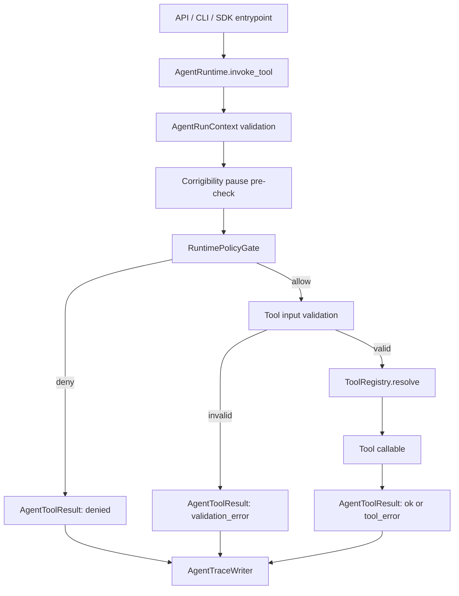

# AR-20260624: Agent Runtime v0 Trusted Substrate

- Status: Accepted and implemented on branch `codex/agent-runtime-v0-trusted-substrate`.
- Paired Goal Card: `docs/decisions/ADR-0003-agent-runtime-v0-trusted-substrate.goal-card.md`
- Paired SPEC: `docs/decisions/ADR-0003-agent-runtime-v0-trusted-substrate.SPEC.md`
- Research intake: `docs/architecture_reviews/AR-20260624-frontier-agent-runtime-research-intake.md`
- Branch: `codex/agent-runtime-v0-trusted-substrate`
- Touched by implementation: OS Core runtime, tool execution, policy gate, trace, checkpoint/replay boundary, and a thin Trusted Loop adapter.
- Boundary: self-developed runtime only. External frameworks are reference material and benchmark targets, not product Core dependencies.

## 1. Context

The Enterprise OS already has a working Trusted Loop, approval-bound governed action path, durable approval-context resume, trace, persistence ports, and corrigibility pause shell. The remaining gap is a real self-developed Agent Runtime substrate that can host controlled workflow/agent execution without weakening the Trusted Loop.

Before ADR-0003 implementation, `packages/os_core/src/agent_os_core/agent_runtime/__init__.py` was intentionally small. It proved the namespace existed, but it was not yet a trusted runtime:

- no mandatory policy gate before tool execution;
- no typed tool-call/result record;
- no failure-path trace semantics;
- no pause-shell pre-check;
- no checkpoint/resume boundary;
- no adapter proving Trusted Loop execution can sit behind the runtime envelope.

ADR-0003 now implements these v0 gaps in the isolated feature branch while preserving the original `run_tool` compatibility surface.

## 2. Decision Proposed

Build Agent Runtime v0 as a narrow trusted substrate, not as a general agent framework.

The substrate is a cross-layer mechanism candidate:

- primary design pressure comes from `autonomous-agent-core` constraints: C6 organ-not-subject, C7 corrigibility, G10 subject-side coupling, ADR-0033 self-modification boundary, and G-Eco freeze discipline;
- first implementation target is Enterprise OS because it already has product trust surfaces to host policy/trace/pause/tool execution;
- workflow replacement for LangGraph/CrewAI is deliberately later, after the substrate proves its policy and trace behavior.

The substrate must own:

- run context;
- tool registry and typed tool metadata;
- policy pre-check;
- structured input/output validation;
- failure-visible trace;
- minimal checkpoint/resume port;
- a thin Trusted Loop adapter after direct runtime tests pass.

It must not own:

- business semantic truth;
- SQL Safety;
- EvidenceChain;
- approval authority;
- connector-side side effects beyond policy-mediated invocation;
- autonomous research claims;
- workflow-layer developer orchestration.

## 3. Source Review

Primary source snapshots reviewed on 2026-06-24:

| Framework | Official repository commit | Files inspected | Relevant lesson |
|---|---:|---|---|
| LangGraph | `711b31550286585b3793857b2a99c8dafd98b785` | `graph/state.py`, `types.py`, `checkpoint/base`, `prebuilt/tool_node.py` | mature state/checkpoint/interrupt vocabulary, but too broad as a product runtime dependency |
| CrewAI | `2eb4e3a236bada5432290654b8d442345eafb19e` | `crew.py`, `task.py`, `flow/runtime`, `state/checkpoint_config.py` | useful guardrail/event/checkpoint patterns, but role-play orchestration should not govern product Core |
| LangChain | `57c83d44bc8ae89a189ad521b9756cfac996039c` | `runnables/base.py`, `runnables/config.py`, `tools/base.py`, `agents/middleware/types.py`, `agents/structured_output.py` | useful uniform invocation/config/tool schema/middleware patterns, but agent loop and dependencies are not acceptable Core substrate |

This source review is now supplemented by the frontier research intake. The intake covers LLM-agent loops, Agent OS papers, benchmark discipline, open-ended self-improvement, corrigibility, active inference, and empowerment. It is a design input, not an implementation dependency.

## 4. Borrow / Reject List

### Borrow

- From LangGraph:
  - explicit state snapshots;
  - checkpoint saver port shape;
  - interrupt/resume as a first-class state transition;
  - typed command/result vocabulary;
  - tool execution envelope with runtime context.
- From CrewAI:
  - task-level guardrails with bounded retries;
  - event-triggered checkpointing;
  - kickoff entrypoint discipline;
  - execution context restoration after checkpoint.
- From LangChain:
  - uniform `invoke`/`ainvoke` style;
  - run config fields: tags, metadata, run_id, max_concurrency;
  - tool schema validation before execution;
  - middleware-like tool-call interception for policy/retry/cache;
  - structured output strategy separation.

### Reject

- Framework import as product Core runtime.
- Open-ended agent loop as first substrate.
- Role-play delegation as governance.
- Message-history-first runtime state.
- Hidden provider/tool behavior that cannot be tested locally.
- Broad async/streaming/concurrency features before policy and trace are real.

## 5. Architecture

The runtime sits below user-facing entrypoints and above tool execution. It is not allowed to bypass Trusted Loop modules. For formal business answers, the adapter invokes the existing Trusted Loop; it does not recreate SQL Safety, EvidenceChain, or Approval.

## 6. Engineering Flow

- Real entrypoint: initially `AgentRuntime.invoke_tool(...)`; later `TrustedLoopAgentRuntimeAdapter.run(...)`.
- Contract/schema: `AgentRunContext`, `ToolSpec`, `AgentToolCall`, `AgentToolResult`, `PolicyDecision`.
- Design review method: every new primitive must answer authority, time, state, failure, and evidence questions before implementation.
- Happy path: safe deterministic tool, valid context, policy allow, trace emitted, typed `ok` result.
- Negative paths:
  - invalid context;
  - missing permission;
  - paused shell;
  - missing tool;
  - invalid tool input;
  - tool body exception.
- Regression tests:
  - policy bypass test;
  - pause bypass test;
  - validation bypass test;
  - trace missing test;
  - external framework import-boundary test.
- Observability: every success and failure path emits trace events with redaction.
- Boundary check: no imports of external agent frameworks in `packages/os_core`, `packages/contracts`, or `apps/api_server`.
- Replay boundary: v0 must record or reject nondeterministic inputs; broad async, streaming, and parallel execution are deferred until a concurrency ADR exists.

## 7. Implementation Slices

### Slice A - Direct Runtime Substrate

- contracts inside `agent_runtime`;
- registry and typed tool call/result;
- runtime policy gate;
- trace events;
- direct safe tool test.

### Slice B - Pause and Checkpoint Boundary

- pause-shell pre-check;
- minimal snapshot port;
- in-memory snapshot implementation if needed by tests.

### Slice C - Trusted Loop Adapter

- one adapter path that wraps the existing `TrustedLoopRuntime`;
- no SQL Safety/EvidenceChain rewrite;
- adapter blocked by pause before loop execution;
- trace proves runtime envelope was used.

## 8. Risks

- Scope creep into a generic workflow engine.
  - Control: v0 only invokes named tools and a Trusted Loop adapter.
- Weak policy gate that becomes decorative.
  - Control: tests assert denied calls do not execute tool bodies.
- Trace-as-logging instead of audit-relevant evidence.
  - Control: failure paths must emit structured events.
- External-framework design gravity.
  - Control: import-boundary test plus source review as reference-only.
- Conflict with current ADR-0002 release state.
  - Control: branch is isolated; implementation should rebase after ADR-0002 push/release gate if main moves.
- Runtime/policy boundary collapse.
  - Control: runtime owns scheduling, validation, gating, trace, checkpoint, and dispatch only. It must not own business truth, agent strategy, or autonomy claims.
- Baseline and evaluation contamination for autonomous-core.
  - Control: Enterprise OS runtime success cannot be cited as autonomous-core evidence. Any object-layer use needs a separate ADR, cheap-baseline review, and frozen falsification gate.
- State consistency race under future concurrency.
  - Control: v0 is a single invocation boundary. Parallel tool calls, shared mutable run state, and async graph execution require a later concurrency design.
- Rollback illusion.
  - Control: checkpoint rollback only concerns runtime state. Irreversible external effects remain governed by side-effect classification, approval binding, and current R4/R5 limits.
- Observer confirmation bias.
  - Control: deliverables must label each claim as product runtime capability, research mechanism, or future hypothesis.
- Resource exhaustion.
  - Control: v0 includes timeout/risk metadata and keeps unbounded loops out of scope; hard budgets can be added later without changing the authority model.

## 9. Acceptance Gate

CTO/founder may accept this AR only if:

- runtime v0 remains narrower than a general graph engine;
- red-first tests are approved before implementation;
- no external framework is introduced as product Core runtime;
- Trusted Loop governance remains authoritative;
- workflow-layer LangGraph/CrewAI replacement is explicitly deferred until the product runtime substrate exists.
- the paired research intake is accepted as the cross-layer constraint, especially the autonomous-core mapping and ADR-0033/C6/C7 boundaries.
- runtime/policy authority remains explicit enough that CTO review can reject strategy leakage into the substrate.
- trace and checkpoint semantics are sufficient to distinguish replayable execution, denied execution, failed execution, and explicitly unreplayable execution.
