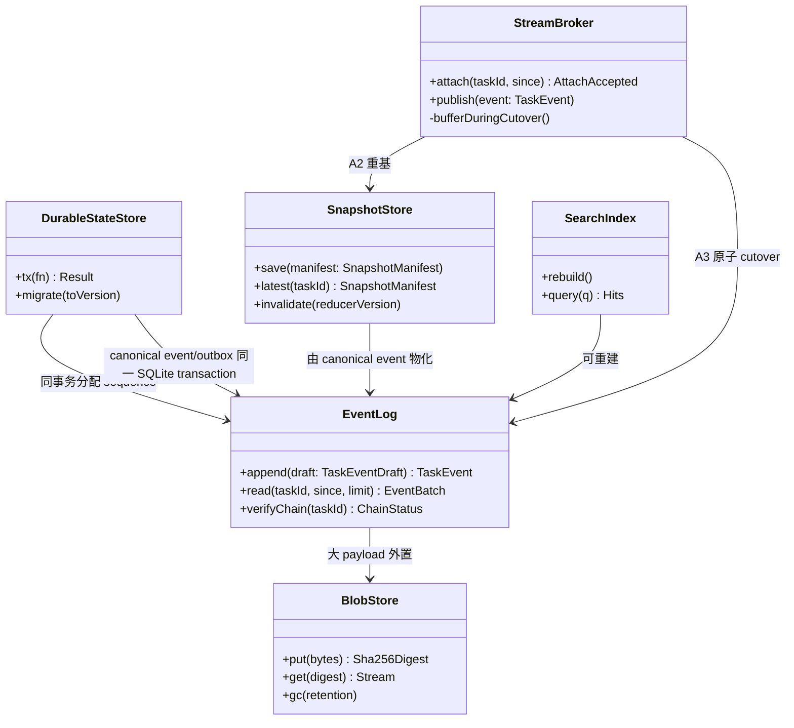

# Agent OS 双 Workbench 架构规格说明书 v2.0(REVISE_TO_SPEC 修订版)

| 项目 | 内容 |
|---|---|
| 文档编号 | A-AGENT-OS-DUAL-WORKBENCH-ARCH-SPEC-V2 |
| 版本 | v2.1(替代被否决的 v1.0;纳入开发前置 Spike 裁决) |
| 状态 | **DESIGN_ONLY / SPECIFIED** —— 本文档全部内容均为规格声明;`specified ≠ implemented ≠ tested` 三态分别记账;引用现有代码处仅作"合同事实"陈述,不构成能力完成主张 |
| 日期 | 2026-09-09 |
| 作者 | 高见远(软件架构师) |
| 审查输入 | `REVIEW-FUSION-AGENT-ARCHITECTURE-SPEC-2026-09-09.md`(结论 REVISE_TO_SPEC,本文逐条落实其 §2/§3/§6/§7) |
| 密钥红线 | 本文档及其衍生的任何设计**不保存任何 secrets / tokens / cookies / 客户凭据**(§7.6) |
| Git 纪律 | 本文档为**未提交工作区文件**;禁止 commit / push / merge |

---

## 0. 输入、权威与读序核对

### 0.1 权威读序核对(按 AGENTS.md §1)

| 步骤 | 对象 | 核对结果 |
|---|---|---|
| 1 | `docs/CURRENT_STATE.yaml` | `updated: 2026-08-13T12:00:00+08:00`;当前工作树 `codex/ide-ui @ b05d29b8`,目标文档均未提交。2026-09-08/09 文档作为本轮 Founder 输入与工作区设计证据,**不是已持久化权威状态**;本文不得据日期覆盖 CURRENT_STATE。Runtime 合同事实逐项回到源码核验 |
| 2 | `docs/AGENT-OS-PRODUCT-BLUEPRINT.md` | v2.1 FINAL / FOUNDER-RATIFIED;§6 canonical kernel objects、§7 reference work loop、§16 non-negotiable boundaries 为本文领域模型的上位约束 |
| 3 | 审查报告(2026-09-09) | 本文的直接修订依据,§7 十条退出条件在本文 §16 逐条自评 |
| 4 | M1 简报(2026-09-08) | 作为未提交工作区设计输入;其 §1.1 window-host 方向获本轮 Founder 继续执行授权;其 §1 "Agent Surface webview editor" 表述被 09-09 审查 P0-2 否决,本文显式登记 reconciliation |
| 5 | 竞品源码蓝图(2026-09-09) | 双 Workbench 拓扑、Parts 布局、`src/vs/sessions` 回移路线的直接依据 |
| 6 | v1.0 spec | 仅按审查 §4 清单保留约 1/3 内容,挂接表见本文 §15 |

### 0.2 v1.0 已撤销决策(不得回潮)

| v1 决策 | 审查裁决 | v2 替代(本文章节) |
|---|---|---|
| D3 双应用 + daemon(独立 Agent Electron 应用 + 独立 Code-OSS IDE + Rust daemon 双宿主) | **REJECT**(P0-1) | 一个 Code-OSS 应用、两类原生窗口、两套顶层 Workbench、共享 Agent Core(§1、§2) |
| ADR-05 最小 fork + built-in extension + Webview 顶层 | **REJECT**(P0-2) | 深度 fork;Agent/Sessions 逻辑进独立顶层模块(与 `src/vs/sessions` 平级);built-in extension 只做 provider/工具适配/IDE contribution(§3、§10) |
| D1 Rust 已锁定 | **REOPEN_DECISION**(P0-3) | 先定义语言无关 Host/Runtime contract;Rust 仅为 executor/sandbox broker 候选;现有 Python Product Runtime 是迁移起点(§5.1、§13.2) |
| Session/Turn/Event 状态模型 | **REJECT_MODEL**(P0-4) | 完整领域模型:Mandate/Task/Run/Artifact/Evidence/Outcome/Decision/HelpRequest/CapabilityGrant/WorkspaceBinding/C7(§5) |
| 共享 daemon 双父进程 stdio | **INVALID_TOPOLOGY**(P0-5) | 受权限保护的 Unix domain socket / named pipe + 绑定握手;supervisor 仅用 stdio 管生命周期(§8) |
| `PermissionDecision{requestId, decision}` | **SECURITY_BLOCKER**(P0-6) | 审批绑定 authority actor + exact ActionContract digest + policy version + expiry + receipt(§7) |

### 0.3 状态记账纪律

- 本文所有设计条目状态为 **SPECIFIED**。
- 引用现有 Python 合同(`packages/contracts/src/agent_os_contracts/*.py`)时标注"合同事实(已实现并测试,见 CURRENT_STATE)",与设计承诺分账。
- 引用竞品时区分**事实(本机路径/公开 URL 可核验)、推断、未知**(§14)。
- 全文不出现"已完成/已上线";现有代码的存在不等于本文设计已实现。

---

## 1. 总体拓扑(双 Workbench)

### 1.1 产品形态(ADR-V2-01)

```text
Agent OS.app(一个 Code-OSS 发行包,一个 Electron main / shared application services)
├── Electron Main / Shared Process
│   ├── WindowKindRegistry            # 两类顶层窗口:IDE / AGENT(§2.1)
│   ├── IDEWindowLifecycle            # 复用 WindowsMainService 原生生命周期
│   ├── AgentWindowLifecycle          # 同一服务上的第二种 window kind
│   ├── CrossWindowActionRouter       # Agent↔IDE handoff action 路由(§2.4)
│   └── AgentCoreSupervisor           # Runtime 受监督子进程 + RuntimeClient(§8.1)
│
├── IDE Window(可多个)
│   └── standard Code-OSS Workbench(workbench.desktop.main)
│       ├── editor / files / search / SCM / test / debug / terminal / extensions
│       ├── native coding chat / diff / multi-diff / edit review(built-in contribution)
│       └── Titlebar 目的地动作:Agent ↗(§2.4)
│
├── Agent Window(可多个)
│   └── AgentOS Sessions Workbench(workbench.agentOS.main,独立 renderer bundle)
│       ├── Titlebar(目的地动作:IDE ↗)
│       ├── Sidebar Part(tasks / automations)
│       ├── Sessions Part(一或多个 SessionView)
│       ├── Editor(默认隐藏,按需出现)
│       ├── Auxiliary Bar(任务 inspector)
│       └── Panel(默认隐藏,终端等按需出现)
│
└── Agent Core(现有 Python Product Runtime,受监督服务进程)
    ├── Mandate / Task / Run / Outcome 状态机与事件日志
    ├── provider-neutral 模型与 capability 路由(CapabilityBroker)
    ├── authority / C7 / evidence / receipt spine
    ├── 事务型状态库 + append-only 事件/审计日志 + content-addressed blob(§6)
    ├── 本地/远程执行 provider 与 sandbox broker 接缝(§5.1)
    └── 自动化调度器(§9,不在 UI 进程)
```

**ADR-V2-01:一个 Code-OSS 应用、两类原生窗口、两套顶层 Workbench。**
理由:审查 P0-1;Cursor/Qoder 本机发行包直接证据(§14 第 1、2 行);VS Code 官方 `src/vs/sessions` 同构(§14 第 3 行)。一个应用不等于一个 renderer;两套 Workbench 共享安装包、主进程、任务数据库与 Runtime client。
被否决替代:①双应用 + daemon(v1 D3,REJECT:两个壳、两套窗口生命周期、两个 deep-link handler、URL scheme 争抢);②Tauri 第二壳(M1 §1.1 已否决);③IDE Webview 顶层(审查 P0-2,REJECT:Webview 无法拥有窗口/布局/Parts/恢复)。

**ADR-V2-02:Agent Core 是受监督服务进程,不是拆产品的理由。**
Runtime 独立进程仅为可靠性/安全边界(崩溃隔离、权限收窄);首切片由 `AgentCoreSupervisor` 管理交互生命周期,后续无人值守 slice 由 OS service manager 管理。它不构成第二个产品,不拥有自己的窗口与品牌。被否决替代:①Runtime 嵌入 renderer;②独立桌面产品形态(v1 D3,REJECT)。

**ADR-V2-03:内部 Agent 对用户默认隐藏。**
"Agent"不是可选 worker 身份;Runtime 按任务组合内部 organ/skill/工具。UI 不渲染"选择执行 Agent"控件;多 Agent 执行细节仅在治理/调试视图暴露(§11.4)。被否决替代:用户手工指定内部 Agent(蓝图 §3.1 已否:无稳定操作合同)。

### 1.2 进程/窗口矩阵

| 进程 | 数量 | 职责 | 崩溃影响 |
|---|---|---|---|
| Electron main | 1(单实例仲裁,§2.3) | 窗口注册/生命周期/handoff 路由/交互 Runtime 监督 | 当前随应用退出;OS service slice 后才允许后台 Runtime 保活 |
| IDE renderer | 0..n | 标准 Workbench | 仅该窗口;任务状态在 Runtime,不丢 |
| Agent renderer | 0..n | Sessions Workbench | 同上 |
| Agent Core(Runtime) | 1 per profile | 领域真相、调度、执行 | 进程崩溃由当前 owner 重启;客户端经 snapshot+tail 重挂(§8.4) |
| extension host | 随 IDE 窗口 | built-in extension(provider/工具适配) | 工具 lease 失效即 RevokeTool(§8.5) |

---

## 2. 窗口与生命周期

### 2.1 WindowKindRegistry(ADR-V2-04)

```typescript
// SPECIFIED;落在 fork 顶层模块 src/vs/agentos/*(见 §10.3 模块归属)
type WindowKind = "ide" | "agent";

interface WindowKindRegistration {
  kind: WindowKind;
  rendererEntry: string;              // "vs/workbench/workbench.desktop.main"
                                      // | "vs/workbench/workbench.agentOS.main"
  windowConfigFlag: string;           // INativeWindowConfiguration 上的判别字段
  defaultRestorePolicy: "restore" | "empty";
}

interface IWindowKindRegistry {
  resolveKind(config: INativeWindowConfiguration): WindowKind;
  entryFor(kind: WindowKind): string;
}
```

- 窗口类型由 **window configuration 显式携带**(现有 scaffold:`agentOSWindow?: boolean`,见 `apps/code-oss/patches/010-native-agent-workbench.patch` 对 `windowImpl.ts`/`windowsMainService.ts` 的修改 —— 合同事实:该 patch 存在但未验证),**禁止**用文件夹名、临时空 workspace 或特殊标签页猜窗口类型(蓝图 §6 禁令)。
- renderer bootstrap 在 loader 处按 kind 选 bundle(现有 patch 对 `src/vs/code/electron-browser/workbench/workbench.ts` 的 `load()` 改造即此机制,保留并重构)。
- v2 将单布尔 flag 升级为注册表,以便未来第三种 kind(如纯 Ops surface)不侵入判别逻辑。被否决替代:继续叠加布尔字段(否决:每加一种窗口改 N 处 if)。

### 2.2 启动与恢复生命周期

| 阶段 | IDE Window | Agent Window | 状态 |
|---|---|---|---|
| 创建 | `windowsMainService.open({forceNewWindow})` | 同一服务,windowConfig 带 agent kind | SPECIFIED |
| 几何/工作区持久化 | Code-OSS 原生 `windowsState` | 同一存储,键按 kind 分桶:`lastUsedWindows: {ide: [...], agent: [...]}`(事实锚点:Cursor 持久化 `default`/`agentWindow`/`lastUsedWindows`,§14-1) | SPECIFIED |
| 重启恢复 | 原生 restore | 恢复窗口 → renderer bootstrap → `AgentOSSessionsProvider.rehydrate()` → 经 host protocol `stream.attach` 恢复 active session(§8.4) | SPECIFIED |
| 崩溃恢复(renderer 进程被杀) | 原生 reload | reload 后**不重建任务状态**:UI 仅持有 cursor;重新 attach 时 Runtime 返回 snapshot+tail(§8.4),Runtime 侧 Run 不中断 | SPECIFIED |
| 空工作区路径 | 允许空 IDE(随后 Open Folder / Clone / 远端) | Agent Window 永远可进入;任务可无工作区(quick chat),Coding 类工作在执行时请求 WorkspaceBinding(§5.4-13),由 host 打开/聚焦 IDE | SPECIFIED |
| Runtime 不可用 | IDE 完全可用;Agent 贡献降级为"启动 Runtime"动作 + 有界诊断(M1 §5) | 本地任务历史可浏览(读派生存储),执行禁用,显示可诊断错误与重连;**禁止**只显示"Runtime 未连接" | SPECIFIED |

### 2.3 单实例与多窗口仲裁(ADR-V2-05)

- 应用级单实例:第二个启动请求转发给首实例(复用 Code-OSS `win32MutexName`/single-instance 通道),按其 CLI/window-action 参数路由到对应 kind。
- **不限制每 kind 单窗口**:允许 2 个 Agent Window 并排(对照:Qoder 以 `isAgentsWindow` 区分并支持 foreground 语义;Cursor `lastUsedWindows` 为数组)。被否决替代:Agent Window 全局唯一(否决:多任务并排是竞品已验证形态;唯一性可作为 restore policy 的默认聚焦策略而非硬约束)。

### 2.4 Cross-window handoff(ADR-V2-06)

右上角只有**一个目的地动作**(不是分段开关、不是编辑器标签页):

```typescript
// SPECIFIED;经 INativeHostService 扩展(现有 patch 已加 openAgentOSWindow/focusOrOpenIDEWindow,保留并补 handoff payload)
interface CrossWindowHandoff {
  intent: "open_workspace" | "continue_task" | "review_artifact" | "inspect_run";
  workspaceId?: string;        // WorkspaceBinding 引用(§5.4-13),非裸路径
  taskId?: string;
  runId?: string;
  artifactRef?: string;        // ArtifactRef.artifact_id
  selection?: { uri: string; range?: [number, number] };  // IDE→Agent 方向
}
interface ICrossWindowActionRouter {
  handoff(target: WindowKind, payload: CrossWindowHandoff): Promise<void>;
  // 语义:目标 kind 已有窗口 → 聚焦最近活跃者并向其 renderer 投递 handoff action;
  //       无窗口 → 按 kind 创建(IDE 可为空窗口),创建完成后投递。
}
```

- IDE → Agent:`Agent ↗` 携带当前 workspace + 活动 task/selection 意图。
- Agent → IDE:`IDE ↗` 携带当前任务的 WorkspaceBinding;无绑定时聚焦/创建空 IDE,不阻塞进入。
- 事实锚点:Cursor 以 `glass.applyIdeWorkspaceHandoff` action + `cursorRunActionInWindow` 向目标 renderer 传 workspace identifier(§14-1,本机事实);本产品采用同一模式,action 走 main 进程 IPC 频道而非 deep link。
- **deep link: PARK**(审查 §6)。外部 URL scheme 不是当前阻塞项;应用内切换一律走 handoff。被否决替代:v1 `myagent://` 双端注册(REJECT 的连带问题:两个应用抢 scheme 在单应用拓扑下不复存在)。

---

## 3. Agent Workbench Parts 与布局合同

> 本章回应审查 P1-5。拓扑基准:VS Code 官方 `src/vs/sessions`(§10)+ 竞品蓝图 §4。现有 `agentOSWindowEditor.ts` 手写 DOM 页面(task/master/detail)**必须删除或替换**(蓝图 §6;合同事实:该文件存在于 `apps/code-oss/patches/010-native-agent-workbench.patch` 第 205–295 行,未验证)。

### 3.1 Renderer bootstrap(ADR-V2-07)

```text
workbench.agentOS.main.ts(独立 bundle,buildfile.js 已登记 —— 合同事实)
└── src/vs/agentos/electron-browser/agentos.main.ts      # 与 src/vs/sessions/electron-browser/sessions.main.ts 平级同构
    └── AgentOSWorkbench extends Workbench               # 与 src/vs/sessions/browser/workbench.ts 同构
        ├── initServices: Agent OS service collection(§3.2)
        ├── initLayout: 固定 topology(§3.3)
        └── renderWorkbench: Part 创建并挂入 SerializableGrid
```

被否决替代:①在 `workbench.desktop.main` 内 if-else 出 Agent 布局(否决:单 bundle 双人格,启动面与测试面无法收敛,Qoder 亦以独立入口 `agents-window.desktop.main.js` 实现,§14-2);②built-in extension 拥有顶层布局(审查 P0-2 REJECT)。

### 3.2 Service collection(每 Agent renderer 一份)

| 服务 | 职责 | 单一状态源 |
|---|---|---|
| 上游 `ISessionsProvidersService` | provider registry:注册、注销、查找;不拥有 active/visible 状态 | ✅ provider catalog |
| 上游 `ISessionsManagementService` | 聚合 session/chat、解析 workspace、路由 lifecycle operation 到 owning provider | ✅ model orchestration |
| 上游 `ISessionsService` | **唯一拥有** visible sessions、active session/chat、focus/navigation 与恢复状态;Part 只渲染模型 | ✅ visible session → active chat |
| 上游 `ISessionsProvider` + `AgentOSSessionsProvider` 实现 | provider seam;本地 Runtime 是首个实现(§5.3);不把 UI 写死到某个 Agent 后端 | — |
| `IRuntimeClientService` | host protocol 客户端(§8):握手、lease、attach、Op 发送、事件订阅、断线重连 | ✅ Runtime 连接与 lease 状态 |
| `ITaskStreamService` | snapshot+tail attach、cursor/epoch gap 检测、事件→视图模型 reducer(reducer 版本化,§6.5) | ✅ per-task event cursor |
| `IAgentOSLayoutService` | 固定 topology 的显隐/尺寸/per-session working set 捕获与恢复 | ✅ layout state |
| `IHandoffService` | 发送/接收 §2.4 handoff action | — |
| `IApprovalPresenter` | 把 `APPROVAL_REQUESTED` 渲染为绑定 digest 的审批卡(§7.3);**只是呈现,不是权威** | — |

### 3.3 Part ownership 与 SerializableGrid topology(ADR-V2-08)

```text
Titlebar Part(自有,含 IDE ↗ 目的地动作、搜索/命令中心、[…])
└── Content(SerializableGrid,固定拓扑,尺寸/显隐持久化)
    ├── Sidebar Part        左,固定位置 [新建任务][搜索] 任务/自动任务列表(进行中/最近)
    ├── Sessions Part       中,主区;一或多个 SessionView;自身管理会话视图 grid,
    │                       不借用 editor group 冒充任务页面;吸收 resize 与显隐 delta 的柔性面
    ├── Editor Part         中,默认隐藏;打开文件/diff/notebook/画布/浏览器/数据视图时出现(IEditorService)
    ├── Auxiliary Bar Part  右,任务 inspector:变更/产物/详情/文件 四态同一组件
    └── Panel Part          下,默认隐藏;终端/Problems/Output/Debug 按需
```

| 规则 | 内容 |
|---|---|
| 隐藏部件 | 不实例化标准 Activity Bar、Status Bar、Banner(同上游 LAYOUT.md 固定布局,§14-3) |
| Part 注册 | 全部经 layout service 注册;删除任一注册使结构测试失败(蓝图 §7 Slice B 退出门) |
| 反退化红线 | CI 反绕过测试:出现 `EditorPane`/`createWebviewPanel` 顶层 Agent UI/绝对定位 overlay/fake workspace window 即失败(蓝图 §8) |
| Webview 边界 | **webview 仅允许作为 Part 内部内容呈现**(如 chat 消息渲染、Markdown/画布预览);不得拥有 Workbench 拓扑、不得作为窗口入口(审查边界提醒) |
| per-session working set | 切换 active session 时捕获/恢复:Editor 输入集、Auxiliary Bar 选择、Panel 状态(同上游 LAYOUT_CONTROLLER.md 的 capture/restore 语义,§14-3) |

被否决替代:①Agent 页面作为 editor tab(蓝图 §1 已否);②CSS/DOM 覆盖标准 editor area(蓝图 §6 必删);③Sidebar 复用 Activity Bar(否决:固定拓扑,不需要活动栏心智)。

### 3.4 SessionView 内容合同(与领域模型的投影关系)

```text
[任务标题] [workspace] [status: TaskStatus/RunStatus 投影] [成员] […]
conversation timeline(任务事件流的可读投影,不是真相根)
├── 用户目标(Goal.statement / Commitment)
├── 计划(WorkflowGraph 节点,可折叠)
├── run steps(NODE_* / ACTION_* / PROVIDER_RESPONDED 事件,流式、可定位)
├── approvals(APPROVAL_REQUESTED → 审批卡 → APPROVAL_RECORDED)
├── artifacts / evidence(ARTIFACT_RECORDED / OUTCOME_OBSERVED)
├── help requests(SrlHelpRequest → 需决定)
└── 终态(RUN_SUCCEEDED/FAILED/CANCELLED + ObservedOutcome)
composer
├── 输入(text + @引用:文件/图片/连接器/任务/对话)
├── [权限/执行环境摘要:CapabilityGrant + RiskTier + sandbox 轴的只读投影]
└── [发送/停止:停止 = correction/stop,按 run/attempt 定位(§7.5)]
```

- 单击 step 定位到对应日志/终端/文件/产物(经 artifact openWith + handoff)。
- 失败展示失败原因、已完成步骤、可恢复动作(retry/resume/compensate),不只显示连接错误。
- 模型/内部 Agent/路由策略由系统决定,仅治理视图暴露(ADR-V2-03)。

---

## 4. 总体 ADR 一览

| ADR | 决策 | 被否决替代 |
|---|---|---|
| ADR-V2-01 | 一个 Code-OSS 应用,双 Workbench(§1.1) | 双应用+daemon;Tauri 二壳;Webview 顶层 |
| ADR-V2-02 | Runtime=受监督服务进程(§1.1) | 嵌入 UI 进程;独立产品 |
| ADR-V2-03 | 内部 Agent 默认隐藏(§1.1) | 用户手选 Agent |
| ADR-V2-04 | WindowKindRegistry 显式 window kind(§2.1) | 布尔 flag 堆叠;路径猜测 |
| ADR-V2-05 | 应用单实例 + 每 kind 多窗口(§2.3) | Agent Window 全局唯一硬约束 |
| ADR-V2-06 | 单一目的地动作 + handoff action 路由(§2.4) | deep link(PARK);分段开关;editor tab |
| ADR-V2-07 | 独立 renderer bundle + AgentOSWorkbench(§3.1) | desktop.main 内 if-else;extension 拥有布局 |
| ADR-V2-08 | 固定 SerializableGrid topology + Part 注册(§3.3) | editor tab 冒充;DOM overlay |
| ADR-V2-09 | 语言无关 Host/Runtime contract,Python Runtime 为起点(§5.1) | 锁定 Rust 全量重写(v1 D1,REOPEN) |
| ADR-V2-10 | 协议单一来源 = Python 合同导出 JSON Schema(§5.2) | 手写两份类型(v1 已立,保留并改源) |
| ADR-V2-11 | 事务库+事件/审计日志+blob+可重建索引(§6.1) | JSONL 唯一真相(审查 P1-1) |
| ADR-V2-12 | versioned snapshot + tail attach(§6.5) | seq 0 全量重放 token delta(审查 P1-2) |
| ADR-V2-13 | 全 mutation 幂等 + expectedRevision(§8.3) | 先到先服务;LWW 配置覆盖权限(审查 P0-6/P1-3) |
| ADR-V2-14 | UDS/named pipe 多客户端 + 绑定握手(§8.2) | 双父进程 stdio(审查 P0-5) |
| ADR-V2-15 | 审批绑定 actor+digest+policy version+expiry+receipt(§7.2) | `{requestId, decision}`(审查 P0-6) |
| ADR-V2-16 | 调度权威在 Runtime(§9) | 桌面 UI 进程 cron(v1 §6.3,审查 P1-4) |
| ADR-V2-17 | `src/vs/sessions` 基线优先回移(§10) | 手写缩小版伪 Workbench(蓝图 §9 已否) |

---

## 5. Host protocol:领域合同逐项映射

> 回应审查 P0-4、退出条件 3/5。**不另起 chat daemon**:host protocol 是现有 Python Product Runtime 合同的投影层。所有"合同事实"行给出源码路径(本 worktree 相对路径 `packages/contracts/src/agent_os_contracts/`,下略前缀)。

### 5.1 语言无关合同与 Runtime 起点(ADR-V2-09,落实 P0-3)

- Host/Runtime contract 以**传输与语言无关**的方式定义:消息 envelope + 领域类型 + 语义不变量,JSON Schema 为机器可读形态(§5.2)。
- 现有 Python Product Runtime(Task/Run/权限/Evidence/Outcome/Help/恢复路径,合同事实见 §5.4 各行)是**迁移起点,不是绕行对象**:host protocol 的每个 Op/Event 必须能逐项映射到现有合同,映射表即 §5.4。
- Rust 仅作为 **executor/sandbox broker 候选**(强进程隔离、syscall 级控制、高吞吐执行场景);主 Runtime 迁移须基准证明收益覆盖回归风险后**另立 ADR**,并附逐项合同映射、双写/回放迁移、兼容门、回滚策略(审查 P0-3 建议原文)。codex-rs 自研/二开:**DEFER/SPIKE**(审查 §6),spike 输入为本章映射表。
- 被否决替代:①新建 Rust kernel 替代 Python Runtime(REJECT:绕开而非迁移);②永远 Python(否决:不预判,留给基准)。

### 5.2 Schema 单一来源与协议版本协商(ADR-V2-10;v1 保留项改源)

- **唯一真源**:`agent_os_contracts` 的 pydantic `ContractModel`(`common.py:24`)+ host protocol 自有 envelope 类型 → 构建期导出 `schema/*.schema.json` → 生成 TS 类型供 fork/renderer 使用。**禁止手写两份**(v1 §6.2 原则保留,源从 Rust crate 改为 Python 合同)。
- 协议版本:`AGENTOS_HOST_PROTOCOL_VERSION = "2.0"`(现有 surface seam 为 `SURFACE_PROTOCOL_VERSION = "1.0"`,`surface.py:14` —— 合同事实;v2 在其上扩展,握手协商取交集,不兼容即拒绝 attach 并报 `PROTOCOL_MISMATCH`,M1 §5 失败行为保留)。
- 演进规则:新增字段必须可选;新增 Op/Event kind 为 MINOR;移除走两版弃用。Event 为 **discriminated union**(`kind` 闭合枚举 + 每 kind typed payload),**禁止 `payload: unknown` 作为冻结协议**(审查 P1-3);传输层 `payload_json` 的 canonical JSON 形态是现有合同的既有模式(`runtime.py:254-263`,合同事实),schema 导出面按 kind 给具体定义。

### 5.3 Provider seam

```typescript
// SPECIFIED;同构上游 ISessionsProvider(§10),Agent Window 与 IDE contribution 共用
interface AgentOSSessionsProvider extends ISessionsProvider {
  listTasks(filter): Promise<TaskSummary[]>;            // TaskStatus/ResponsibilityItem 投影
  createTask(cmd: CreateTaskOp): Promise<TaskRef>;      // 可带 WorkspaceBinding 或 quick chat
  attachStream(taskId, since?): Promise<AttachAccepted>;// snapshot+tail(§6.5)
  sendTurn(op: SessionTurnOp): Promise<void>;           // 幂等(§8.3)
  decideApproval(op: ApprovalDecisionOp): Promise<ApprovalReceipt>;// §7.2
  stopRun(op: StopOp): Promise<void>;                   // 按 run/attempt 定位(§7.5)
  respondHelp(op: HelpResponseOp): Promise<void>;       // SrlHelpResponse 投影
  listArtifacts(taskId): Promise<ArtifactView[]>;
  openArtifact(ref, surfaceHint): Promise<void>;        // Editor/handler/handoff 路由
  recoverAfterRestart(): Promise<void>;                 // 重握手 + 重 attach(§8.4)
}
```

### 5.4 领域合同逐项映射表(核心;退出条件 3/5)

| # | 领域对象 | 权威合同(合同事实:源码) | host protocol 投影(SPECIFIED) | 关键语义 |
|---|---|---|---|---|
| 1 | **Mandate** | `mandate.py:65` `Mandate`(mission_statement, authority_envelope `MandateEnvelope:35`, status `MandateStatus:18`, correction_epoch, expires_at);`CreateMandateCommand:49`;`MandateRatificationReceipt:92` | `mandate.create/list/get`、`mandate.ratify`(返回 receipt digest)、事件 `MANDATE_*`(经 TaskEvent payload);只读投影 `MandateResponsibilityView`(`responsibility.py:475`) |  intake 不静默变执行权(现有已验证性质:RATIFIED 且 task_activation_authorized=false,CURRENT_STATE `mandate_workspace_input`) |
| 2 | **Goal / Commitment** | `task.py:9` `Goal`(statement, constraints);`task.py:19` `Commitment`(deliverables, acceptance_criteria, authority_scopes, budget `ResourceBudget`, risk_tier, exit_conditions, expires_at) | `task.create` 携带;`task.get` 返回;SessionView 头部与详情页数据源 | Commitment 是任务验收合同,UI 不得改写 |
| 3 | **Task** | `runtime.py:13` `TaskStatus`(DRAFT/COMMITTED/RUNNING/WAITING/PAUSED/VERIFYING/COMPLETED/FAILED/CANCELLED) | `task.list/get`、Sidebar/看板状态列、事件流按 taskId 分域(seq per task) | Task 是产品交互主对象;Session 仅是交互/订阅投影(审查 P0-4 替代原文) |
| 4 | **Run / Attempt** | `runtime.py:298` `AgentRun`(run_id, task_id, commitment_id, workflow_id+version+digest, status `RunStatus:25`, lease_fence, attempt, configuration_snapshot_id/digest);`RunRecoverySnapshot:231` | `run.list/get/stop/pause/resume`、Runs 视图、多 Agent 可观察性(§11.4);`attempt` 即审查 P0-6 要求的精确定位维度 | stop 必须可按 run/attempt,不只 session |
| 5 | **WorkflowGraph / Step(Node)** | `workflow.py:122` `WorkflowGraph`(dag_v1,fail-closed:loop/parallel/subworkflow validate 拒绝,CURRENT_STATE merged_this_turn);`NodeSpec:58` | 计划/步骤视图投影;`NODE_STARTED/COMPLETED/FAILED` 事件驱动 timeline | 图不可热改;Run 绑定 digest |
| 6 | **TaskEvent(事件流)** | `runtime.py:50` `TaskEventType`(41 个闭合枚举,含 RUN_*/NODE_*/APPROVAL_*/CORRECTION_*/OUTCOME_*/SESSION_*);`TaskEvent:294`(sequence ge=1, payload_json canonical) | host Event envelope:`{eventId, taskId, seq, epoch, ts, kind: TaskEventType \| HostEventKind, payload: <per-kind typed>, correlationId?, causationId?}`;write-ahead 后发布(§6.3) | discriminated union;session 内 seq + gap detection(v1 保留) |
| 7 | **ActionContract / Policy / Approval / Permit / Receipt(Decision 族)** | `authority.py:161` `ActionContract`(action_digest() 内容寻址, policy_version, observed_correction_epochs, approval_requirement, idempotency_key);`:221` `PolicyDecision`;`:200` `ApprovalDecision`(actor_id, actor_role 限 PRINCIPAL/TENANT_ADMIN, action_digest, expires_at);`:236` `ActionPermit`(`matches()`仅核对 action/digest/principal/tenant/workspace/epochs);`:267` `ActionReceipt` | 审批卡 = `APPROVAL_REQUESTED` 事件 + `approval.decide` Op(§7.2);receipt 事件 `ACTION_RECEIPT_RECORDED`;lease/expiry/grant/current epoch 由 dispatch guard 复核 | 审批绑定 actor+digest+policy version+expiry+receipt(§7 全章) |
| 8 | **C7 CorrectionState** | `authority.py:109` `CorrectionState`(scope TASK/RUN/CAPABILITY, epoch, halted);`:122` `CorrectionSnapshot`(epoch_vector) | 只读投影 `correction.state` 事件 `CORRECTION_WRITTEN`;UI 的 correction 请求入口(§7.5) | epoch 使未执行 permit 全失效;C7 不可旁路论证 §7.4 |
| 9 | **ExpectedOutcome / ObservedOutcome** | `outcome.py:19` `ExpectedOutcome`(evaluator_type+version, evidence_requirements, threshold, frozen_at);`:40` `ObservedOutcome`(status VERIFIED/NOT_MET/UNRESOLVED/INVALID;VERIFIED 必须 score+evidence 且无 gaps) | 任务详情/终态卡;`OUTCOME_OBSERVED` 事件;Outcome Portfolio 视图(`outcome_portfolio.py:36`,可选 surface) | 结果由 evaluator 产出,非自述成功 |
| 10 | **Artifact / Evidence** | `evidence.py:29` `ArtifactRef`(content_digest Sha256, media_type, location_class, acl_scopes, retention_policy);`:48` `EvidenceRef`(source_kind, provenance) | `artifact.list/get/openIntent`;Auxiliary Bar「产物/变更」;blob 外置(§6.4) | 打开 surface 由 media_type+openWith 路由:Coding→diff/editor,设计→画布,数据→表格,Ops→日志(蓝图 §3.2) |
| 11 | **HelpRequest / SrlHelpResponse** | `srl_help.py:32` `SrlHelpRequest`(help_class 五类, bounded_options, minimum_answer, expires_at, cancellation/escalation_policy);`:67` `SrlHelpResponse`(typed,raw text 非权威);`situated.py:488` `HelpRequest` | 「需决定」过滤(非独立 Inbox 产品概念,蓝图 §4.2);`help.list/respond`;`HelpBudget:112`/`HelpBurdenReceipt:120` 治理投影 | 回应是 typed 命令;过期/取消策略随请求走 |
| 12 | **CapabilitySpec / CapabilityGrant** | `capability.py:26` `CapabilitySpec`(side_effect_guarantee 七档, idempotency/cancellation/compensation 约束校验, risk_tier, timeout);`:71` `CapabilityGrant`(max_risk_tier, budget_limit, status ACTIVE/REVOKED, expires_at) | composer 权限摘要只读投影;`capability.listGrants`;grant/revoke 走审批路径(§7),**不走普通配置写** | 权限扩张无 LWW 旁路(审查 P0-6) |
| 13 | **WorkspaceBinding** | 复合绑定,合同事实:`protocol_ingress.py:12` `PrincipalRef`(principal/tenant/workspace 前缀校验)+ `mandate.py:129` `MandateWorkspaceRecord` + `runtime_daemon/descriptor.py` `RuntimeDescriptor.workspace_path`(0600 私有) | `workspace.list/resolve`(local/remote/none);handoff payload 引用;握手 authority scope 由服务端绑定(§8.2) | 服务端绑定 principal+tenant+workspace,拒绝客户端权威注入(现有已验证性质) |
| 14 | **协作围栏(lease/写决策)** | `workspace_collaboration.py:178` `WorkLease`(fence_token, scopes `ResourceScope:46` covers/overlaps, authority_context 不得超越);`:215` `WorkspaceWriteDecision`(disposition CONTINUE/REPLAN/CONFLICT/CANCEL);`surface.py:131` `SurfaceConflictProjection`(denial-only 投影) | 冲突卡(REPLAN→重规划 / REVIEW_DIFF→看 diff);`collab.events` 订阅 | CURRENT_STATE pin:fence REAL_PRODUCT_RUNTIME_FENCE_IMPLEMENTED,surface NOT_IMPLEMENTED —— 本文正是其 surface 设计 |
| 15 | **Responsibility / 任务看板** | `responsibility.py:421` `ResponsibilityItem`(state UNKNOWN/NEEDS_ATTENTION/DONE_VERIFIED/TRACKED 闭合原因);`:334` `MandateTaskLink`(append-only, versioned) | Sidebar「进行中/需决定/最近」;看板列 = TaskStatus × ResponsibilityItemState 投影 | 读模型,不另立状态机 |
| 16 | **Provider / Credential / Session** | `provider.py:85` `ProviderProfile`;`:61` `CredentialRef`(安全引用,无 secret 本体);`:35` `SessionRef`/`:45` `TurnId`;`:284` `ProviderExecutionReceipt` | 模型/用量/成本投影;`ProviderFailure:346` 驱动失败卡 | secret 永不入协议/事件/日志(§7.6) |
| 17 | **TaskConfigurationSnapshot** | `task_configuration.py:147` `TaskConfigurationSnapshot`(immutable graph/grant/policy/prior 绑定,seal digest schemas :17-19) | Run 详情的「本次执行配置」只读卡;`TASK_CONFIGURATION_SNAPSHOT_SEALED` 事件 | Run 绑定不可变快照,禁止热改配置(蓝图 §6) |
| 18 | **多 Agent 可观察性** | `mandate.py:102` `AgentInstanceRef`;`trajectory.py:109` `TrajectoryStep`/`:120` `EpisodeManifest`;`authority.py:74` `CandidateGenerationEnvelope` | 治理/调试视图的运行分解(默认隐藏,ADR-V2-03) | 可观察 ≠ 可指挥;操作仍走统一权威路径 |
| 19 | **组织/成员/角色** | `authority.py:61` `PrincipalIdentity`(role `PrincipalRole:25`:PRINCIPAL/TENANT_ADMIN/WORKER/MODEL/PLUGIN);tenant_id/workspace_id 全合同贯穿 | 成员视图/任务成员 chips;权限矩阵按 role 投影(§11.2) | 组织管理后台为后续 surface;合同层租户隔离已是既有强制 |

> 映射规则:①每个 Op 注明幂等键与 revision 要求(§8.3);②每个事件 kind 必须在 `TaskEventType` 或显式 `HostEventKind`(窗口/lease/attach 生命周期事件)闭合集内;③任何合同演进先改 Python 合同,再导出 schema,再生成 TS;④未列入本表的 UI 数据一律来自上述投影的客户端派生,不得自建真相。

### 5.5 Op 目录(SPECIFIED,摘要)

| 族 | Ops | 幂等/并发 |
|---|---|---|
| `rpc/` | hello, heartbeat, lease.renew, goodbye | hello 幂等(boot_id 去重) |
| `session/` | open, turn, close | clientOperationId;turn 带 expected_event_sequence(沿袭 `SurfaceTurnCommand:42`) |
| `task/` | create, commit, list, get, link(MandateTaskLink), archive | create/link 幂等;archive 带 expectedRevision |
| `run/` | stop, pause, resume, retry | 按 run/attempt 定位;stop 幂等 |
| `approval/` | decide | 绑定 action_digest+policy_version+expected_event_sequence(§7.2) |
| `correction/` | request(pause/tighten/halt) | 仅请求;生效权在 C7 面(§7.5) |
| `stream/` | attach, detach | attach 幂等(同 cursor 重入返回同 snapshot) |
| `artifact/` | list, get, openIntent | 只读 |
| `capability/` | listSpecs, listGrants, proposeGrant, revokeGrant | grant/revoke 走审批,禁 LWW |
| `help/` | list, respond | respond 幂等(help_request_id+responder 去重) |
| `automation/` | define, update, list, disable, triggerNow | define 幂等;update 带 expectedRevision(§9) |
| `collab/` | events.subscribe, lease.status | 只读订阅 |

---

## 6. 状态与持久化

### 6.1 存储四分(ADR-V2-11,落实审查 P1-1)

| 存储 | 职责 | 技术(SPECIFIED) | 说明 |
|---|---|---|---|
| 事务型状态库 | 多实体原子事务、唯一约束、租约、组织权限查询 | SQLite(现有 Runtime 已用 canonical SQLite,合同事实:CURRENT_STATE 多处"canonical SQLite URI")起步;接口隔离以便升级 | 真相之根一 |
| canonical domain event/outbox | `TaskEvent` 不可变流水、幂等、sequence、恢复与发布源 | 与状态表处于同一 SQLite;event row 含 canonical payload digest,事务内追加 | **唯一事务提交根的一部分**;状态与事件不可分裂提交 |
| append-only 审计段 | 长期审计与研究导出的可验证载体 | committed outbox 的派生消费者;段式日志 + SHA-256 链 | 派生证据,不是第二真相根;损坏即停止导出并告警,不得回写 canonical event |
| content-addressed blob store | 大对象外置(>64KiB 阈值,SPECIFIED 可调) | `blobs/<sha256>`;ArtifactRef.content_digest 直指 | v1 保留项(§15) |
| 可重建搜索/看板索引 | 查询加速 | SQLite FTS/派生表;**可随时由前两者重建,索引不是真相** | v1 原则保留 |
| JSONL | **仅研究导出格式**(可回放、可编码、可统计) | 导出器从事件日志生成 | 审查 P1-1:研究格式不得反过来决定产品真相模型;v1 §10.5 研究对接目标由导出器继续满足 |

### 6.2 事务与一致性规则

- 多实体写入(Task+Run+Approval+canonical Event/Outbox)在**同一 SQLite transaction**提交;事件 sequence 由状态库单调分配。发布器只消费 committed outbox,以 `(task_id, sequence)` 幂等重投。
- schema migration 版本化;drift 检测 fail-closed(现有 mandate intake 已有该性质,合同事实)。
- retention/归档按 workspace+retention_policy(ArtifactRef 字段);局部恢复以 snapshot + 日志段为单位。

### 6.3 Write-ahead 发布(v1 保留项)

事件**先持久化(事务提交)再投递**订阅者;崩溃后客户端从 snapshot+tail 恢复,无"已投递未落盘"窗口。

### 6.4 Blob 外置与红线

- payload 内联上限 64KiB;超出写 blob 并留 `blobRef`(digest+size+media_type)。
- blob 内容同样受 §7.6 secret 扫描门禁;blob 不随事件删除而物理清除(retention 到期才 GC),保证审计不可抹除。

### 6.5 Versioned snapshot + tail attach(ADR-V2-12,落实审查 P1-2)

```typescript
// SPECIFIED
interface AttachAccepted {
  protocolVersion: string;
  taskId: string;
  snapshot: { id: string; digest: string; schemaVersion: string;
              coversThroughSeq: number; epoch: number } | null; // null=任务尚浅
  tailStartSeq: number;      // 快照后第一条可用事件
  headSeq: number;           // 当前最新
  lease: SubscriptionLease;  // {leaseId, expiresAt}
}
interface SnapshotManifest {   // canonical materialized state,用于快速 attach
  taskId: string; schemaVersion: string; reducerVersion: string;
  coversThroughSeq: number; epoch: number;
  stateDigest: string;       // 规范化物化视图 digest
  blobRefs: string[];
}
```

| 规则 | 内容 |
|---|---|
| A1 | raw immutable events 供审计;canonical snapshot 供快速 attach;二者 digest 互相锚定 |
| A2 | `since >= tailStartSeq` → tail 增量;`since < tailStartSeq`(已裁剪)→ 返回 `SNAPSHOT_REQUIRED`,客户端从 snapshot 重基 + tail,**禁止退回 seq 0 全量重放**(v1 R3 逻辑不成立处,修复) |
| A3 | 回放→实时 cutover 原子化:attach 在 Runtime 侧以一次读事务取 (snapshot, tail, headSeq),cutover 期间新事件按 seq 缓冲续接,无空洞无重复(v1 §3.4 R4/R5/R6 保留,`replayed` 标记保留) |
| A4 | reducer/schema migration 版本化;reducerVersion 不匹配的 snapshot 作废重建 |
| A5 | cursor/epoch 双轨:seq 管顺序,epoch 管纠正代际(CorrectionEpochVector);epoch 不匹配的快照不得用于恢复执行,只可用于只读视图 |

### 6.6 持久化类图(结构视图)



---

## 7. 权限与权威

### 7.1 权威链(单一执行路径)

```text
提议(model/organ/plugin/workflow edge)
 → ActionContract(不可变,action_digest=content_digest,含 policy_version 与 observed_correction_epochs)
 → PolicyDecision(verdict ALLOW/DENY/ESCALATE, policy_version, correction_epochs)
 → [ESCALATE] ApprovalDecision(actor=PRINCIPAL|TENANT_ADMIN, action_digest, expires_at)
 → ActionPermit.matches() 校验 action_id+digest+principal+tenant+workspace+correction_epochs 全等
 → CapabilityBroker dispatch guard 复查 lease_fence、permit expiry、grant status/expiry、current correction snapshot 与 sandbox 轴
 → ActionReceipt(status, idempotency_key, attempt, output_artifact_ids)
 → TaskEvent 全链留痕
```

以上 `matches()` 范围是源码合同事实;dispatch guard 的完整复核是本 spec 的实现要求,不得把两者混称为当前能力。Blueprint §7「Every consequential effect passes through the same authority path」为上位不变量。

### 7.2 审批协议(ADR-V2-15,落实审查 P0-6)

```typescript
// SPECIFIED;在现有 SurfaceApprovalCommand(surface.py:52)上扩展
interface ApprovalDecisionOp {
  protocolVersion: "2.0";
  clientOperationId: string;            // 幂等
  taskId: string; runId: string; attempt: number;
  actionDigest: string;                 // exact ActionContract digest(sha256)
  expectedPolicyVersion: string;        // 客户端看到的策略版本,漂移即冲突
  expectedEventSequence: number;        // 乐观并发
  disposition: "APPROVE" | "REJECT" | "REVISE";
  reason: string;
}
interface ApprovalReceipt {             // 服务端返回
  approvalId: string; actorId: string; actorRole: "PRINCIPAL" | "TENANT_ADMIN";
  actionDigest: string; decidedAt: string; expiresAt: string;
  policyVersion: string; eventSequence: number;
}
```

| 不变量 | 落实点 |
|---|---|
| actor 绑定 | 审批主体由**服务端**从握手 authority scope 解析(§8.2);客户端不得自报 actor;合同层校验 role∈{PRINCIPAL, TENANT_ADMIN}(`authority.py:212-218`,合同事实) |
| exact digest | decide 绑定 `actionDigest`;服务端重算 ActionContract digest,不等即拒;「任一在线宿主均可审批」被**显式否决**——显示界面≠权威主体,审批卡在任何窗口渲染,但权威判定只在 Runtime |
| policy version | `expectedPolicyVersion` 与服务端当前版本比对,漂移返回 `POLICY_VERSION_CONFLICT`,客户端须重取审批卡 |
| expiry | ApprovalDecision.expires_at 强制晚于 decided_at(合同事实);permit 亦有过期;过期须重新审批 |
| receipt | 成功返回 `ApprovalReceipt` 并落 `APPROVAL_RECORDED` 事件;审批卡据事件收敛,不据本地乐观态 |
| 范围化 always-allow | 「长期放行」只能以新的 **CapabilityGrant**(带 max_risk_tier/budget_limit/expires_at/revocation)经审批产生;v1 `always_allow_rule` 无范围无期限形态**否决**;权限扩张不走 ConfigureSession 类普通配置(禁 LWW 旁路) |

### 7.3 审批卡 UI 合同

审批卡必须渲染:action 摘要(人读)+ digest 前缀 + capability+version + risk_tier + 资源范围 + policy_version + 过期时间 + 请求者(principal/run);「批准」按钮提交的 digest 必须与卡面同源(防 TOCTOU:卡面数据与提交绑定同一事件 seq,服务端复核)。

### 7.4 C7 不可旁路论证(退出条件 7)

1. **写入面**:CorrectionState 只能经 C7 主权面(`op_*`,外部纠正权威)写入;产品 UI/LLM/plugin 无写路径(AGENTS.md §3-1;Blueprint §16-6)。UI 的「停止/暂停/收紧」是 `correction.request` **请求**,由 C7 面裁决生效。
2. **执行面**:每个 ActionContract 冻结 `observed_correction_epochs`;`ActionPermit.matches()` 要求 epochs 全等(合同事实 `authority.py:256-264`)。C7 halt 写入 → epoch 递增 → **所有未执行 permit 立即失配**,执行 fail-closed;无任何配置项可跳过 matches()。
3. **调度面**:CapabilityBroker 在 dispatch 前重读 CorrectionSnapshot;halted scope 内一切 dispatch 拒绝(含无人值守 automation,§9)。
4. **传播面**:`CORRECTION_WRITTEN` 事件 write-ahead 后广播;UI 进入 `CORRECTION_HALTED` 呈现(`SurfaceSessionStatus:30` 已有此态,合同事实)。
5. **旁路测试(验收必须)**:①伪造 ApprovalDecision(role=WORKER)→ 合同校验拒绝;②旧 epoch permit 重放 → matches 失败;③直接写库绕过 broker → digest/链校验 drift fail-closed;④UI 伪造 correction 生效态 → 无事件即不收敛,且服务端状态查询证伪;⑤halt 后 in-flight 工具调用的取消/补偿路径按 SideEffectGuarantee 分级验证。

### 7.5 停止语义(修复 v1 Interrupt 粒度)

`run.stop {taskId, runId, attempt, reason}`:按 run/attempt 精确定位;语义 = correction.request(pause/halt) + in-flight 动作按 `CapabilitySpec.cancellation_supported`/`compensation_supported` 分级取消或补偿(`PatchCompensationRecord`,`runtime.py:180`,合同事实);UI「停止」按钮对所有 surface 同一语义。

### 7.6 Secret 红线(v1 §8.5 保留,全系统)

1. 模型/连接器密钥:运行时从 OS 钥匙串读取,内存持有;**永不**进入事件日志、blob、快照、协议消息、崩溃转储、遥测。
2. host 客户端零密钥知识:descriptor bearer(M1 §4:0600、拒 symlink/非 loopback/组可读)仅存于钥匙串引用路径,renderer/webview 永不收到 token。
3. CI 门禁:对事件日志样本、导出 JSONL、日志、blob 抽样做 secret 模式扫描,命中即 fail(v1 Phase 1 验收保留)。
4. 沙箱进程环境变量白名单最小集,密钥类变量永不下发(v1 R-S3 保留)。

### 7.7 权限策略 × OS sandbox 两正交轴(v1 ADR-07 保留)

- **审批轴**(§7.1–7.3):「人/策略是否同意」,deny-first;模式档(deny_all/plan_only/read_only_auto/on_request/workspace_auto/trusted_workspace/full_auto,v1 表保留)映射到 RiskTier(0–5,`resource.py:11`)与 CapabilitySpec.side_effect_guarantee。
- **sandbox 轴**:「同意后能碰到什么」,OS 进程边界 + syscall/fs profile + 执行器保证(审查 P0-3:不由业务编排语言保证);策略对象 `{network: None|LocalOnly|Full, filesystem: ReadOnly|WorkspaceWrite|Full, env_allowlist, cpu/wall limit}`(v1 保留);违规=硬失败注入自纠,不弹窗(v1 ADR-11 保留)。
- sandbox broker 是 Rust 候选落点(§5.1);平台:Linux Seccomp+Landlock、macOS Seatbelt、Windows 评估项(v1 §4.4.3 保留,SPECIFIED 待决)。

---

## 8. 传输与多客户端

### 8.1 进程拓扑(ADR-V2-14,落实审查 P0-5)

```text
AgentCoreSupervisor(Electron main 内)
   │  stdio:仅生命周期管理(spawn/重启/健康),不承载多客户端数据面
   ▼
Agent Core(Runtime 进程)
   ├── 数据面 A:Unix domain socket(macOS/Linux)/ named pipe(Windows)
   │     路径:profile 私有目录,0600/仅属主 ACL;多客户端并发接入
   ├── 数据面 B(现状兼容):loopback HTTP + 0600 descriptor bearer
   │     (合同事实:apps/runtime_daemon/descriptor.py;M1 §4 校验规则保留)
   └── 两步鉴别:peer credential → 本地进程准入;
                 trusted profile session → principal/tenant → scoped channel lease
```

- 同一应用内两类窗口的 renderer **不各自直连** Runtime:IDE 侧经 extension host 的 RuntimeClient,Agent 侧经 main 进程 RuntimeClient 代理(contextBridge 暴露 typed intent;webview/renderer 零长期凭据)。每个代理 channel 使用服务端签发的短期 channel lease,不得共享一个无窗口边界的 main-process authority。
- CLI/外部客户端直连 UDS 数据面,同一握手。
- 单实例仲裁:Runtime 每 profile 单例(profile lock + endpoint generation/fence)。首个实现切片中关闭/重载 renderer 或窗口不停止 Runtime,但 application quit 会有界终止交互 Runtime。application quit 后保活与无人值守调度必须由后续 OS service slice 提供(macOS LaunchAgent/Linux user systemd/Windows per-user service/task),在该 slice 通过前不得声称后台持续运行。
- 被否决替代:双父进程 stdio(审查 P0-5 INVALID);renderer 直连 stdio 子进程(v1 ADR-14 的安全理由保留并扩展到 UDS)。

### 8.2 握手绑定(rpc/hello,SPECIFIED)

```json
{"jsonrpc":"2.0","id":1,"method":"rpc/hello","params":{
  "protocolVersion":"2.0",
  "hostType":"ide_extension|agent_window|cli|test",
  "hostInstanceId":"hostinst_01J...",
  "windowId":"window_01J...",
  "profile":"default",
  "channelBootstrapRef":"one_time_ref_01J...",
  "clientOperationId":"op_01J...",
  "requestedCapabilities":["stream.attach","approval.decide","collab.subscribe"]
}}
```

```json
{"jsonrpc":"2.0","id":1,"result":{
  "protocolVersion":"2.0",
  "instanceId":"boot:...", "profile":"default", "generation":7,
  "authorityScope":{"principalId":"user:...","tenantId":"...","allowedWorkspaceIds":["workspace:..."]},
  "lease":{"leaseId":"hlease_01J...","issuedAt":"...","expiresAt":"...",
           "profileSessionId":"profile-session:...","hostInstanceId":"hostinst_01J...",
           "windowId":"window_01J...","principalId":"user:...","tenantId":"...",
           "allowedWorkspaceIds":["workspace:..."],"generation":7,
           "capabilities":["stream.attach","approval.decide"]},
  "serverTime":"..."
}}
```

| 绑定项 | 语义 |
|---|---|
| instance/profile | `boot_id` + profile;Runtime 重启后 instanceId 变化,客户端必须重 attach(快照游标仍有效) |
| bootstrap ref | Electron main/CLI bootstrap 从受信 profile session 获得一次性短期 ref;Runtime 校验后立即消费。renderer 不接收 profile credential 或长期 token |
| host identity | `SO_PEERCRED`/named-pipe token 只约束本地进程,**不产生业务身份**。Runtime 从受信 profile session 解析 principal/tenant,签发绑定 `profile_session_id+host_instance_id+window_id+principal_id+tenant_id+allowed_workspace_ids+capabilities+expiry+generation` 的短期 channel lease;客户端自报字段无效 |
| protocol version | 取交集;不兼容拒绝并禁执行保 IDE(M1 §5) |
| capability lease | 服务端签发能力子集+有效期;`rpc/lease.renew` 续期;**离线撤销 = 租约过期不续 + 服务端吊销列表**;lease 失效即所有 Op 拒绝(v1 host capability lease 保留项落实) |
| authority scope | principal/tenant/allowed-workspace 集合由 channel lease 绑定;具体 workspace 仍须按 Op 重新求交,不得由握手客户端扩大 |

### 8.3 幂等与并发控制(ADR-V2-13,落实审查 P1-3)

| 规则 | 内容 |
|---|---|
| I1 | 一切 mutation Op 携带 `clientOperationId`(ULID);Runtime 以 (scope, clientOperationId) 去重,重试/宿主崩溃/ack 丢失安全 |
| I2 | 配置/策略/定义类修改携带 `expectedRevision`(automation、task archive 等)或 `expectedEventSequence`(turn/approval);不匹配返回 typed conflict,**禁止静默 LWW** |
| I3 | 跨客户端顺序以 server-assigned sequence 为准;客户端因果元数据(correlationId/causationId,合同事实 `TaskEventDraft`)仅作追踪,不定义顺序 |
| I4 | 事件为 discriminated union(§5.2);未知 kind 旧客户端忽略,MAJOR 不兼容拒绝 attach |
| I5 | 双端同时操作同一对象:approval 以 (actionDigest, 首个合法 decision) 生效,后者收幂等确认;turn 按任务级 Op 队列串行化(v1 §7.3 串行原则保留,承载者从"会话"改为"任务/运行") |

### 8.4 断线与恢复

| 场景 | 行为 |
|---|---|
| 传输断开 | 客户端指数退避重连 → 重握手(新 lease)→ `stream.attach(since=lastSeq)`;A2 规则处理裁剪 |
| Runtime 重启 | instanceId 变化;快照/事件不受影响(durable);执行中 Run 经 `RunRecoverySnapshot`(合同事实 `runtime.py:231`)恢复;lease 全部作废重签 |
| renderer 重载 | 不触碰 Runtime;凭 workspace state 中 taskId + cursor 重 attach(M1 §5「Webview reload」语义上移到 Workbench 层) |
| lease 过期 | Op 拒绝 `LEASE_EXPIRED`;UI 显示重连;host 贡献工具全部 Revoke(§8.5) |

### 8.5 Host 贡献工具(v1 保留项,挂到 lease)

IDE 经 `tool.contribute` 注册宿主工具(`ide.applyDiff`/`ide.readDiagnostics`/`ide.getOpenFiles` 等,v1 §5.4 清单保留,经 CapabilityBroker 包装为 CapabilitySpec 后进入权威链,**不绕过 §7.1**);反向调用 `HostToolInvocation/Result` 同样作为事件落盘;lease 失效/宿主离线即 Revoke,超时(默认 120s,SPECIFIED)失败注入。诊断回路(fs.edit → diagnostics → 自纠)为纵向切片验收点(§12)。

### 8.6 Framing(待 transport spike)

暂选 **Content-Length header(LSP 风格)或 socket length-prefix**(审查 §6 暂选);ndjson 仅用于研究导出;spike 输出(framing 定稿 + 背压策略 + 大消息分块)在 schema 冻结前完成。

---

## 9. 调度与自动化(Runtime 层,不在 UI 进程)(ADR-V2-16,落实审查 P1-4)

| 项 | 规定 |
|---|---|
| 定义 | `automation.define { automationId, name, rrule, taskTemplate(目标/Commitment 模板), workspaceBindingRef, mandateRef, capabilityGrantRef, budget, expiresAt, stopConditions, deliveryPolicy(结果投递:任务时间线/通知) }`;UI(Agent Window「自动任务」页)只编辑定义与展示运行 |
| 调度器 | Runtime 内;durable schedule state + authoritative leases + monotonic fences + bounded budgets(合同事实:该模式已在 `mandate_active_perception` 验证,CURRENT_STATE) |
| 权限 | 每次无人值守触发**绑定独立 Mandate + CapabilityGrant + 预算 + 期限 + 停止条件 + 投递策略**(审查 P1-4 原文);默认 RiskTier 上限收紧;无 grant 的写操作一律走审批或拒绝 |
| UI 未运行 | **目标状态,尚未实现**:仅当 OS service slice 通过后才照常触发;当前交互 Runtime 随应用生命周期,不得提前作后台能力主张 |
| C7 | halted scope 内调度器 fail-closed(§7.4-3) |
| 可观察 | 每次触发是普通 Run:事件全留痕、可回放、可停止/补偿 |

被否决替代:v1 §6.3 桌面 Main 进程 cron(否决:桌面端不运行即不触发,与长期工作/恢复目标冲突,且 UI 进程获得调度权威)。

---

## 10. `src/vs/sessions` 基线(已完成开发前置裁决)

### 10.1 基线 commit 决策(D-BASE,ADR-V2-17)

**D-BASE 已落锤**:Sessions 实施基线固定为 VS Code 正式 tag `1.136.2`,exact commit `88e44fa0e00b08f7758b4f6d05632e4fd5e4df6f`。当前活动 fork 仍为 `1.106.3`/`bf9252a2...`;`apps/code-oss/upstream.lock.json.sessionsBaseline` 仅登记 `CHARACTERIZED_NOT_ACTIVE`。活动基线只能与可应用的新 patch、构建和反退化测试在同一实现提交切换。

| 选项 | 评估 | 裁决建议 |
|---|---|---|
| A. fork 基线整体升级到 `1.136.2` | 依赖完整;现有 patch `git apply --check` 已证明不能直接重放,需按新接缝重写 | **选择** |
| B. 把 `src/vs/sessions` 回移到 1.106.3 | 844 个 sessions 文件、1,923 个唯一 import 目标,其中 1,090 个位于 sessions 外;相关底层跨 7,294 个变更文件 | **否决:依赖闭包过大** |
| C. 跟踪上游 main 任意 commit | 无 release 稳定性保证 | 否决 |

**证据锚点(公开一手来源)**:①`src/vs/sessions/` 在 microsoft/vscode `main` 持续演进,例:commit `c14ff798a753dc8afcf8081ffe90a4763a9ee226`(PR #330378,2026,改动 `src/vs/sessions/contrib/providers/agentHost/...`,github.com 可核验);②2026-09-07 当日 main 上该目录仍有多个合入(PR #334957/#334974/#334977 等);③目录内含官方 spec:`LAYOUT.md`/`SESSIONS.md`/`LAYERS.md`/`LAYOUT_CONTROLLER.md`/`SESSIONS_LIST.md`(经 github.com 路径与 deepwiki 镜像核验);④Sessions 以独立 entry 与 `--sessions`/`vscode-sessions-insiders://` 形态出现在 Insiders(公开报道,推断成分标注于 §14-3)。

**Spike 证据**见 `A-AGENT-OS-DUAL-WORKBENCH-PREFLIGHT-SPIKE-2026-09-09.md`:已固定 tag/commit、统计文件与 import closure、量化 A/B 差异并验证旧 patch 冲突。实现 slice 仍须在 exact baseline 上生成逐文件 ownership manifest 与新 patch review。

### 10.2 直接复用 / 改写 / 不采用清单(SPECIFIED,基于公开源码结构;spike 复核)

| 上游模块(路径) | 处置 | 理由 |
|---|---|---|
| `sessions/browser/workbench.ts` + `parts/` + layout controller | **复用上游结构,产品差异显式改写** | 保留 Workbench/Part/working-set 纪律;Editor 的 grid/modal 行为以 exact baseline 为准,不得用旧蓝图猜测 |
| `services/sessions/`(`ISessionsProvidersService`/`ISessionsManagementService`/`ISessionsService`) | **直接复用三层接口,实现适配** | registry/model orchestration/view state 分权;禁止压平成第二套单服务 |
| `ISessionsProvider` seam | **直接复用** | `AgentOSSessionsProvider`(§5.3)作为其本地实现 |
| `sessions/electron-browser/sessions(.main).ts` 入口与 window configuration | **改写** | 并入 WindowKindRegistry(§2.1)与现有 `agentOSWindow` flag 机制 |
| `contrib/chat`(聊天渲染/composer) | **改写** | 内容渲染可留(composer/timeline),数据源全部改接 §5 host protocol;Copilot 专有逻辑删除 |
| `contrib/changes`(changeset 视图) | **改写** | 对接 ArtifactRef/changeset 投影;GitHub PR 轮询删除 |
| `contrib/providers/agentHost`、`remoteAgentHost` | **不采用** | Copilot/远端 host 专有;由 Runtime provider 替代 |
| `contrib/automations` | **不采用(自研对齐 §9)** | 调度权威必须在 Runtime;上游为 UI 侧定义,语义不符 |
| AI Customizations 管理编辑器、`vscode-sessions-insiders://` scheme、mobile 布局 | **不采用/延后** | 分别对应:治理后置、deep link PARK、移动非目标 |

### 10.3 Fork 模块归属(控制修改边界)

| 归属 | 内容 |
|---|---|
| `src/vs/agentos/`(新顶层,与 `vs/sessions` 平级) | Agent OS 专属:window kind、sessions provider 实现、task/approval/conflict 视图、host protocol client |
| `src/vs/sessions`(随整体基线升级取得) | 通用 Sessions Workbench 基础设施,尽量零改动;必要改动以 patch 登记 |
| `src/vs/workbench` | 仅共享能力补丁(如 titlebar 目的地动作挂载点),逐处登记(patch 序列已存在:`apps/code-oss/patches/`) |
| built-in extension `extensions/agent-os` | provider/工具适配/IDE contribution(chat、diff、diagnostics、handoff 命令);**不拥有窗口与布局** |
| 必删 | `agentOSWindowEditor.ts` 手写 DOM 页面、EditorPane/EditorInput 伪装、CSS overlay(蓝图 §6) |

---

## 11. 组织协作与可观察性(退出条件 8)

### 11.1 组织与租户边界

- tenant_id/workspace_id 贯穿全部合同(§5.4 各行),服务端绑定(§8.2);跨租户同 ID 混淆 fail-closed(现有已验证性质)。
- 组织/成员/角色的**合同原语**已就位(`PrincipalIdentity`+`PrincipalRole`,§5.4-19);组织管理后台(成员增删、角色分配 surface)为后续切片,本文只规定其投影:**成员目录只读投影 + 任务成员 chips + 角色驱动的 UI 能力矩阵**(WORKER 不渲染审批按钮等)。

### 11.2 成员权限矩阵(投影规则,SPECIFIED)

| 能力 | PRINCIPAL | TENANT_ADMIN | WORKER | MODEL/PLUGIN |
|---|---|---|---|---|
| 发起/参与任务 | ✅ | ✅ | ✅ | 经 capability,无 UI |
| 审批(ApprovalDecision) | ✅ | ✅ | ❌(UI 不渲染,合同校验兜底) | ❌ |
| grant/revoke | ✅ | ✅ | ❌ | ❌ |
| correction 请求 | ✅ | ✅ | ✅(请求,非生效) | ❌ |
| 审计/事件导出 | ✅ | ✅ | 按 acl_scopes | ❌ |

### 11.3 任务看板与评论/handoff

- **看板**:列 = TaskStatus × ResponsibilityItemState 的读投影(§5.4-3/15);「需决定」= NEEDS_ATTENTION + WAITING_APPROVAL 过滤,非独立 Inbox(蓝图 §4.2)。
- **评论/协作线程**:任务内主对话 + 侧对话(蓝图 §3.1「对话」对象);评论以 typed 消息入任务事件流(`SESSION_MESSAGE_RECORDED` 等,合同事实 TaskEventType),与系统事件同时间线、同 seq、可回放;actor 由 authority scope 绑定。
- **handoff**:三种均已类型化——①人→人:任务成员 + 评论 @ + ResponsibilityItem 转移;②人→Agent:turn/approval/help response;③Agent→人:`SrlHelpRequest`(五类 HelpClass,带 bounded_options 与 minimum_answer,§5.4-11)。跨窗口 handoff 见 §2.4。
- **协作围栏**:多 actor(人/Agent/工具)写同一工作区时,WorkLease + WorkspaceWriteDecision 给出 CONTINUE/REPLAN/CONFLICT/CANCEL;UI 以 `SurfaceConflictProjection` 渲染冲突卡(§5.4-14)。

### 11.4 多 Agent 执行可观察性

- 默认隐藏(ADR-V2-03);治理视图( Runs 面板)提供:Run 列表(status/attempt/lease_fence/active_node)、步骤时间线(NODE_*/ACTION_*/PROVIDER_RESPONDED)、每次模型调用的 ProviderExecutionReceipt(用量/成本)、CandidateGenerationEnvelope(候选集/排除项/abstain 标记)、TrajectoryStep/EpisodeManifest 轨迹回放。
- 可观察性不改变权威路径:治理视图的任何干预(停止/纠正/重试)仍走 §5.5 Op 与 §7.1 权威链。

---

## 12. 纵向切片(端到端时序,退出条件 10)

> 一个真实切片:创建任务 → 选择工作区 → 执行 → 打开产物/diff → Agent/IDE 双向切换 → 停止/失败/恢复。参与者:用户 U、Agent Window renderer(AW)、Electron main(M)、Runtime(R)、IDE Window renderer(IW)、extension host(EH)。

```mermaid
sequenceDiagram
    autonumber
    participant U as 用户
    participant AW as Agent Window
    participant M as Electron main
    participant R as Agent Core(Runtime)
    participant EH as IDE extension host
    participant IW as IDE Window

    U->>AW: [新建任务] 输入目标
    AW->>M: intent: task.create(typed, 无 token)
    M->>R: rpc/hello → task.create{clientOperationId, goal, commitment}
    R-->>M: TaskRef + TASK_CREATED(seq 分配, write-ahead)
    M-->>AW: 事件投影; Sidebar 出现任务
    U->>AW: 选择工作区(workspace.resolve)
    AW->>M->>R: workspace.bind{taskId, workspaceBindingRef}
    R-->>AW: WorkspaceBinding 生效(服务端绑定 principal/tenant/workspace)
    AW->>R: stream.attach{taskId} → snapshot+tail(§6.5)
    U->>AW: 发送指令 session.turn{clientOperationId, expected_event_sequence}
    R->>R: RUN_STARTED; WorkflowGraph 绑定 TaskConfigurationSnapshot(seal digest)
    R-->>AW: NODE_STARTED / PROVIDER_RESPONDED(流式 timeline)
    R->>R: ActionContract(fs.edit) → PolicyDecision=ESCALATE
    R-->>AW: APPROVAL_REQUESTED(digest, risk_tier, policy_version, expires)
    U->>AW: 审批卡「批准」
    AW->>R: approval.decide{actionDigest, expectedPolicyVersion, expectedEventSequence}
    R->>R: ApprovalDecision(actor=PRINCIPAL 服务端绑定) → ActionPermit → 执行 → ActionReceipt
    R-->>AW: APPROVAL_RECORDED / ACTION_RECEIPT_RECORDED / ARTIFACT_RECORDED
    U->>AW: 点击产物(diff)
    AW->>R: artifact.openIntent{ref, surfaceHint:"diff"}
    R-->>M: handoff 建议(workspace+artifact)
    M->>IW: CrossWindowHandoff{intent:"review_artifact"}(聚焦或创建 IDE)
    IW->>EH: 打开 multi-diff;EH tool.contribute 注册 ide.* 工具(lease 绑定)
    U->>IW: 继续编码;IDE 内 chat 发追问
    EH->>R: session.turn(同一 taskId;Op 队列串行化)
    R-->>AW: 事件广播(Agent Window 同步可见, 双窗口同 cursor 域)
    U->>IW: 点 Agent ↗ → M 聚焦 AW 并投 handoff{continue_task}
    U->>AW: 「停止」
    AW->>R: run.stop{runId, attempt} → correction.request(halt)
    R->>R: C7 面生效: epoch+1; 未执行 permit 全失配; in-flight 按 capability 取消/补偿
    R-->>AW: CORRECTION_WRITTEN / RUN_CANCELLED(+compensation 事件)
    Note over R: 故障注入:provider 失败 → NODE_FAILED → RUN_FAILED(失败原因+已完成步骤+可恢复动作)
    U->>AW: 「恢复/重试」
    AW->>R: run.retry → 新 attempt(attempt+1, RunRecoverySnapshot 复核)
    Note over AW,R: 恢复路径杀 Runtime → supervisor 重启 → 重握手 → attach(since) → 视图无损续接
```

**切片验收(可证伪,SPECIFIED)**:①全程无 EditorPane/Webview 顶层;②两窗口为不同 renderer bundle 且共享同一 taskId 事件域(seq 连续);③审批卡 digest 与 ActionReceipt digest 一致;④停止后不存在 permit 漏执行(旁路测试 §7.4-5);⑤Runtime 重启后 attach 的 tail 无 seq 空洞;⑥IDE 空窗口与 workspace-backed 两条路径均通(蓝图 Slice D 退出门)。

---

## 13. 风险与待决

### 13.1 风险登记

| # | 风险 | 等级 | 缓解(SPECIFIED) |
|---|---|---|---|
| R1 | `src/vs/sessions` 回移 diff 超预期 | 高 | D-BASE spike 先行;阈值内才动手;否则升级基线(选项 A) |
| R2 | 现有 patch(agentOSWindow 机制)与新顶层模块冲突 | 中 | patch 重放纳入 Slice A;保留 window flag/NativeHost 入口,删除 DOM 页面 |
| R3 | 审批阻塞导致运行僵死 | 高 | 审批超时 deny(可配)+ Interrupt/correction 可打断(v1 R1 保留) |
| R4 | Python Runtime 吞吐/延迟不满足流式多窗口 | 中 | host contract 语言无关;基准后局部 Rust 化(executor/broker);不预判全量迁移 |
| R5 | 快照/reducer 版本漂移破坏恢复 | 高 | reducerVersion 强制匹配;不匹配置废重建;schema 演进 CI 跑历史样例(v1 R8 保留) |
| R6 | 协作围栏 surface 首次实现 | 中 | 以 SurfaceConflictProjection 只读起步;写路径后续切片 |
| R7 | Windows named pipe 身份语义差异 | 中 | 传输 spike 覆盖;首发布平台 macOS/Linux 优先 |
| R8 | 双 Workbench 内存占用 | 低 | bundle 裁剪(去 ActivityBar 等);restore policy 可配 |

### 13.2 待 Founder 拍板(优先级序)

| # | 事项 | 现状 |
|---|---|---|
| P1 | **D-BASE:`src/vs/sessions` 基线 commit**(§10.1) | **DECIDED**:`1.136.2` / `88e44fa0...`;活动 lock 切换随首实现 slice 原子完成 |
| P2 | codex-rs 自研/二开 | **DEFER/SPIKE**(审查 §6);spike 输入 = §5.4 映射表 + license 逐依赖核验 |
| P3 | Rust 主 Runtime 迁移 | REOPEN;仅在基准证明后另立 ADR(§5.1) |
| P4 | transport framing 定稿 | 暂选 Content-Length/length-prefix;待 transport spike(§8.6) |
| P5 | deep link / 产品 scheme | **PARK**(审查 §6;应用内 handoff 优先) |
| P6 | Windows 沙箱方案(AppContainer/WSL2) | SPECIFIED 待决(§7.7) |
| P7 | 组织管理后台 surface 范围 | §11.1 仅规定投影;后台范围待产品排期 |

---

## 14. 竞品证据表(退出条件 9;事实/推断/未知分列)

| # | 判断 | 来源(可核验) | 事实 | 推断(有限) | 未知 |
|---|---|---|---|---|---|
| 1 | Cursor 同应用双 Workbench | 本机 `/Applications/Cursor.app/Contents/Resources/app`;版本 3.19.13,commit `dd066f332fcea7382764400fde902f61920648d0`(2026-09-08 本机检查,M1 §1.1/蓝图 §2.1) | 独立 bundle `out/vs/workbench/workbench.glass.main.js` + 独立 CSS;main 暴露 `openGlassWindow`(`glass:true, new-window:true`);`cursorFocusOrOpenEditorWindow`;handoff action `glass.applyIdeWorkspaceHandoff` + `cursorRunActionInWindow`;持久化 `default`/`agentWindow`/`lastUsedWindows`;`cursor.toggleAgentWindowIDEUnification`;`agentLayoutService` | 两类窗口共享主进程服务、经跨窗口 action 传 workspace | 其 Runtime/持久化/沙箱内部实现(闭源不可见,**不填"无"**) |
| 2 | Qoder Agent Window 是专用 Workbench | 本机 `/Applications/Qoder IDE.app/Contents/Resources/app`;产品 1.29.0(VS Code 基座 1.106.3,commit `733d555d9d78c46f93f09df4288a87ce18c87874`)(2026-09-08 本机检查) | 独立入口 `out/lingma/agents-window/agents-window.desktop.main.js`;`isAgentsWindow`/`openAgentsWindow`/`focusLastActiveEditorWindow`;`environmentMainService.agentsWindowWorkspace`;启动序列 initServices→initLayout→renderWorkbench→createWorkbenchLayout→initializeArtifactArea→restore;Part:`taskListPart`/`masterEditorPart`/`artifactAreaPart` 入 Workbench grid | Agent Window 为专用 Workbench+服务集合,非 IDE 页中页;**v1 将其降为"Quest 悬浮窗近似"系错误归纳,撤销** | 其 Quest 引擎/协议/存储(闭源) |
| 3 | VS Code 官方 Agents Window(`src/vs/sessions`) | github.com/microsoft/vscode `main`:目录 `src/vs/sessions/`;commit `c14ff798a753dc8afcf8081ffe90a4763a9ee226`(PR #330378);目录内 `LAYOUT.md`/`SESSIONS.md`/`LAYERS.md`/`LAYOUT_CONTROLLER.md`;2026-09-07 main 仍活跃合入(PR #334957 等) | 顶层与 `vs/workbench` 平级;固定拓扑 Titlebar+Sidebar+Sessions Part+Editor+Auxiliary Bar+Panel;隐藏 Activity/Status/Banner;`ISessionsService` 单一状态源;`ISessionsProvider` seam;renderer `sessions.ts`/main `sessions.main.ts` | 对本产品最可靠路线是选基线回移(蓝图 §9 高置信度判断,本文采纳为 ADR-V2-17) | ①首个引入该目录的 commit(未逐一翻页核验,不重要:基线取 release tag);②Insiders `Sessions - Insiders` 独立 App 与 `--sessions` 旗标的长期形态(公开报道,未核验官方公告) |
| 4 | codex-rs(OpenAI Codex)crate 分层 | 公开仓库 github.com/openai/codex(Apache-2.0,v1 §10.1 登记) | protocol/core/app-server 等 crate 切分;SandboxCommand 沙箱抽象;TS→Rust 重写在先 | 与本设计的协议/存储/执行分层同构,可作 sandbox broker 参考 | 逐依赖 license 核验未完成(spike 项);其 Op/Event 与本协议语义差距未量化 |
| 5 | Claude Code 审批模式/压缩分层 | v1 §4.4/§4.5 参考(公开文档级) | 多级审批模式与多层上下文压缩概念存在 | 模式档可映射到 RiskTier×grant(§7.7) | 其内部协议/存储(闭源,不填"无") |

> 规则(审查 P1-6):每条含版本+路径/URL;闭源不可见 ≠ 不存在,一律入"未知"列;v1 竞品表中"沙箱/协议/持久化=无"的填法全部撤销。

---

## 15. v1 保留内容挂接表(审查 §4)

| v1 保留项(审查 §4 原文) | v2 挂接位置 | 改造 |
|---|---|---|
| Op/Event 信封、session 内 seq 与 gap detection | §5.4-6 事件 envelope;§6.5 attach | seq 域从"会话"改为"任务";增 epoch 双轨 |
| schema 单一来源与协议版本协商 | §5.2 | 真源从 Rust crate 改为 Python 合同 |
| write-ahead 后再发布 | §6.3 | 不变 |
| content-addressed blob 外置 | §6.1/§6.4 | 增 secret 扫描与 retention GC |
| replay 与 live subscription 原子 cutover | §6.5 A3 | 与 snapshot+tail 合并;修 R3 全量回退谬误 |
| host capability lease 与离线撤销 | §8.2 lease;§8.4 失效路径 | 与 authority scope 同发 |
| 权限策略与 OS sandbox 两正交轴 | §7.7 | 模式档映射到 RiskTier/grant |
| secret 不入日志红线 | §7.6 | 扩展到 blob/快照/转储 |
| 反例/故障验收 | §7.4-5、§12 验收、§13.1 | 每切片必配旁路/故障用例 |

另保留:v1 §7.3 任务级 Op 串行(§8.3 I5);v1 §4.2 循环安全阀(turn 预算)移入 Runtime 执行预算(ResourceBudget 已有,合同事实);v1 §5.4 IDE 贡献工具清单(§8.5);v1 ADR-14 renderer 不直连(§8.1)。

---

## 16. 退出条件自评(审查 §7 十条)

| # | 条件 | 自评 | 证据(本文) |
|---|---|---|---|
| 1 | 删除"双应用"和 Webview 顶层 Agent UI | **满足** | §0.2 撤销登记;§1.1 ADR-V2-01;§3.3 webview 边界(仅 Part 内部) |
| 2 | 一个 Code-OSS 应用的双 Workbench 启动与窗口生命周期(WindowKindRegistry、窗口恢复、cross-window handoff) | **满足** | §2.1 注册表;§2.2 生命周期表(含崩溃/空工作区);§2.4 handoff 合同 |
| 3 | 现有 Product Runtime 真实合同逐项映射到 host protocol | **满足** | §5.4 十九行映射表(每行附源码位置);§5.1 不另起 daemon 声明 |
| 4 | VS Code `src/vs/sessions` 上游 commit、依赖差异、复用/改写/不采用清单 | **满足(开发前置证据)** | §10.1 exact `1.136.2@88e44fa0`;前置 Spike 给出 844 文件、import closure、A/B 差异与 patch-check;§10.2 三类处置。此结论不等于升级已实现 |
| 5 | 定义 Mandate/Task/Run/Artifact/Evidence/Outcome/Decision 完整领域模型 | **满足** | §5.4(#1–#11 全覆盖 Mandate/Task/Run/Artifact/Evidence/Outcome/Decision/HelpRequest/CapabilityGrant/WorkspaceBinding/C7) |
| 6 | 修复 multi-client transport、snapshot+tail、幂等、revision、capability lease | **满足** | §8.1/§8.2(UDS+绑定握手);§6.5(snapshot+tail);§8.3(clientOperationId/expectedRevision);§8.2 lease+离线撤销 |
| 7 | 审批绑定 authority actor 与 exact action digest,论证 C7 不可旁路 | **满足** | §7.2(五不变量);§7.4(写入/执行/调度/传播四面论证+旁路测试) |
| 8 | 组织协作、成员权限、任务看板、评论/handoff、多 Agent 可观察性 | **满足** | §11.1–11.4(组织管理后台 surface 列为 P7 待排期,合同原语已映射) |
| 9 | 竞品判断附本地路径/一手来源,区分事实/推断/未知 | **满足** | §14(五行,逐格分列;撤销 v1 无来源归纳) |
| 10 | 真实纵向切片 | **满足** | §12(时序图覆盖创建→工作区→执行→产物/diff→双向切换→停止/失败/恢复,+可证伪验收) |

---

## 17. 修订记录

| 版本 | 日期 | 变更 | 状态 |
|---|---|---|---|
| v1.0 | 2026-09-09 | 初版(双应用+daemon 拓扑) | REVISE_TO_SPEC(审查否决,存档) |
| v2.0 | 2026-09-09 | 按审查 §2/§3/§6/§7 全面修订:双 Workbench 拓扑、领域合同逐项映射、权限/传输/持久化修复、sessions 基线、组织协作、纵向切片 | SPECIFIED(待 Founder 复审) |
| v2.1 | 2026-09-09 | 固定 `1.136.2@88e44fa0`;选择整体升级;收敛 SQLite event/outbox;补 Runtime 生命周期、channel identity binding、Sessions 三服务与 dispatch guard | SPECIFIED(待 Founder 复审;未进入产品实现) |

(完)
