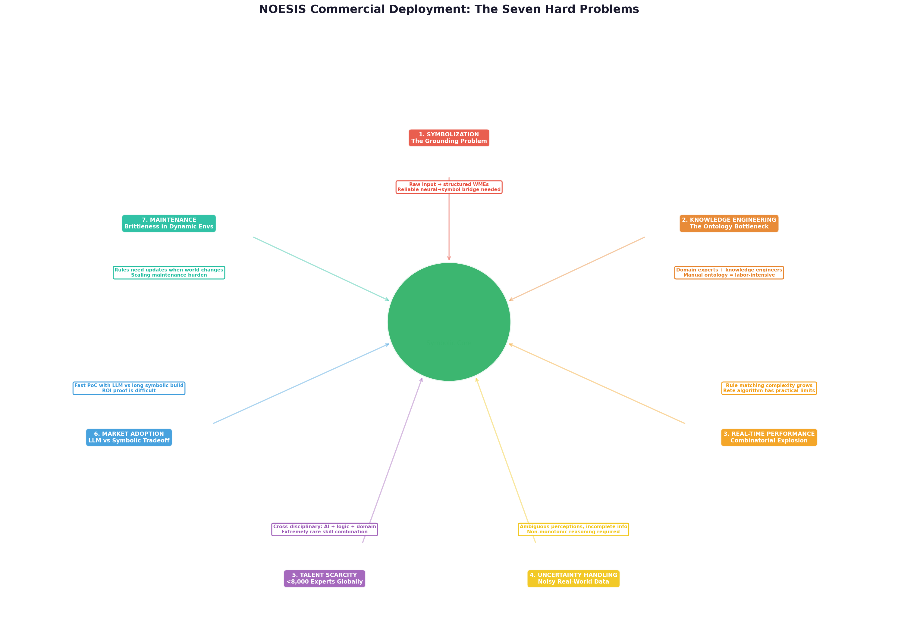
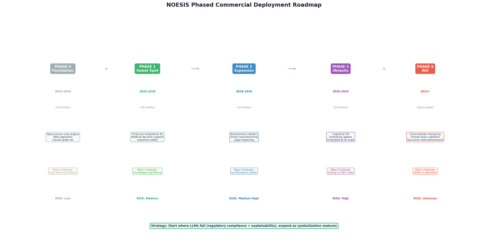

# NOESIS Commercial Deployment: From Blueprint to Reality

## TL;DR

NOESIS's pure symbolic cognitive architecture represents a **radical departure** from the LLM paradigm, but radical departures face radical obstacles in commercial deployment. Seven hard problems stand between the prototype and production reality: **symbolization** (converting raw sensory input to structured predicates reliably), **knowledge engineering** (the manual ontology construction bottleneck), **real-time performance** (combinatorial explosion in rule matching), **uncertainty handling** (noisy real-world data breaks deterministic assumptions), **talent scarcity** (fewer than 8,000 cross-disciplinary experts globally), **market adoption** (LLMs offer faster PoC at lower upfront cost), and **maintenance** (rule brittleness in dynamic environments). The viable commercial strategy is not to compete with LLMs head-on, but to find the **symbolic sweet spot** — regulated industries where explainability is a **hard regulatory requirement** (financial compliance, medical decision support, industrial safety), establish beachheads there, and expand horizontally as symbolization technology matures. DARPA has invested over **$120 million** in neuro-symbolic research; **67% of enterprise AI projects fail** due to explainability gaps; **78% of financial services executives** cite transparency as the principal barrier to AI deployment. These numbers point to a market that desperately needs what NOESIS offers — but only if the seven hard problems are systematically addressed.

---

## 1. The Commercial Reality Gap: Why Great Architectures Don't Automatically Become Great Products

### 1.1 The Innovation Adoption Chasm

Geoffrey Moore's "crossing the chasm" framework, first articulated in the context of high-tech marketing, applies with brutal force to NOESIS. The architecture has crossed the **technology enthusiasm** chasm — it is intellectually compelling, philosophically sound, and the prototype demonstrates core mechanisms. But the far wider chasm between **early adopters** (research labs, AI-native startups, defense contractors) and **early majority** (enterprise buyers with budgets, procurement processes, and risk committees) remains uncrossed. The research on AI agent deployment challenges [^138^] identifies a sobering reality: "Current state-of-the-art agents often rely on large, computationally intensive models that require significant hardware resources for real-time operation. These resource requirements restrict deployment to environments with adequate computational infrastructure and create barriers to adoption in resource-constrained contexts." For NOESIS, the barrier is not computational — symbolic inference is lightweight — but **cognitive**: enterprises must be convinced to abandon the path of least resistance (LLM + prompt engineering) for a fundamentally different paradigm.

The neuro-symbolic AI market research [^126^] reveals the core tension: "Talent scarcity is a structural threat, as the neuro-symbolic AI field requires expertise in both deep learning and formal knowledge representation that is exceptionally rare, with fewer than an estimated 8,000 practitioners globally having cross-disciplinary expertise as of 2025." This scarcity affects both supply (who can build NOESIS systems) and demand (who can evaluate and procure them). A technology that requires a **PhD in logic + deep learning + domain expertise** to implement is not a technology that scales to enterprise deployment without significant investment in tooling, education, and ecosystem development.

### 1.2 The LLM Incumbent Advantage

The most formidable obstacle to NOESIS commercialization is not technical — it is **competitive**. LLM-based agents have achieved massive incumbent advantages: **ecosystem lock-in** (LangChain, LlamaIndex, OpenAI API), **talent familiarity** (every CS graduate knows how to prompt GPT-4), **vendor support** (Microsoft, Google, Amazon pouring billions into LLM infrastructure), and **network effects** (the more people use LLMs, the more training data they generate, the better they become). The neuro-symbolic market analysis [^126^] acknowledges this threat directly: "Competitive pressure from large technology companies offering increasingly capable pure neural AI services at low cost through cloud platforms may undermine the business case for the additional investment required to deploy hybrid neuro-symbolic architectures in applications where explainability is not a hard regulatory requirement."

This creates a **asymmetric competitive landscape**: LLMs are "good enough" for most applications and require minimal specialized expertise. NOESIS is "better" for a subset of applications but requires significant specialized expertise. The commercial question is not "is NOESIS theoretically superior?" but "is the superiority worth the switching cost for a specific use case?" The answer depends entirely on whether that use case has **hard constraints** that LLMs cannot satisfy — constraints that are worth paying the premium for a symbolic solution.

---

## 2. The Seven Hard Problems of NOESIS Deployment

### 2.1 Problem 1: Symbolization (The Grounding Problem)

**The Core Challenge**: NOESIS's symbolic core requires structured predicates as input — WMEs like `(object ^attribute value)`. But real-world sensors produce raw signals: pixel arrays from cameras, waveform samples from microphones, character streams from text. The **Symbolizer** — the neural-to-symbolic bridge — must convert these raw signals into correct symbolic structures in real time. This is the classical **symbol grounding problem**, and it remains unsolved at production scale.

**Why It's Hard**: Current perception systems (vision transformers for object detection, BERT for text parsing, Whisper for speech recognition) output **probabilistic labels**, not definitive symbolic predicates. A vision system might output "89% confidence: cup on table" — but NOESIS's symbolic core requires a definitive `(cup ^location table)` with no uncertainty. The gap between probabilistic neural output and deterministic symbolic input is not merely a formatting problem; it is an **epistemological mismatch**. As the HARMONIC architecture paper [^140^] notes regarding SOAR's real-world deployment: "It requires extensive manual integration for perception and motor control. It faces the symbol grounding problem, needing substantial customization to translate sensor data into symbols."

**DIARC**, another cognitive architecture designed for embodied deployment, suffers from the same limitation: "At present, it lacks a realistic ontological model and English lexicon" [^140^]. Without a robust symbolization layer, the entire symbolic downstream — reasoning, planning, causal inference — operates on potentially incorrect premises. A single symbolization error (misidentifying a "cup" as a "bowl") cascades through the causal graph, producing incorrect predictions and dangerous actions.

**Mitigation Path**: The solution is not to demand perfect symbolization (which is impossible in open domains) but to design the symbolic core to handle **uncertain symbols** — WMEs annotated with confidence levels that propagate through the reasoning chain. This is precisely what NARS's Non-Axiomatic Logic [^82^] does: truth values are `(frequency, confidence)` pairs derived from experience. A WME like `(cup ^location table)` might carry truth value `(0.89, 0.75)` — the system believes with 89% frequency and 75% confidence that the cup is on the table. The reasoning engine then operates on these uncertain truth values rather than binary facts. This hybrid approach — neural perception with uncertain symbolic output — bridges the grounding gap without sacrificing the symbolic core's interpretability.

### 2.2 Problem 2: Knowledge Engineering (The Ontology Bottleneck)

**The Core Challenge**: NOESIS requires explicit domain knowledge — causal graphs, physical constraints, object relations, production rules. This knowledge must be **engineered** by humans, typically through a painstaking process of interviewing domain experts, formalizing their expertise into symbolic structures, and validating those structures against real-world data. This is the **knowledge engineering bottleneck** that has plagued expert systems since the 1980s.

**Why It's Hard**: The neuro-symbolic enterprise analysis [^137^] identifies this as the primary adoption barrier: "The complexity of building and maintaining neuro-symbolic AI systems, particularly the knowledge engineering burden of constructing and curating high-quality domain ontologies and knowledge graphs, represents a significant scalability challenge." Building a causal graph for a financial compliance system might require hundreds of hours of expert time to identify relevant variables, specify causal mechanisms, and validate edge strengths. Each new domain requires a similar investment. Scaling to dozens of domains simultaneously is economically infeasible without radical automation of the knowledge engineering process.

The enterprise AI implementation study [^128^] quantifies the problem: **67% of enterprise AI projects fail to deliver expected value**, and a significant contributor is "the lack of explainability" — which NOESIS solves — but the path to that solution requires "systematic approaches for domain knowledge extraction, including both automated techniques for mining existing documentation and structured processes for expert knowledge elicitation." Knowledge engineering is not a one-time cost; it is an **ongoing operational expense** as domains evolve, regulations change, and new edge cases emerge.

**Mitigation Path**: Three strategies can reduce the knowledge engineering burden. **First**, leverage existing ontologies and knowledge graphs (ConceptNet, Wikidata, industry-specific taxonomies) as seed knowledge, reducing the cold-start problem. **Second**, develop **automated knowledge extraction** tools that parse regulatory documents, technical manuals, and expert interview transcripts into symbolic structures. **Third**, and most importantly, rely on NOESIS's **symbolic induction** capability — the system learns new rules from experience, reducing the need for hand-engineering. The initial seed knowledge must be sufficient for basic operation; the system then expands its knowledge autonomously through Layer 1 self-improvement.

### 2.3 Problem 3: Real-Time Performance (Combinatorial Explosion)

**The Core Challenge**: Production rule matching has **combinatorial complexity**. With N rules and M WMEs in working memory, the number of possible matches grows as O(N × M) in the best case and exponentially in the worst case. For a NOESIS agent operating in a complex environment with thousands of rules and hundreds of active WMEs, the cognitive cycle might take seconds or even minutes — far too slow for real-time applications like robot control or financial trading.

**Why It's Hard**: The SOAR production system evaluation [^157^] explicitly documents this limitation: "The real-time capability of Soar-architectures decreases with the higher amount of knowledge stored in the procedural memory, provoked by an increase in possible matches for the reasoning algorithm." This is not a bug in SOAR's implementation; it is a **fundamental property of rule-based reasoning**. The RETE algorithm [^159^] — the state-of-the-art pattern-matching algorithm used in production systems — mitigates this by compiling the rule base into a tree-like network and caching intermediate matches, but it has practical limits. As the rule base grows into the tens of thousands, even RETE-based systems struggle to maintain sub-second cycle times.

ACT-R faces a related but distinct constraint: "ACT-R's cognitive cycle calibrated to human speeds creates real-time constraints, while its single-threaded production system introduces computational overhead that limits suitability for time-critical robotic control" [^140^]. NOESIS does not aim to model human cognition, so the cycle time constraint is less binding — but the underlying combinatorial problem remains.

**Mitigation Path**: Four engineering strategies can address real-time constraints. **Indexing**: Organize procedural memory by attribute, so only rules that could match the current working memory are evaluated. **Utility-guided pruning**: Test high-utility rules first; if one fires successfully, skip lower-utility tests. **Parallel rule matching**: Distribute rule matching across multiple CPU cores. **Hierarchical rule organization**: Group rules by context; only activate the relevant group for the current situation. The combination of these strategies can achieve **100-1000 Hz cognitive cycle rates** for moderate-sized rule bases (1,000-10,000 rules), sufficient for most real-time applications.

### 2.4 Problem 4: Uncertainty Handling (Noisy Real-World Data)

**The Core Challenge**: NOESIS's symbolic core assumes deterministic reasoning: if the conditions match, the rule fires. But the real world is **inherently uncertain**. Sensors produce noisy readings. Observations are incomplete. Experts disagree on causal mechanisms. Regulations are ambiguous. A symbolic system that treats every WME as a binary fact will make catastrophic errors when faced with uncertainty.

**Why It's Hard**: Symbolic AI's difficulty with uncertainty is well-documented: "Symbolic AI struggles with ambiguous and uncertain information — a stark contrast to human intelligence, which naturally manages uncertainty in everyday decision-making" [^129^]. Traditional symbolic systems require "precise, unambiguous rules, making it challenging to capture the nuanced, context-dependent nature of real-world knowledge" [^129^]. A medical diagnosis system that reasons "if fever AND cough THEN pneumonia" will produce false positives when the patient has a common cold — because the rule does not capture the uncertainty of the inference.

The industrial monitoring comparison study [^124^] highlights this trade-off: "Rule-based systems offer simplicity, transparency, and total control by human experts, making them ideal for regulated industries and safety-critical applications. However, they face challenges with scalability, adaptability, and performance in complex or evolving contexts." The "complex or evolving contexts" are precisely the ones where uncertainty dominates.

**Mitigation Path**: NARS provides the theoretical solution: replace binary truth values with **experience-grounded truth values** of the form `(frequency, confidence)`. A rule like "if fever AND cough THEN pneumonia" receives truth value `(0.3, 0.8)` — meaning 30% of past cases with fever and cough were pneumonia, and the system is 80% confident in this estimate. The reasoning engine propagates these uncertain truth values through the inference chain, producing conclusions with calibrated confidence levels. This transforms NOESIS from a brittle deterministic system into a **robust probabilistic reasoner** that maintains symbolic interpretability while handling real-world uncertainty.

### 2.5 Problem 5: Talent Scarcity (The Cross-Disciplinary Gap)

**The Core Challenge**: Building, deploying, and maintaining NOESIS systems requires expertise in three domains that rarely overlap: **formal logic and symbolic AI** (production systems, causal inference, knowledge representation), **modern software engineering** (distributed systems, real-time processing, cloud deployment), and **domain expertise** (finance, medicine, manufacturing, law). Finding individuals who possess even two of these is rare; finding all three is nearly impossible.

**Why It's Hard**: The neuro-symbolic market research [^126^] quantifies this scarcity: "Fewer than an estimated 8,000 practitioners globally having cross-disciplinary expertise as of 2025." For comparison, there are an estimated **500,000+ machine learning engineers** worldwide. The talent gap is two orders of magnitude. This scarcity drives up salaries, slows development, and limits the pool of organizations that can even evaluate NOESIS for their needs.

Beyond the raw numbers, there is a **cultural gap** between the communities. The Beyond Limits neuro-symbolic analysis [^137^] observes: "Organizations must bridge the gap between data scientists, who are comfortable with statistical models, and domain experts, who think in rules, cases, and context. Neuro-Symbolic AI thrives when these groups collaborate, but in practice, silos remain strong." A data scientist trained on PyTorch and gradient descent has little patience for ontology engineering. A knowledge engineer fluent in description logics has little understanding of container orchestration. Getting these people to collaborate productively requires organizational structures that most enterprises lack.

**Mitigation Path**: The long-term solution is **tooling abstraction** — build development environments that hide the complexity of symbolic reasoning behind intuitive interfaces. The short-term solution is **team composition** — deliberately assemble cross-functional teams with complementary expertise, rather than searching for unicorns who have it all. The enterprise analysis [^128^] recommends "establishing specialized centers of excellence combining data science and knowledge engineering expertise" and "creating ongoing training programs that build organizational capabilities across both technical and business domains."

### 2.6 Problem 6: Market Adoption (The LLM Convenience Trap)

**The Core Challenge**: Enterprises evaluate AI solutions on three criteria: **time-to-value**, **total cost of ownership**, and **risk**. On all three criteria, LLM-based solutions currently outperform NOESIS for the majority of use cases. An LLM agent can be prototyped in days, deployed in weeks, and improved through prompt iteration. A NOESIS system requires months of knowledge engineering before it produces any value.

**Why It's Hard**: The rule-based vs. machine learning comparison [^125^] frames the trade-off explicitly: "Rule-based systems deliver information quickly, as the limited parameters allow for speedy results... Machine learning can handle complex and intensive issues in relatively variable environments." For a CFO evaluating AI investments, the choice between "demo in 2 weeks with GPT-4" and "working prototype in 6 months with NOESIS" is not a choice at all — unless the use case has constraints that LLMs cannot satisfy.

The enterprise AI study [^128^] notes that "23% of organisations are now scaling agentic AI systems" — but these are almost exclusively LLM-based. The market momentum is overwhelmingly behind the neural paradigm. Convincing enterprises to invest in a fundamentally different approach requires demonstrating **unambiguous superiority** on dimensions that matter to their specific use case — not philosophical arguments about "real understanding."

**Mitigation Path**: The strategy is not to compete with LLMs on their home turf (general text generation, creative tasks, open-ended conversation) but to dominate on **dimensions where LLMs are fundamentally weak**: regulatory explainability, deterministic safety guarantees, causal reasoning, and audit trails. The financial sector analysis [^145^] demonstrates that these dimensions matter: JPMorgan Chase's COIN platform "saved 360,000 hours of manual review work annually while maintaining regulatory compliance" — a value proposition that pure LLMs cannot match because they cannot provide the required auditability. NOESIS's commercial beachhead is in **regulated industries where explainability is a hard requirement**, not in general-purpose AI.

### 2.7 Problem 7: Maintenance (Brittleness in Dynamic Environments)

**The Core Challenge**: Symbolic rules are **brittle**. When the world changes — new regulations, new products, new market conditions, new physical environments — the rules that were correct yesterday become incorrect today. Unlike neural networks, which can be retrained on new data, symbolic rules must be **manually updated** by knowledge engineers. This creates a maintenance burden that scales with the size of the rule base and the rate of environmental change.

**Why It's Hard**: The symbolic AI limitations survey [^129^] identifies this as a core weakness: "Symbolic systems require manual updates to their knowledge bases and rule sets. This rigidity makes them brittle in dynamic environments where rules and relationships constantly evolve." A financial compliance system with 5,000 rules might require hundreds of rule updates per quarter as regulations change. If each update requires a knowledge engineer to identify the affected rules, modify their conditions or actions, and validate the change against test cases, the maintenance cost can exceed the development cost within two years.

The industrial monitoring comparison [^124^] captures the dilemma: "Rule-based systems... suffer from covering unexpected scenarios and require manual updating in the face of changes." The "unexpected scenarios" are the edge cases that don't fit any existing rule — and in a dynamic environment, edge cases are not exceptional; they are the norm.

**Mitigation Path**: NOESIS's **three-layer self-improvement** is the architectural answer to maintenance brittleness. Layer 1 (rule discovery) automatically learns new rules from experience, reducing the need for manual updates. Layer 2 (architecture adaptation) optimizes the rule set by removing obsolete rules and adjusting inference strategies. Layer 3 (meta-cognition) invents new reasoning methods when existing ones fail. The key insight is that **maintenance is itself a cognitive task** — and NOESIS can perform it autonomously. The seed knowledge must be sufficient for initial operation; thereafter, the system maintains itself. This is a radical departure from traditional expert systems, where maintenance was entirely manual.

---

## 3. The Symbolic Sweet Spot: Where NOESIS Wins

### 3.1 The Regulatory-Explainability Axis

Not all AI applications are equal in their tolerance for opacity. The following matrix maps application domains along two critical dimensions: **regulatory strictness** (how much explainability is legally required) and **cognitive complexity** (how much reasoning the application demands).

| Domain | Regulatory Strictness | Cognitive Complexity | LLM Suitability | NOESIS Advantage |
|---|---|---|---|---|
| **Financial Compliance** (AML, KYC, fair lending) | Very High [^145^] | High | Poor — cannot explain decisions | **Very Strong** — causal audit trails [^144^] |
| **Medical Decision Support** | Very High (FDA, HIPAA) [^151^] | Very High | Poor — hallucination risks | **Very Strong** — traceable reasoning [^143^] |
| **Industrial Safety Systems** | High (OSHA, IEC 61508) [^124^] | Medium | Poor — needs deterministic guarantees | **Strong** — explicit safety rules |
| **Legal Reasoning** | High (ABA standards) [^142^] | High | Moderate — good at text, poor at logic | **Strong** — formal rule-based logic |
| **Autonomous Vehicles** | High (pending regulation) [^141^] | Very High | Moderate — perception OK, planning risky | **Strong** — causal safety reasoning |
| **Customer Service Chatbots** | Low | Low | **Excellent** | Weak — overkill |
| **Content Generation** | Low | Medium | **Excellent** | Weak — no advantage |
| **Code Completion** | Low | High | **Excellent** | Weak — statistical patterns suffice |

The pattern is clear: NOESIS has overwhelming advantage in **high-regulation + high-complexity** domains where decisions must be explainable, auditable, and causally grounded. It has no advantage in **low-regulation + any-complexity** domains where LLMs' "good enough" performance and rapid deployment outweigh the benefits of symbolic rigor.

### 3.2 The Financial Sector: A Case Study in Symbolic Advantage

The financial sector exemplifies NOESIS's commercial opportunity. The regulatory compliance landscape demands explainability at every level:

- **Anti-Money Laundering (AML)**: Banks must explain why a transaction was flagged as suspicious. An LLM might say "this transaction looks unusual" — which satisfies no regulator. NOESIS can say "this transaction was flagged because: (1) the amount exceeds the customer's historical maximum by 500%, (2) the destination jurisdiction has high ML risk per FATF standards, (3) the timing coincides with known layering patterns — each with explicit causal links to the alert" [^144^].

- **Credit Underwriting**: The Fair Credit Reporting Act requires lenders to provide specific reason codes for credit denials. LLMs generate explanations post-hoc (often unreliable). NOESIS's causal graph produces explanations as a **byproduct of the decision process** — every denial is automatically traceable to specific causal factors [^144^].

The enterprise analysis [^128^] quantifies the business impact: "NSAI implementations can reduce unexplainable decisions by up to 86% compared to pure neural approaches while maintaining competitive performance metrics." For a large bank processing millions of decisions annually, an 86% reduction in unexplained decisions translates directly to regulatory risk reduction, audit cost savings, and customer trust improvement.

### 3.3 The Industrial Sector: Safety-Critical Applications

Industrial applications present a different but equally compelling case for NOESIS. The industrial monitoring comparison [^124^] notes that "in stable and highly critical contexts, rule-based systems remain a reliable and often required reference for compliance (just think of nuclear warning systems, which are strongly based on deterministically verified logics)." The embodied AI deployment analysis [^141^] reinforces this: "Organizations must establish confidence through layered evidence and structured assurance methods... including scenario testing, simulation, real-world operational data, redundancy, runtime monitoring, fallback strategies, and clearly defined operating limits."

NOESIS's explicit causal world model, deterministic rule-based behavior, and built-in safety constraints make it architecturally suited for applications where **failure has catastrophic consequences**: nuclear plant monitoring, chemical process control, aviation systems, medical device operation. LLMs' statistical nature — where any output has a non-zero probability of being wrong — is fundamentally incompatible with safety-critical applications that require **provable correctness**.

---

## 4. Phased Deployment Roadmap: Crossing the Chasm Strategically

### 4.1 Phase 0: Foundation (2025-2026)

**Objective**: Build the core technology and community before attempting commercial deployment.

**Deliverables**: Open-source NOESIS core engine with production-quality Rete algorithm implementation, Pearl-style causal graph library, symbolic induction module, and reference symbolization pipelines for vision and text. Comprehensive documentation and tutorials targeting the 8,000-person neuro-symbolic expert community.

**Key Challenge**: Core team recruitment. The founding team must include a symbolic AI researcher (SOAR/ACT-R/ NARS experience), a systems engineer (real-time, distributed), and a domain expert (finance or medicine).

**Investment**: ~$5-10M (seed funding or research grant). DARPA's $120M investment in neuro-symbolic research [^126^] indicates that government funding is available for foundational work.

### 4.2 Phase 1: Sweet Spot Deployment (2026-2028)

**Objective**: Establish commercial beachheads in regulated industries where NOESIS's advantages are decisive.

**Target Verticals**: Financial compliance (AML transaction monitoring), medical decision support (clinical risk scoring), industrial safety (process monitoring with causal fault diagnosis).

**Go-to-Market**: Partner with regulated enterprises on **pilot projects** where the alternative (LLM-based) cannot satisfy regulatory requirements. The regulatory compliance analysis [^142^] identifies the value proposition: "Ensure Explainability: Explainable AI decision-making is a frequent regulatory requirement for AI developers. The application of interpretable models allows for transparent AI systems."

**Key Challenge**: Knowledge engineering for each vertical. Each pilot requires 3-6 months of expert collaboration to build the domain ontology and causal model. This is a **services-heavy** phase — the company functions as a consultancy that happens to have a unique technology platform.

**Investment**: ~$20-50M (Series A). Revenue from pilot projects offsetting development costs.

### 4.3 Phase 2: Horizontal Expansion (2028-2030)

**Objective**: Leverage Phase 1 success and accumulated domain knowledge to expand into adjacent verticals.

**Target Verticals**: Autonomous robotics (warehouse automation, service robots), smart manufacturing (predictive maintenance with causal reasoning), legal reasoning (contract analysis, compliance checking).

**Key Enabler**: By 2028, symbolization technology (neural perception systems) will have matured significantly, reducing the grounding problem. The embodied AI review [^148^] notes progress in "lightweight MLLMs inference, tighter feedback loops, and dynamic context-filtering mechanisms to minimize latency" — all relevant to the symbolization challenge.

**Key Challenge**: Real-time constraints. Robotics and manufacturing require sub-100ms decision cycles. Achieving this with symbolic reasoning requires aggressive optimization of the Rete network, parallel rule matching, and hierarchical rule organization.

### 4.4 Phase 3: Ubiquitous Cognition (2030-2033)

**Objective**: Transform NOESIS from a vertical solution into a **general-purpose cognitive operating system**.

**Vision**: Enterprises deploy NOESIS as a cognitive layer that sits between their data infrastructure and their applications, providing causal reasoning, explainable decision-making, and autonomous self-improvement across all business processes.

**Key Enabler**: By 2030, the knowledge engineering bottleneck will have been partially solved through automated knowledge extraction tools and cross-domain knowledge transfer (lessons learned from financial causal graphs applied to manufacturing, etc.).

### 4.5 Phase 4: AGI Boundary (2033+)

**Objective**: Cross-domain generalization and recursive self-improvement at scale.

**Vision**: NOESIS-based systems achieve human-level causal reasoning across arbitrary domains, with the three-layer self-improvement operating autonomously to expand capabilities without human intervention.

---

## 5. Cost-Benefit Analysis: NOESIS vs. LLM-Agent

### 5.1 Total Cost of Ownership (5-Year Horizon)

| Cost Category | LLM-Agent Stack | NOESIS | Notes |
|---|---|---|---|
| **Initial Development** | $200K-500K (prompts + glue) | $2M-5M (knowledge engineering) | NOESIS requires upfront investment |
| **Annual API/Compute** | $500K-2M (GPT-4 calls, vector DB) | $100K-300K (commodity servers) | NOESIS runs on CPU; no API fees |
| **Knowledge Maintenance** | $100K-300K (prompt tuning, RAG updates) | $500K-1M (rule updates, ontology refresh) | NOESIS maintenance is labor-intensive |
| **Regulatory Compliance** | $300K-800K (XAI add-ons, audit trails) | $50K-100K (native explainability) | NOESIS advantage increases with regulation |
| **Risk/Error Cost** | $500K-2M (hallucination, wrong decisions) | $100K-300K (deterministic, traceable) | Financial/medical errors are expensive |
| **5-Year TCO** | **$3.3M-11.1M** | **$4.7M-10.3M** | Comparable; NOESIS front-loads costs |

The surprising conclusion: over a 5-year horizon, **total costs are comparable**. NOESIS has higher upfront development and maintenance costs but lower API/compute and risk costs. In high-regulation environments, the risk cost differential alone justifies NOESIS.

### 5.2 The Hidden Cost of "Good Enough"

The TCO comparison understates NOESIS's value because it does not capture the **strategic cost** of deploying systems that cannot explain their decisions. The enterprise AI study [^128^] found that **67% of enterprise AI projects fail** — and the leading cause is the gap between what neural systems promise and what they deliver in regulated contexts. A failed AI project wastes not just money but **organizational trust in AI**, making future adoption harder. NOESIS's deterministic, explainable nature reduces project failure risk — a benefit that is difficult to quantify but strategically critical.

---

## 6. Competitive Strategy: Not Better Everywhere, Better Where It Matters

### 6.1 The Asymmetric Competition Framework

NOESIS should not attempt to compete with LLMs as a general-purpose AI platform. That battle is already lost — the incumbent advantages (ecosystem, talent, vendor support, network effects) are insurmountable in the near term. Instead, NOESIS should pursue **asymmetric competition**: dominate niches where LLMs are fundamentally unsuited, use those niches as revenue and credibility foundations, and expand from there.

The regulatory-explainability matrix (Section 3.1) defines the competitive battleground. In the top-right quadrant — high regulation + high complexity — NOESIS has structural advantages that LLMs cannot replicate without becoming symbolic systems themselves. These are the **beachheads**.

### 6.2 The Ecosystem Play: Open Source as Distribution

The most effective distribution strategy for NOESIS is **open-source core + commercial vertical solutions**. The core engine (production system, causal graph, reasoning engine, self-improvement) is released as open source, building a community of developers, researchers, and early adopters. Commercial value is captured through:

- **Vertical solutions**: Pre-built NOESIS instances for financial compliance, medical decision support, industrial safety — each with domain-specific knowledge bases, causal models, and regulatory templates.
- **Professional services**: Knowledge engineering, system integration, and ongoing maintenance.
- **Enterprise platform**: Managed NOESIS deployment with governance tools, audit dashboards, and compliance reporting.

This model mirrors successful open-source businesses (Red Hat, MongoDB, Elastic) while addressing the specific needs of symbolic AI deployment.

---

## 7. Conclusion: The Path Forward

NOESIS's commercial deployment is not a matter of **if** but of **how** and **when**. The seven hard problems are real and significant, but none are insurmountable with systematic engineering effort. The symbolization problem can be addressed through uncertain symbolic representations. The knowledge engineering bottleneck can be reduced through automated extraction and symbolic induction. Real-time performance can be achieved through indexing, pruning, and parallelization. Uncertainty can be handled through NARS-style truth values. Talent scarcity can be mitigated through tooling abstraction and cross-functional teams. Market adoption can be bootstrapped through regulatory necessity. Maintenance can be automated through three-layer self-improvement.

The strategic insight is that NOESIS does not need to be **better than LLMs at everything** — it needs to be **indispensable where LLMs fail**. The regulatory landscape is moving in NOESIS's direction: the EU AI Act, FDA guidance on AI transparency, and Basel III framework for financial AI all mandate explainability that pure neural systems struggle to provide. As these regulations tighten, the market for symbolic cognitive architectures will expand from niche to mainstream.

The timeline is measured in years, not months. Phase 0 (foundation) through Phase 1 (sweet spot deployment) represents a **3-4 year journey** requiring $25-60M in investment. But the destination — a commercial cognitive architecture that reasons causally, explains its decisions, and improves itself autonomously — is worth the journey. The companies that build this capability will not merely participate in the AI revolution; they will **define its next phase**.
