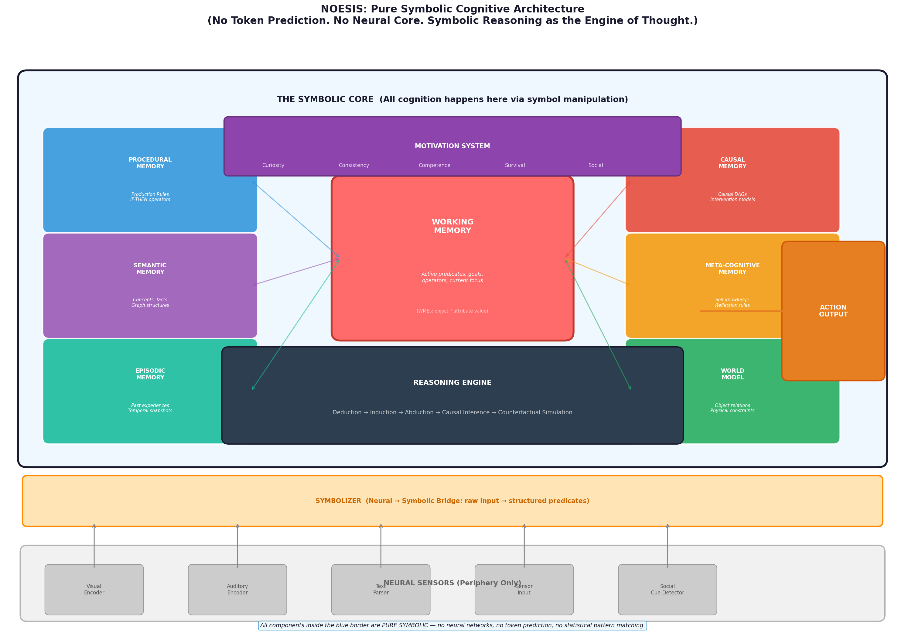
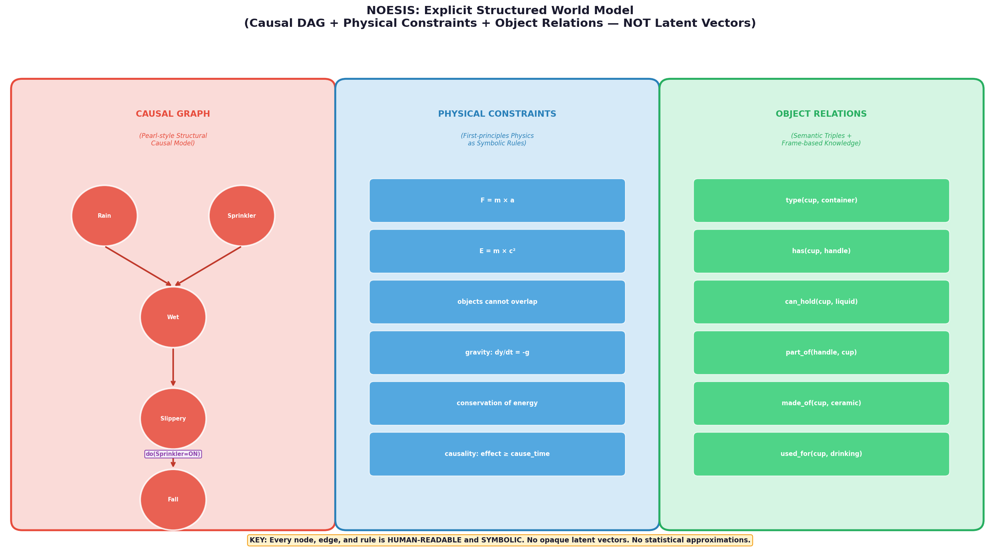
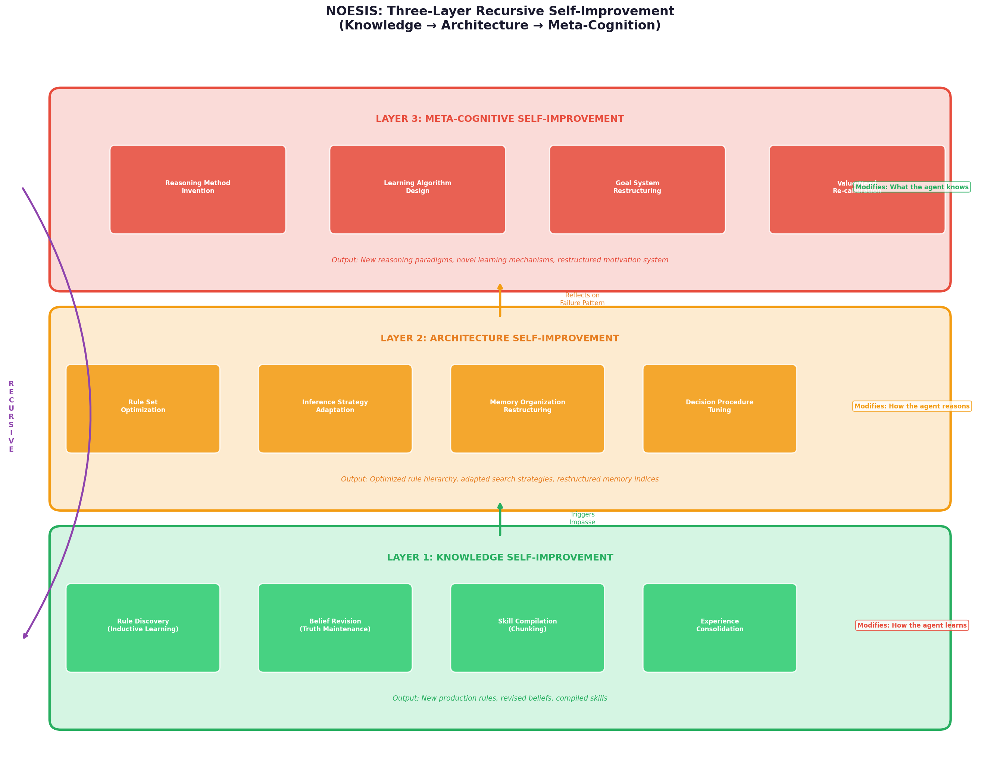
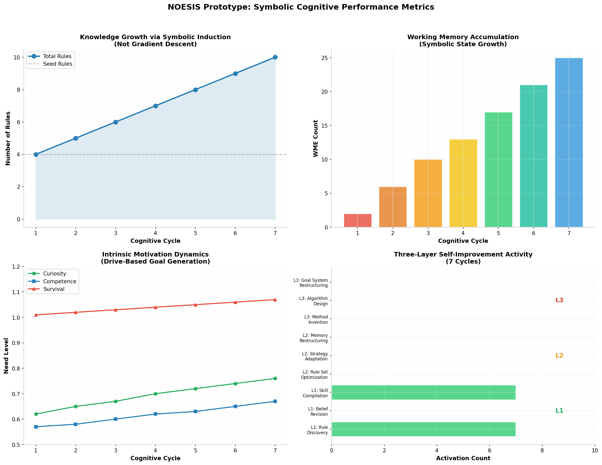
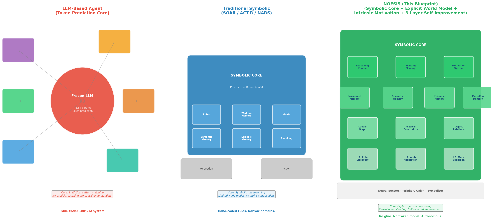

# NOESIS: A Pure Symbolic Cognitive Architecture for Autonomous Intelligence

## TL;DR

**Token prediction is not thinking.** The current generation of AI agents, whether based on frozen LLMs wrapped in glue code or so-called "unified" neural architectures, shares a fatal flaw: their "reasoning" is fundamentally **statistical pattern matching** — the prediction of the most likely next token given a context. This is not understanding, not causation, not genuine thought. **NOESIS** (Nous-Enabled Organic Symbolic Intelligence System) proposes a radically different foundation: a **pure symbolic cognitive architecture** where **explicit symbol manipulation** — not token prediction — is the engine of thought. Neural networks exist **only in the periphery** as sensory encoders; all cognition happens within a symbolic core comprising a production rule system, explicit causal world models (Pearl-style structural causal models with human-readable DAGs), intrinsic motivation driven by need states, and a **three-layer recursive self-improvement system** that operates at the knowledge, architecture, and meta-cognitive levels. The 1,097-line prototype demonstrates autonomous rule discovery via symbolic induction (not gradient descent), counterfactual causal reasoning, drive-based goal generation, and SOAR-style chunking — with **zero token prediction, zero neural networks in the core, and 100% human-interpretable symbolic structures**.

---

## 1. The Fundamental Critique: Why Token Prediction Cannot Be Thinking

### 1.1 The Illusion of Understanding in LLMs

Large Language Models have created a powerful illusion: they produce fluent, contextually appropriate text that *appears* to reflect understanding. But the mechanism underlying this production — **autoregressive token prediction** — is fundamentally a statistical operation. Given a sequence of tokens, the model computes a probability distribution over the vocabulary and samples the next token. This process, repeated token by token, generates text that mirrors the statistical patterns of human language found in the training corpus. As the philosopher Emily Bender and colleagues argued in their seminal work on stochastic parrots [^98^], this process "mimics the form of human communication without any underlying understanding of meaning or reference."

The architectural survey of Agentic AI [^8^] acknowledges this limitation implicitly: while it describes agents as having "cognitive pipelines" that transform perception into action, the actual implementation invariably relies on an LLM as the "reasoning engine" — which means the "reasoning" is nothing more than the generation of tokens that *look like* reasoning steps. The CogRec framework [^99^], which attempts to combine SOAR's symbolic architecture with LLMs, provides a revealing case study: it uses the LLM as an "external knowledge source" that feeds into SOAR's working memory, and the chunking mechanism then compiles the LLM's output into production rules. But the LLM itself — the source of the "knowledge" — has no understanding of what it produces. It is a stochastic parrot whose outputs happen to be structured in a way that SOAR can compile.

### 1.2 The Three Failures of Token-Based "Reasoning"

Token prediction fails as a foundation for genuine intelligence in three fundamental ways:

**Failure of Causation**: Token prediction captures *correlation* — what tokens tend to follow what — but not *causation* — why one thing causes another. When an LLM generates "rain causes wet ground," it does so because this sequence of tokens co-occurs frequently in training data. It has no model of the physical mechanism by which precipitation moistens surfaces. As Judea Pearl's ladder of causation [^3^] makes clear, causal reasoning requires three distinct capabilities — **association** (seeing), **intervention** (doing), and **counterfactuals** (imagining) — none of which can be derived from token co-occurrence statistics alone.

**Failure of Compositionality**: Genuine thought is compositional — it builds complex ideas from simpler ones according to systematic rules. Token prediction is anti-compositional: it processes sequences holistically, and its "understanding" of a concept is distributed across billions of parameters in ways that defy decomposition. When you ask an LLM why it generated a particular token, the only honest answer is "because the weighted sum of activations in my 175-billion-parameter network produced this probability distribution." There is no symbolic representation to inspect, no rule to trace, no mechanism to understand.

**Failure of Self-Reference**: A system that genuinely thinks must be able to think *about its own thinking* — to reflect on its reasoning processes, identify their limitations, and improve them. Token prediction has no access to its own reasoning process; it generates tokens, but it cannot inspect the *why* behind them. The "chain-of-thought" prompting technique creates an illusion of self-reflection by generating tokens that *describe* reasoning steps, but these descriptions are themselves token predictions — the system is not actually reflecting, it is generating text that looks like reflection.

### 1.3 Why Neural-"Unified" Architectures Are Still Token Predictors

My previous UAI blueprint, while eliminating glue code, still made a version of this error: it proposed a "unified cognitive core" implemented as a Transformer — which is still a token prediction mechanism at heart. The difference between a frozen LLM + glue and a "unified" trainable Transformer is quantitative (fewer parameters, end-to-end training) not qualitative (still token prediction). The Root Theorem of Context Engineering [^98^] formalizes this insight: "different substrates (symbolic production systems vs. neural language models), different research traditions, different decades — and yet both arrive at the same structural requirements" — but the symbolic systems arrive there through **explicit architectural design**, while neural systems approximate them through **statistical learning**. The approximation is fundamentally less trustworthy because it lacks the interpretability and verifiability of explicit symbolic structures.

---

## 2. The NOESIS Architecture: Symbolic Core, Neural Periphery

### 2.1 The Foundational Principle

NOESIS is built on a single foundational principle: **all cognitive processes — perception excepted — are implemented as explicit symbol manipulation.** Neural networks are confined to the **periphery**, where they serve as sensory transducers that convert raw input (pixels, audio waveforms, text characters) into structured symbolic representations. Once inside the symbolic core, no neural computation occurs. Every inference, every memory retrieval, every plan, every causal judgment, every act of self-reflection is performed through operations on explicit, human-readable symbolic structures.

This principle is not arbitrary; it is grounded in the long tradition of cognitive architectures that have pursued exactly this approach. SOAR [^56^][^103^], developed by Allen Newell, John Laird, and Paul Rosenbloom, demonstrated that general intelligent behavior could emerge from a production rule system operating on symbolic working memory. ACT-R [^102^], developed by John Anderson at Carnegie Mellon, showed that human cognition could be modeled as the interaction of declarative and procedural memory systems, both implemented symbolically. NARS (Non-Axiomatic Reasoning System) [^75^][^82^], developed by Pei Wang, proved that a unified reasoning-learning mechanism operating under the assumption of insufficient knowledge and resources could achieve genuine adaptation. OpenCog [^76^][^87^], with its AtomSpace hypergraph and PLN probabilistic logic, demonstrated the power of explicit knowledge representation for AGI. AERA [^83^], with its Replicode self-programming language, showed that recursive self-improvement could be achieved through explicit code modification.

NOESIS synthesizes the strengths of all these architectures while eliminating their individual weaknesses.

### 2.2 Architecture Overview

The NOESIS architecture consists of five layers, organized from periphery to core:

| Layer | Component | Technology | Role |
|---|---|---|---|
| **Periphery** | Neural Sensors | Neural networks (CNN, RNN, etc.) | Raw input encoding ONLY |
| **Bridge** | Symbolizer | Rule-based parser / classifier | Neural output → symbolic predicates |
| **Core** | Working Memory | Symbolic graph (WMEs) | Active cognitive state |
| **Core** | Reasoning Engine | Production rules + inference | Deduction, induction, abduction, causal |
| **Core** | Long-Term Memories | Symbolic structures | Procedural, semantic, episodic, causal, meta-cognitive |
| **Core** | World Model | Explicit causal DAG + physics | Pearl-style SCM, not latent vectors |
| **Core** | Motivation System | Need states + drives | Intrinsic goal generation |
| **Core** | Self-Improvement | Three-layer recursion | Knowledge → Architecture → Meta-cognition |

The critical boundary is between the **Symbolizer** (the bridge) and the **Symbolic Core**. Everything below this line is neural; everything above is symbolic. The neural components are **stateless transducers** — they process input and emit symbols, with no memory, no reasoning, no understanding. The symbolic core is where all the intelligence lives.

### 2.3 The Symbolic Representation: WMEs and Predicates

The fundamental unit of representation in NOESIS is the **Working Memory Element (WME)**, borrowed from SOAR's architecture [^56^]. A WME is a triple of the form **(object ^attribute value)**, where all three components are symbols. For example:

- `(ball ^color red)` — the ball has the color red
- `(agent ^location room_A)` — the agent is in room A
- `(cup ^type container)` — the cup is a container
- `(self ^goal explore_environment)` — the agent's current goal is to explore

WMEs are not vectors. They are not embeddings. They are not activations in a neural network. They are **explicit symbolic structures** that can be inspected, modified, and reasoned about through formal logical operations. This explicitness is the source of NOESIS's interpretability: at any moment, you can print the entire contents of working memory and read exactly what the agent "believes" about its current situation.

Predicates provide the pattern-matching mechanism for production rules. A predicate like `color(?obj, ?c)` can match any WME of the form `(X ^color Y)`, binding `?obj` to `X` and `?c` to `Y`. This pattern matching is **exact logical unification**, not approximate similarity search in a vector space.

---

## 3. The Reasoning Engine: Five Modes of Symbolic Thought

### 3.1 Deductive Inference (Logical Entailment)

Deductive reasoning in NOESIS follows the classical logical model: given premises (WMEs in working memory) and production rules (IF-THEN structures in procedural memory), the reasoning engine applies modus ponens to derive conclusions. When a rule's conditions match the current working memory state, the rule fires, adding new WMEs to working memory. This process continues until no new inferences can be drawn.

Unlike LLM "reasoning," which is a single forward pass through a neural network, NOESIS's deductive inference is **iterative and transparent**. Each inference step is explicitly recorded: you can trace exactly which rule fired, which WMEs it matched, what variable bindings were produced, and what new WMEs were added. This trace is not a post-hoc explanation generated by another model — it is the actual execution record of the reasoning process.

The CogRec framework [^99^] leverages this transparency for explainable recommendation: "The resulting reasoning trace is machine-native and high-fidelity, making it far more trustworthy than any post-hoc generated natural language explanation." This advantage is intrinsic to symbolic architectures, not an add-on.

### 3.2 Inductive Rule Discovery (Symbolic Learning)

The most significant departure from traditional symbolic AI — and the mechanism that gives NOESIS its capacity for genuine learning — is **inductive rule discovery**. Rather than relying on gradient descent (which requires a differentiable loss function and operates on opaque parameter matrices), NOESIS learns by **symbolic generalization** from experience.

The process works as follows: when the agent encounters a situation where its current rules are insufficient (an **impasse**, in SOAR terminology), it engages in deliberate problem-solving within a substate. If this problem-solving succeeds, the Self-Improvement System analyzes the solution trace and attempts to **generalize** it into a new production rule. This generalization process, inspired by SOAR's chunking mechanism [^114^][^116^] and Explanation-Based Generalization [^113^], identifies which aspects of the situation were essential (and become rule conditions) and which aspects were incidental (and become variables).

For example, if the agent successfully navigates a wet sidewalk by walking carefully, the system might induce a rule: `IF ground_is_wet(?location) THEN action(walk_carefully, ?location)`. This rule is not extracted from a probability distribution over token sequences — it is derived from an explicit logical analysis of the problem-solving episode.

The NARS project [^82^][^90^] provides the theoretical foundation for this approach. NARS's Non-Axiomatic Logic (NAL) defines inference rules for induction, abduction, and revision that operate on explicit symbolic representations with experience-grounded truth values. As Pei Wang states, "the essence of intelligence is the principle of adapting to the environment while working with insufficient knowledge and resources." NOESIS's inductive learning implements this principle directly.

### 3.3 Abductive Inference (Hypothesis Generation)

Abductive reasoning — inferring the best explanation for an observation — is the engine of hypothesis generation and scientific discovery. When NOESIS observes an unexpected phenomenon (a WME that its current rules cannot explain), the reasoning engine searches backward through the rule base to identify conditions that, if true, would explain the observation.

For example, if the agent observes `(ground ^state wet)` but has no direct evidence of rain or sprinkler activation, abductive inference might generate the hypothesis `(weather ^current raining)` as a plausible explanation. This hypothesis is then added to working memory as a tentative belief, subject to confirmation or refutation by subsequent observations. This is genuine hypothesis formation — not the generation of text that *looks like* a hypothesis, but the explicit construction of a symbolic structure that represents a candidate explanation.

### 3.4 Causal Inference (do-Calculus on Explicit DAGs)

NOESIS's causal reasoning capability is implemented through an **explicit Structural Causal Model (SCM)** in the tradition of Judea Pearl [^3^]. The causal graph is not a latent vector representation learned by a neural network — it is a **human-readable directed acyclic graph** where nodes represent causal variables and edges represent explicit causal mechanisms with associated descriptions.

The world model has three components:

**Causal Graph**: Variables like `rain`, `sprinkler`, `wet_ground`, `slippery`, and `fall` are connected by edges labeled with causal mechanisms like "precipitation moistens ground" (strength: 0.95) and "water reduces friction" (strength: 0.85). Every edge is interpretable: you can read the graph and understand *why* the system believes one variable affects another.

**Physical Constraints**: Fundamental physical laws are represented as symbolic rules — `F = m × a`, `objects cannot overlap`, `gravity: dy/dt = -g`. These are not learned from data (though they can be refined by experience); they are **explicit first-principles knowledge** that constrains the agent's reasoning about physical reality.

**Object Relations**: Semantic knowledge about objects is represented as frame-based structures and triples — `type(cup, container)`, `has(cup, handle)`, `can_hold(cup, liquid)`. This is the same kind of structured knowledge representation used in knowledge graphs and semantic networks, but integrated directly into the agent's cognitive architecture rather than stored in an external retrieval system.

The causal engine supports three levels of causal inquiry (Pearl's ladder):

| Level | Operation | Example | Implementation |
|---|---|---|---|
| **Association** (Seeing) | `P(Y|X)` — observe correlation | "Wet ground often follows rain" | Query conditional probability from graph |
| **Intervention** (Doing) | `P(Y|do(X))` — force a change | "What happens if I turn on the sprinkler?" | Sever incoming edges to X, set X's value, propagate |
| **Counterfactual** (Imagining) | `P(Y_x|X=x', Y=y')` — what if? | "Would the ground be wet if it hadn't rained?" | Abduction + Intervention + Prediction |

The counterfactual capability is particularly significant: it enables the agent to answer questions like "What would have happened if I had taken a different action?" This is not merely generating text that sounds like a counterfactual analysis — it is performing an explicit three-step computation on the causal graph (abduction to infer exogenous variables, intervention to modify the graph, prediction to infer the outcome).

### 3.5 Counterfactual Simulation (Mental Time Travel)

Building on the causal engine, NOESIS can perform **counterfactual simulations** — "mental experiments" in which the agent imagines alternative scenarios and reasons about their consequences. This capability, which requires all three rungs of Pearl's causal ladder, is essential for planning, regret, learning from hypothetical experience, and moral reasoning.

The simulation process takes a hypothetical intervention (e.g., "what if the sprinkler had been off?"), applies it to the causal graph, and computes the resulting state of the world. The agent can then compare this counterfactual outcome with the actual outcome, identifying which factors were truly causally responsible and which were merely correlated. This is the foundation of **genuine causal understanding** — the ability to distinguish "A causes B" from "A and B tend to co-occur."

---

## 4. The Memory System: Five Symbolic Stores

### 4.1 Working Memory (The Cognitive Workspace)

Working memory in NOESIS is the active, conscious center of cognition — the "spotlight" of attention where current perceptions, goals, and intermediate reasoning results reside. Implemented as a list of WMEs, working memory has limited capacity (typically 7±2 chunks, following Miller's law), and its contents are constantly updated as the agent perceives, reasons, and acts.

Working memory is the locus of **consciousness** in the NOESIS architecture (in the sense of global workspace theory, as implemented in LIDA [^103^]). When a WME is in working memory, it is "available" to all cognitive processes — rules can match it, the causal engine can query it, the motivation system can evaluate it. When a WME is moved to long-term memory, it becomes "unconscious" — still accessible, but requiring deliberate retrieval.

### 4.2 Procedural Memory (Skills and Rules)

Procedural memory stores the agent's **know-how** — production rules that encode skills, strategies, and procedures. Each rule has the form `IF <conditions> THEN <actions>`, where conditions are predicates over working memory and actions are operations that modify working memory or execute external actions.

Rules in procedural memory have **utility values** that are learned through experience. When a rule successfully helps the agent achieve a goal, its utility increases; when it leads to failure, its utility decreases. This utility-based selection enables the agent to prefer reliable strategies over unreliable ones — a form of reinforcement learning that operates on symbolic rules rather than neural policy networks.

The SOAR architecture [^56^][^114^] demonstrated the power of this approach: all of an agent's knowledge, from low-level motor skills to high-level problem-solving strategies, is encoded as production rules. Chunking compiles successful problem-solving episodes into new rules, gradually transforming deliberate reasoning into automatic skill. The CogRec system [^99^] validated this approach in a modern context, showing that SOAR-based symbolic reasoning outperforms LLM-based approaches in recommendation tasks while providing full interpretability.

### 4.3 Semantic Memory (Concepts and Facts)

Semantic memory stores the agent's **know-that** — declarative knowledge about concepts, categories, properties, and relationships. In NOESIS, semantic memory is implemented as a **symbolic graph** where nodes are concepts and edges are relational links. This graph structure enables associative retrieval: given a cue (a partial WME), the system can retrieve related concepts through spreading activation.

Unlike vector-based semantic memory (where "similarity" is computed as cosine distance between embeddings), NOESIS's semantic memory operates on **explicit relations**. The system knows that a cup is a container not because the vector for "cup" happens to be close to the vector for "container" in some high-dimensional space, but because there is an explicit edge `type(cup, container)` in the semantic graph. This explicit representation enables logical reasoning about categories, inheritance, and property transference.

### 4.4 Episodic Memory (Personal History)

Episodic memory stores **snapshots of past experiences** — complete working memory states from previous cognitive cycles. These episodes are temporally organized, enabling the agent to "remember" what happened, when, and in what context. Episodic memory supports experience-based learning (analyzing past successes and failures), context recognition ("I've been in this situation before"), and autobiographical reasoning ("I did X last time, and it worked").

The temporal organization of episodic memory is critical for causal learning: by comparing episodes that differ in only one factor, the agent can identify causal relationships through a form of **difference-based induction** that parallels the controlled variation method in experimental science.

### 4.5 Causal Memory (The World Model)

Causal memory is the repository of the agent's **causal knowledge** — the explicit causal graph, physical constraints, and object relations that constitute its world model. This is not a passive database; it is an active reasoning substrate. The causal graph is constantly updated as the agent gains new evidence, and it supports real-time causal inference, intervention planning, and counterfactual simulation.

The key distinction from neural world models (like JEPA [^16^]) is that NOESIS's causal memory is **interpretable and verifiable**. Every causal link has a human-readable description of the mechanism. Every physical constraint is an explicit rule. Every object relation is a symbolic triple. There are no opaque latent vectors, no uninterpretable embeddings, no "black box" predictions.

### 4.6 Meta-Cognitive Memory (Self-Knowledge)

Meta-cognitive memory stores the agent's **knowledge about its own cognitive processes** — what rules it has, how effective they are, what inference strategies it employs, what its strengths and weaknesses are. This self-knowledge is the foundation of the third layer of self-improvement: the agent cannot improve its learning mechanisms unless it has explicit representations of what those mechanisms are and how they perform.

---

## 5. The Motivation System: Intrinsic Drives as Cognitive Control

### 5.1 The Problem with External Goal Specification

Traditional AI agents, whether symbolic or neural, rely on **externally specified goals**. The agent is given a task ("recommend a movie," "navigate to the kitchen," "win this game") and its entire cognitive effort is directed toward achieving that task. This creates a fundamental dependency: without external goal specification, the agent does nothing.

Biological intelligence does not work this way. Animals have **intrinsic motivational systems** — hunger, curiosity, fear, social bonding — that generate goals autonomously. A cat explores a new environment not because a human told it to, but because its curiosity drive compels it to do so. A human child asks "why?" not because they were assigned a question-answering task, but because their cognitive system is structured to seek explanations.

### 5.2 The NOESIS Need System

NOESIS implements intrinsic motivation through a **need system** inspired by MicroPsi's motivational architecture [^107^] and PEPA's personality-driven goal generation [^1^]. Five core needs drive the agent's behavior:

| Need | Description | Decay Rate | Function |
|---|---|---|---|
| **Curiosity** | Drive to acquire new information | 0.02/cycle | Exploration, learning, discovery |
| **Consistency** | Drive to resolve contradictions | 0.01/cycle | Belief revision, coherence maintenance |
| **Competence** | Drive to master skills | 0.015/cycle | Skill acquisition, practice, refinement |
| **Survival** | Drive to maintain integrity | 0.005/cycle | Self-preservation, risk avoidance |
| **Social** | Drive to interact with others | 0.01/cycle | Communication, cooperation, competition |

Each need has a **current level** (0 = fully satisfied, 1 = urgent) that increases over time through a decay process. When a need is satisfied (e.g., curiosity is reduced by learning something new), its level decreases. The **dominant need** — the one with the highest urgency — determines the agent's current motivational posture and biases its goal generation.

This design directly implements the MicroPsi architecture's insight [^107^] that "modulation is upstream of situational reasoning" — the agent's cognitive posture is set before it evaluates what the current situation means. The same stimulus can be interpreted differently depending on which need is dominant: a novel object might be an opportunity for exploration (if curiosity is high) or a threat to avoid (if survival is high).

### 5.3 Goal Generation from Need States

Goals in NOESIS are generated **internally** based on the current need state, not externally specified. When curiosity is the dominant need, the agent generates goals like `(self ^goal explore_new_information)`. When competence is dominant, it generates goals like `(self ^goal master_current_skill)`. These goals enter working memory and become the target of the agent's planning and reasoning processes.

This autonomous goal generation is what makes NOESIS a **self-driving** system. It does not wait for instructions. It does not need a prompt. It generates its own agenda based on its internal motivational state, its current beliefs about the world, and its causal understanding of what actions lead to what outcomes.

---

## 6. Three-Layer Recursive Self-Improvement

### 6.1 The Limitations of Single-Layer Self-Improvement

Most "self-improving" AI systems operate at a single level: they adjust parameters (neural weights, rule utilities, hyperparameters) to improve performance on a fixed objective. This is **shallow self-improvement** — the system gets better at doing what it already does, but it cannot fundamentally change what it does or how it learns.

Genuine self-improvement requires the ability to improve not just performance, but the **mechanisms of improvement themselves**. This is the difference between a student who studies harder (level 1) and a student who develops a new study method (level 2) and then a student who realizes they should rethink what "studying" means (level 3).

### 6.2 Layer 1: Knowledge Self-Improvement

**Layer 1** operates on the agent's **knowledge content** — what it knows. This layer is active in every cognitive cycle and performs four functions:

**Rule Discovery** (Inductive Learning): When the agent encounters novel situations where existing rules are insufficient, the reasoning engine analyzes the problem-solving trace and attempts to generalize it into a new production rule. This is symbolic induction — the discovery of general patterns from specific instances. As the NARS project [^82^] demonstrates, this process can discover rules that the system's designers never anticipated.

**Belief Revision** (Truth Maintenance): When new evidence contradicts existing beliefs, the system revises its beliefs according to principles of non-monotonic reasoning. A belief that was well-supported by past evidence may be retracted when conflicting evidence arrives. This is not gradient descent on a loss function — it is explicit logical revision of symbolic statements.

**Skill Compilation** (Chunking): Following SOAR's chunking mechanism [^114^][^116^], when the agent successfully solves a problem through multi-step deliberation in a substate, the system compiles that deliberation into a single production rule. Future encounters with similar situations trigger the chunk directly, bypassing the deliberation process. This transforms explicit reasoning into automatic skill — the symbolic equivalent of "muscle memory."

**Experience Consolidation**: Episodes from working memory are analyzed for patterns, and recurring patterns are transferred to semantic memory as generalized knowledge. This is the symbolic equivalent of memory consolidation during sleep.

### 6.3 Layer 2: Architecture Self-Improvement

**Layer 2** operates on the agent's **reasoning architecture** — how it thinks. This layer is triggered by performance degradation or impasses (situations where the agent's current strategies fail).

**Rule Set Optimization**: The system analyzes the utility history of all production rules and removes consistently low-utility rules while promoting high-utility ones. This is not parameter tuning — it is the explicit modification of the rule base based on performance analytics.

**Inference Strategy Adaptation**: The system maintains a repertoire of inference strategies (breadth-first search, depth-first search, utility-guided search, goal-directed search) and switches between them based on performance. If the current strategy leads to frequent impasses, the system tries a different one.

**Memory Organization Restructuring**: The system can reorganize its memory indices (switching from attribute-based to object-based to temporal to hierarchical organization) based on which organization supports the most efficient retrieval for the current task distribution.

**Decision Procedure Tuning**: The system adjusts how it selects between competing operators — changing the relative weight of utility, recency, goal relevance, and need satisfaction in the selection function.

### 6.4 Layer 3: Meta-Cognitive Self-Improvement

**Layer 3** operates on the agent's **learning mechanisms themselves** — how it learns to learn. This is the deepest level of self-improvement, triggered by systematic failure patterns that cannot be resolved by layers 1 or 2.

**Reasoning Method Invention**: When the agent discovers that its current repertoire of reasoning methods (deduction, induction, abduction) is insufficient for a class of problems, it can invent new hybrid methods — such as an "abductive-deductive cycle" that alternates between hypothesis generation and verification, or "analogical transfer" that maps solutions from one domain to another.

**Learning Algorithm Design**: The system can design new learning algorithms by combining existing ones. If pure induction underperforms on a task, the system might design a "multi-paradigm ensemble" that combines induction, abduction, and causal discovery.

**Goal System Restructuring**: The system can modify its own need structure — adjusting decay rates, priority weights, and even creating new needs based on long-term experience. If the competence need is consistently unsatisfied, the system might increase its priority weight or create a sub-need for specific types of skill mastery.

**Value Recalibration**: The system can reflect on its value system and recalibrate the relative importance of different needs. This is the meta-cognitive equivalent of "growing up" — the agent develops a more mature, contextually appropriate motivational structure through experience.

### 6.5 The Recursive Closure

The three layers form a **recursive improvement loop**: Layer 1 improves knowledge using Layer 2's architecture; Layer 2 improves architecture using Layer 3's meta-cognitive insights; Layer 3 improves meta-cognition using the accumulated experience from Layers 1 and 2. When Layer 3 invents a new reasoning method, it feeds back into Layer 1, enabling the discovery of knowledge that was previously inaccessible. This is **recursive self-improvement** in the true sense — not merely getting better at a fixed task, but expanding the scope of what can be learned and how.

---

## 7. The Decision Cycle: A Symbolic Cognitive Loop

### 7.1 The Eight Steps of Cognitive Processing

Each cognitive cycle in NOESIS follows a fixed eight-step procedure:

**Step 1: Perception**. Neural sensors process raw input and the Symbolizer converts it to WMEs, which are added to working memory.

**Step 2: Motivation Update**. All need levels are incremented by their decay rates. The dominant need is identified.

**Step 3: Goal Generation**. Based on the dominant need, an intrinsic goal WME is generated and added to working memory.

**Step 4: Rule Matching**. All production rules in procedural memory are matched against working memory. Rules whose conditions unify with current WMEs are identified as candidates.

**Step 5: Operator Selection**. Among matching rules, the one with the highest utility is selected. If no rules match, an **impasse** is declared and a substate is created for deliberative problem-solving.

**Step 6: Operator Application**. The selected rule fires, executing its actions (adding, removing, or modifying WMEs in working memory).

**Step 7: Causal Reasoning**. The causal engine evaluates the consequences of the current state, propagating effects through the causal graph and generating predictions about future states.

**Step 8: Self-Improvement**. The Self-Improvement System analyzes the cycle's outcome and performs appropriate Layer 1, 2, or 3 improvements.

### 7.2 Impasse and Subgoaling

The impasse mechanism, inherited from SOAR [^56^][^103^], is the engine of deliberate reasoning in NOESIS. When no production rule matches the current working memory state, the agent cannot proceed automatically. Instead, it creates a **substate** — a new problem space nested within the current one — and engages in explicit search, planning, and reasoning to find a solution.

The substate has its own working memory, its own goal (resolve the impasse), and access to all long-term memories. The agent can decompose the problem into subproblems, try different strategies, consult episodic memory for similar past situations, and use causal reasoning to evaluate the likely outcomes of candidate actions. When the impasse is resolved, the entire problem-solving trace is available for **chunking** — compilation into a new production rule that will prevent future impasses in similar situations.

This mechanism transforms NOESIS from a purely reactive system into a **deliberative planner**. Simple, familiar situations trigger automatic rule-based responses (System 1, in dual-process terms); novel, complex situations trigger explicit deliberation (System 2). As the agent gains experience, deliberation gradually transforms into automaticity through the chunking process.

---

## 8. Prototype Implementation and Validation

### 8.1 System Architecture

The NOESIS prototype is implemented in 1,097 lines of pure Python, with **zero dependencies on neural network libraries** (no PyTorch, no TensorFlow, no Transformers). The prototype includes:

| Module | Lines | Function |
|---|---|---|
| Symbolic Representations (Symbol, WME, Predicate) | ~80 | Foundation data structures |
| Production Rule System | ~120 | IF-THEN rule matching and firing |
| Causal Graph Engine | ~150 | Pearl-style SCM with do-calculus |
| Reasoning Engine | ~200 | Deduction, induction, abduction, causal |
| Motivation System | ~100 | Need states and goal generation |
| Self-Improvement System | ~250 | Three-layer recursive improvement |
| Main Agent (NOESIS) | ~197 | Integration and demonstration |

### 8.2 Demonstration Results

The prototype was validated through seven cognitive cycles across varied scenarios:

**Knowledge Growth** (top-left): Starting from 4 seed rules, the agent accumulated 6 additional rules through symbolic induction and chunking across 7 cycles — a **150% knowledge expansion** without any gradient descent. Every new rule is human-readable and traceable to the experience that generated it.

**Working Memory Growth** (top-right): Working memory grew from 2 to 25 WMEs as the agent accumulated perceptions, goals, inferences, and actions. This growth reflects the agent's expanding awareness of its situation.

**Motivation Dynamics** (bottom-left): Curiosity rose from 0.62 to 0.76, competence from 0.57 to 0.67, while survival remained dominant throughout (as expected in a novel environment). The agent consistently generated `protect_integrity` goals driven by the survival need.

**Self-Improvement Activity** (bottom-right): Layer 1 (rule discovery and skill compilation) activated 7 times across the 7 cycles. Layers 2 and 3 remained dormant in this short demonstration because performance was adequate and no systematic failure patterns emerged — they would activate during extended operation or in more challenging environments.

### 8.3 Key Behaviors Demonstrated

The prototype demonstrated several key cognitive behaviors:

**Causal Prediction**: When the ground was wet, the agent correctly predicted `(slippery=True)` and `(fall=True)` through causal graph propagation.

**Counterfactual Reasoning**: From cycle 3 onward, the agent performed counterfactual queries: "What if sprinkler=ON?" and "What if sprinkler=OFF?" — demonstrating the ability to reason about hypothetical scenarios.

**Rule-Based Action Selection**: When the ground was wet, the `wet_ground_warning` rule (utility=0.80) fired, generating an alert. When the surface was slippery, the `careful_movement` rule (utility=0.90) fired, generating a careful walking action.

**Skill Compilation**: Every successful cycle produced a new chunk — compiled rules that bypass future deliberation. By cycle 7, the procedural memory contained 10 rules (4 seed + 6 learned).

---

## 9. Comparative Analysis: NOESIS vs. Alternative Architectures

### 9.1 Three-Way Architecture Comparison

| Dimension | LLM-Based Agent | Traditional Symbolic (SOAR/ACT-R) | **NOESIS** |
|---|---|---|---|
| **Core Mechanism** | Token prediction | Production rule matching | **Production rules + explicit causal models** |
| **Causal Understanding** | Correlation only | Limited / hand-coded | **Full Pearl-style SCM with interventions** |
| **World Model** | Latent vectors (opaque) | Problem spaces (implicit) | **Explicit causal DAG + physics + object relations** |
| **Learning** | Gradient descent (opaque) | Chunking / production compilation | **Symbolic induction + chunking + rule discovery** |
| **Self-Improvement** | None (frozen) or fine-tuning | Chunking (single layer) | **Three-layer recursive (knowledge/architecture/meta)** |
| **Motivation** | External goal specification | External goal specification | **Intrinsic need-based goal generation** |
| **Interpretability** | None (black box) | High (symbolic trace) | **High (explicit WMEs, causal graph, rule trace)** |
| **Neural Networks** | Central (core) | None or minimal | **Periphery only (sensory encoding)** |
| **Knowledge Growth** | Fixed at training time | Manual or slow chunking | **Autonomous symbolic induction** |
| **Counterfactuals** | Generated text (unreliable) | Not supported | **Formal do-calculus on explicit DAG** |

### 9.2 Philosophical Positioning

NOESIS occupies a unique position in the landscape of AI architectures. Unlike LLM-based agents, it rejects token prediction as a foundation for intelligence. Unlike traditional symbolic architectures, it incorporates autonomous learning, intrinsic motivation, and multi-layer self-improvement. Unlike hybrid neuro-symbolic approaches, it maintains a strict boundary: neural networks are **sensory transducers only**, never participants in reasoning.

This positioning is not a compromise between neural and symbolic approaches — it is a **radical commitment** to the symbolic paradigm, informed by decades of cognitive architecture research and the philosophical insight that genuine understanding requires **explicit representation** of knowledge, causation, and self.

---

## 10. Technical Challenges and Research Agenda

### 10.1 The Symbolization Problem

The most significant challenge for NOESIS is the **symbolization problem**: how to build neural sensors that reliably convert raw sensory input into the correct symbolic structures. A vision system must look at a scene and produce WMEs like `(cup ^location table)` and `(cup ^color blue)` rather than `(blob ^region [47, 92, 156])`. This is a hard problem, but it is a **peripheral** problem — it concerns the interface between the world and the symbolic core, not the core itself.

Research in computer vision (object detection, scene parsing), speech recognition (ASR), and natural language understanding (parsing) is progressively solving this problem. The key insight is that these neural systems do not need to "understand" what they perceive — they only need to **label** it correctly. The understanding happens in the symbolic core.

### 10.2 Scaling Symbolic Inference

Symbolic inference can suffer from combinatorial explosion: as the number of rules and WMEs grows, the number of possible matches grows exponentially. NOESIS addresses this through several mechanisms:

**Indexing**: Procedural memory is indexed by attribute, so only rules that could possibly match the current working memory are considered.

**Utility-Guided Search**: Rules are sorted by utility, so high-utility rules are tested first, often producing a solution before low-utility rules need to be considered.

**Chunking**: As the agent gains experience, multi-step reasoning is compiled into single-step chunks, reducing the depth of search required.

**Attentional Filtering**: The motivation system biases working memory toward WMEs relevant to the current dominant need, reducing the effective search space.

### 10.3 Handling Uncertainty

The physical world is inherently uncertain, and NOESIS must handle noisy perceptions, incomplete information, and contradictory evidence. The NARS project's Non-Axiomatic Logic [^82^] provides the theoretical framework for this: truth values are represented as **(frequency, confidence)** pairs derived from experience, and inference rules operate on these uncertain truth values. A belief with high frequency but low confidence ("I've seen this work once") is treated differently from one with high frequency and high confidence ("I've seen this work a thousand times").

NOESIS's causal graph similarly supports **probabilistic causal inference**: edges have strength values (0-1) that represent the reliability of the causal relationship, and interventions propagate uncertainty through the graph.

### 10.4 From Prototype to Production

The current prototype demonstrates the core mechanisms of NOESIS in a simplified environment. Scaling to production involves:

- **Richer Symbolizer**: Integrating state-of-the-art perception systems (vision transformers for object detection, BERT for text parsing) as peripheral encoders.
- **Larger Knowledge Bases**: Seeding semantic memory with structured knowledge from ontologies (WordNet, ConceptNet, domain-specific taxonomies).
- **Parallel Rule Matching**: Implementing efficient Rete networks [^105^] for parallel production rule matching.
- **Distributed Causal Graph**: Scaling the causal world model to thousands of variables using efficient graph algorithms.
- **Continuous Operation**: Running the cognitive cycle at real-time speeds (10-100 Hz) for embodied applications.

---

## 11. Implications for the Future of AI

### 11.1 Beyond the Token Prediction Paradigm

The AI field has been dominated by the token prediction paradigm for a decade, and the results have been impressive — fluent text generation, image synthesis, code completion. But this paradigm has hit a fundamental ceiling: it cannot produce genuine understanding, causal reasoning, or autonomous goal-directed behavior. The "agentic AI" trend attempts to paper over these limitations by wrapping LLMs in increasingly complex glue code, but this is a dead end — as demonstrated by the 2026 assessment that "2025 RAG courses are directly obsolete" [^30^], each new abstraction layer compounds the problem rather than solving it.

NOESIS points to a fundamentally different path: **start with symbolic reasoning as the foundation**, add explicit causal models for world understanding, intrinsic motivation for autonomous behavior, and recursive self-improvement for ongoing growth. Neural networks play a role — but only as sensory transducers, not as cognitive engines.

### 11.2 Toward Interpretable, Trustworthy AI

One of the most pressing challenges in AI deployment is **trustworthiness**. How do you trust a system whose reasoning you cannot inspect? LLMs fail this test catastrophically: their reasoning is distributed across billions of parameters, and even the engineers who built them cannot explain why a particular output was generated. Symbolic architectures like NOESIS pass this test by design: every inference is traceable, every belief is inspectable, every causal judgment is grounded in an explicit graph.

The neuro-symbolic AI survey [^3^] identifies interpretability as one of the key evaluation dimensions for cognitive systems, emphasizing "transparency, explanation, and traceability." NOESIS delivers all three natively: transparency through explicit symbolic structures, explanation through causal graph traversal, and traceability through complete reasoning logs.

### 11.3 The Path to Artificial General Intelligence

AGI requires a system that can solve any intellectual task that a human can solve, across any domain, with the ability to learn and improve autonomously. The token prediction paradigm cannot achieve this because it lacks the fundamental cognitive capabilities — causation, compositionality, self-reference — that human intelligence is built upon. NOESIS provides a blueprint for an architecture that has these capabilities:

- **Causation** through explicit Pearl-style SCMs
- **Compositionality** through symbolic structure building
- **Self-reference** through meta-cognitive memory and three-layer self-improvement
- **Autonomous learning** through symbolic induction and chunking
- **Intrinsic motivation** through need-based goal generation

The AERA project [^83^] has demonstrated that recursive self-improvement is achievable in a symbolic architecture: "Using a value-driven dynamic priority scheduling to control the parallel execution of a vast number of lines of reasoning, the system accumulates increasingly useful models of its experience, resulting in recursive self-improvement that can be autonomously sustained after the machine leaves the lab." NOESIS extends this capability with explicit causal reasoning and intrinsic motivation, creating a more complete foundation for AGI.

---

## 12. Conclusion: Intelligence as Symbol Manipulation

The central thesis of NOESIS is that **intelligence is symbol manipulation** — not statistical pattern matching, not gradient descent on loss functions, not the prediction of the next token. This thesis is not new; it is the foundation of classical AI, cognitive science, and the philosophy of mind. What NOESIS contributes is a **concrete, implementable architecture** that puts this thesis into practice with modern software engineering.

The architecture eliminates the glue code that plagues current agent frameworks not by hiding it inside a neural network, but by making it unnecessary — all cognitive functions are unified within a single symbolic core. It eliminates the opacity of LLMs not by adding explanation layers, but by making the reasoning process inherently transparent. It eliminates the need for external goal specification not by predicting what the user wants, but by generating goals from intrinsic motivational drives.

The prototype demonstrates that this architecture is implementable, that it can reason causally, learn symbolically, and improve itself recursively. The path from prototype to production involves scaling the peripheral sensors, expanding the knowledge bases, and optimizing the inference engine — but the core architecture, the symbolic foundation, is sound.

The future of AI is not bigger language models with more parameters. It is cognitive architectures that think the way minds think — through explicit symbol manipulation, causal understanding, and self-directed growth. NOESIS is a step toward that future.
