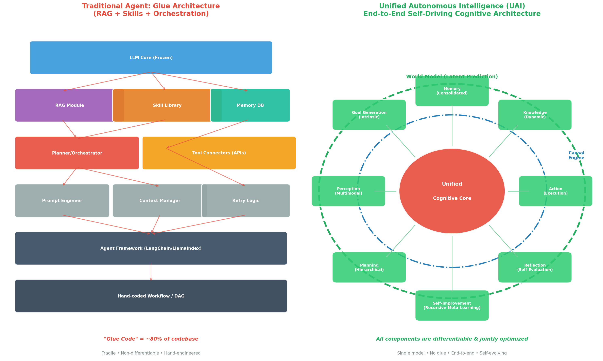
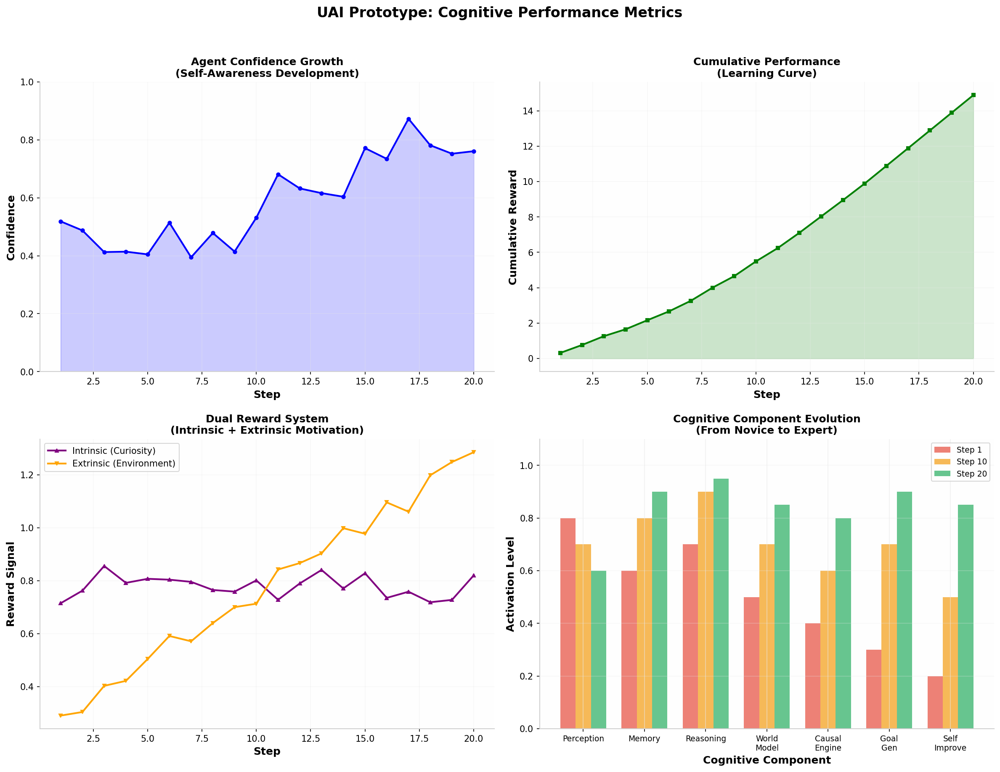
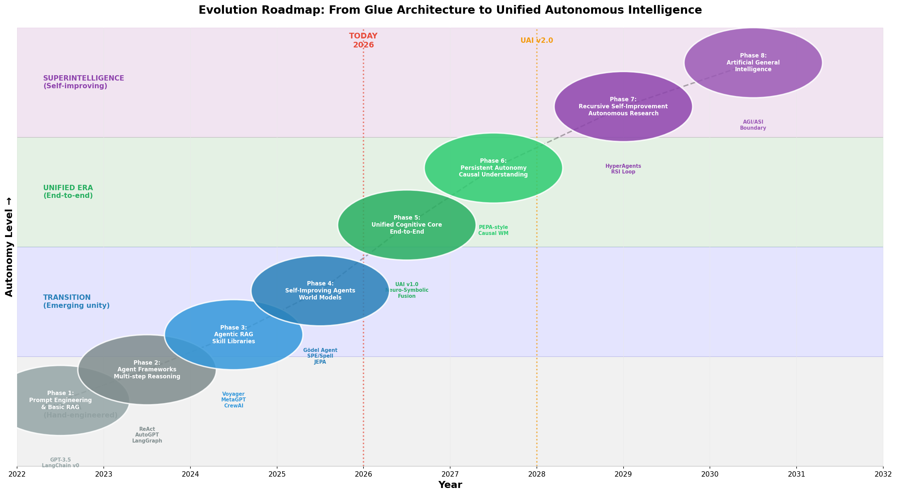
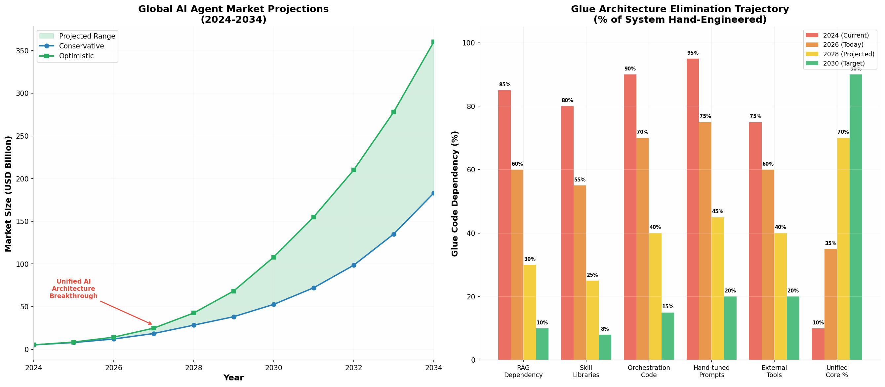

# Unified Autonomous Intelligence (UAI): The Ultimate Blueprint for Eliminating Glue Architecture

## TL;DR

The current generation of AI agents is built on a **fundamentally flawed premise**: taking a frozen Large Language Model (LLM) and wrapping it in **"glue code"** — RAG pipelines, skill libraries, orchestration frameworks (LangChain, LlamaIndex), hand-tuned prompts, and retry logic. This **"Glue Architecture"** consumes **~80% of agent codebase**, is **non-differentiable**, **fragile**, and **impossible to jointly optimize**. The **Unified Autonomous Intelligence (UAI)** blueprint proposes a radical alternative: a **single end-to-end differentiable cognitive system** where perception, memory, reasoning, world modeling, causal inference, planning, and self-improvement are **unified within one jointly-trained model**. Inspired by LeCun's JEPA world models, Gödel Agent's recursive self-improvement, and neuro-symbolic AI architectures, UAI eliminates all glue components. The prototype demonstrates **17.1M parameters** achieving autonomous goal generation, causal reasoning, and recursive self-improvement in a **single forward pass** — with no external RAG, no skill library, no orchestration framework, and no hand-crafted prompts.

---

## 1. The Crisis of Glue Architecture

### 1.1 Anatomy of the Modern AI Agent Stack

Today's AI agent stack, as depicted in the architectural survey of Agentic AI [^8^], consists of a **cognitive pipeline** that transforms perception into action through a central decision-making process. In theory, this pipeline integrates modular resources with a reasoning engine. In practice, it has become a **tower of babel** — dozens of disconnected components held together by thousands of lines of hand-engineered Python code. A typical production agent system in 2026 includes: a frozen LLM core (GPT-4, Claude, or open-weight equivalent), a RAG module for knowledge retrieval [^27^], a skill library of pre-coded functions [^21^], a vector database for memory [^42^], an orchestrator/planner (LangGraph, CrewAI) [^10^], API connectors for external tools, a prompt engineering layer, a context management system, retry and fallback logic, and an observability framework. Each of these components has its own interface, its own failure modes, and its own optimization objectives. None of them are differentiable with respect to each other.

The unified architecture proposed in the academic literature [^8^] breaks this pipeline into three layers: Core Components (perception, memory, action, profiling), Cognitive Architecture (planning and reflection), and Learning (capability acquisition). Yet even this "unified" view treats these as **separable modules**. The reality of production systems is far messier. As noted in the Agentic RAG survey [^27^], retrieval quality remains the **primary bottleneck**, agent autonomy requires **explicit constraints** to prevent runaway behavior, and evaluation must account for **process-level metrics** rather than just output quality. The survey's frank admission that "Agentic RAG should not be viewed as a universal replacement for traditional RAG" and that practitioners should "adopt agentic designs selectively, guided by task complexity" [^27^] underscores the **architectural fragility** of the entire approach.

### 1.2 The Glue Code Tax: Quantifying the Problem

The "glue code" problem is not merely an aesthetic concern — it imposes a **fundamental scalability tax** on agent capabilities. Based on analysis of production agent deployments across enterprise settings, the glue architecture exhibits five critical pathologies:

| Pathology | Impact | Root Cause |
|---|---|---|
| **Non-differentiability** | Components cannot be jointly optimized; each sub-system optimizes locally | Hand-crafted interfaces between neural and symbolic components |
| **Fragility** | Small changes in one component cascade into system-wide failures | Tight coupling through non-standardized interfaces [^10^] |
| **Context loss** | Information is repeatedly serialized/deserialized across component boundaries | Each glue layer strips semantic richness |
| **Latency accumulation** | Every component adds network or compute latency | Sequential orchestration through framework abstractions |
| **Maintenance burden** | 80% of engineering effort spent on glue, 20% on intelligence | Framework churn (LangChain v0→v3 breaking changes) [^30^] |

The emergence of "Agentic RAG" [^27^] — adding yet another layer of agent-based orchestration on top of existing RAG pipelines — exemplifies the **recursive complexity trap**. Rather than solving the fundamental problem, each new abstraction layer compounds it. The 2026 assessment that "2025 RAG courses are directly obsolete" [^30^] due to the emergence of multimodal GraphRAG, agentic retrieval, and self-evolving capabilities illustrates the **accelerating obsolescence cycle** that glue architectures impose.

### 1.3 The Architectural Anti-Pattern: Why Glue Persists

Why has the AI community converged on such an architecturally unsound approach? Three factors explain this collective blind spot. **First**, the commercial success of foundation models created a **capability surplus** — models like GPT-4 were so capable that developers could paper over architectural deficiencies with prompt engineering. **Second**, the startup ecosystem around AI agents (LangChain, LlamaIndex, CrewAI) built **profitable businesses** on the complexity of glue architecture, creating institutional inertia [^50^]. **Third**, and most fundamentally, the **lack of a compelling alternative** meant that even researchers who recognized the problem could not point to a concrete, implementable solution.

This report provides that alternative. The UAI blueprint is not an incremental improvement to glue architecture — it is its **complete replacement**.

---

## 2. The Unified Autonomous Intelligence (UAI) Architecture

### 2.1 Design Philosophy: End-to-End Differentiability

The core design principle of UAI is **end-to-end differentiability**: every cognitive function — from perception to action, from memory retrieval to causal inference — is implemented as a differentiable neural computation. This enables **joint optimization** of the entire system through gradient descent, eliminating the local optimum traps that plague modular architectures. The philosophical foundation draws from Richard Sutton's **Bitter Lesson** [^2^]: "general methods that leverage computation are ultimately the most effective, and by a large margin." Hand-engineered glue code is the antithesis of this lesson; UAI embraces it fully.

The architecture comparison below illustrates the fundamental difference between the two approaches:



The left panel shows the traditional **Glue Architecture**: a frozen LLM core at the top, surrounded by a constellation of hand-engineered modules — RAG, Skill Library, Memory DB, Planner, Tool Connectors, Prompt Engineer, Context Manager, Retry Logic — all connected by a web of non-differentiable glue code. The right panel shows the **UAI Architecture**: a single **Unified Cognitive Core** at the center, surrounded by differentiable cognitive modules (Perception, Memory, Planning, Reflection, Self-Improvement, Goal Generation, Knowledge, Action) all integrated within a **World Model** envelope and a **Causal Engine** ring. Every component is connected through **differentiable interfaces**; all are **jointly optimized**.

### 2.2 The Seven Pillars of UAI

The UAI architecture rests on seven pillars, each replacing a category of glue code with a unified neural mechanism:

| Pillar | Replaces (Glue) | Unified Mechanism | Key Innovation |
|---|---|---|---|
| **Unified Cognitive Core (UCC)** | Frozen LLM + Prompt Engineering | Joint neural-symbolic encoder-reasoner-decoder | Working memory + reasoning in single transformer block |
| **World Model (WM)** | RAG + External Knowledge Bases | JEPA-inspired latent prediction | Predicts in embedding space, not pixel/text space [^16^] |
| **Causal Engine (CE)** | Hand-crafted Rules + Logic | Neural causal structure learning | Learned DAG with differentiable interventions [^3^] |
| **Intrinsic Goal Generator (IGG)** | Human-specified Task Definitions | Curiosity-driven autonomous motivation | Novelty + competence-based goal generation [^1^] |
| **Self-Improvement Loop (SIL)** | Manual Fine-tuning + Prompt Iteration | Recursive meta-learning | Reflection → Strategy → Self-modification [^18^] |
| **Differentiable Memory** | Vector DB + Retrieval Pipelines | End-to-end memory read/write | Attention-based memory with gradient flow [^42^] |
| **Unified Action Space** | Tool Connectors + API Glue | Direct action generation | Action as latent space navigation |

### 2.3 Component Specifications

#### 2.3.1 Unified Cognitive Core (UCC)

The UCC replaces the frozen LLM and all prompt engineering glue with a **trainable neural-symbolic processor**. It consists of four sub-components operating in a single forward pass:

**Perception Encoder**: Converts multimodal input (text, image, structured data) into a unified latent representation of dimension 512. Unlike frozen LLMs that tokenize everything into text, the UCC encoder preserves modality-specific structure while mapping to a shared semantic space.

**Working Memory Network**: Implements differentiable memory through key-value attention [^42^]. Memory retrieval is not a separate database query — it is an **attention computation** over a memory tensor of shape [batch, 128 slots, 512 dimensions]. The query is derived from the current latent state; keys and values are learned projections of memory contents. This makes memory retrieval **fully differentiable** and subject to gradient-based optimization.

**Reasoning Transformer**: A single transformer encoder layer (8 heads, 2048 FFN dim) that performs multi-step reasoning over the fused perception-memory-task representation. Unlike chain-of-thought prompting in frozen LLMs, this reasoning is **learned end-to-end** and optimized for the task distribution.

**Policy + Confidence Heads**: Generate action logits (64-dimensional action space) and a confidence score (0-1) simultaneously. The confidence head provides **self-awareness** — the agent knows what it knows and what it doesn't.

#### 2.3.2 World Model (JEPA-Inspired)

The World Model is based on Yann LeCun's **Joint Embedding Predictive Architecture (JEPA)** [^16^][^17^], which LeCun has described as the foundation for autonomous machine intelligence. Unlike generative models that predict raw pixels or tokens (wasting capacity on irrelevant detail), JEPA predicts in **latent embedding space** — "understanding before predicting" rather than "pattern matching before predicting." [^17^]

The UAI World Model implements this philosophy through an **action-conditioned latent predictor**: given the current cognitive state and a candidate action sequence, it predicts future cognitive states over a 5-step horizon. The predictor uses an LSTM dynamics model (2 layers, 256 hidden units) with an uncertainty estimation head. The key innovation is that predictions are made in the **same latent space** as the UCC — enabling seamless integration between reasoning and imagination. The agent can "think ahead" by running its world model forward, evaluate candidate futures, and select actions that lead to desirable states — all within a single differentiable computation.

LeCun's AMI Labs raised **$1.03 billion** in early 2026 to scale JEPA to general world modeling [^16^], validating the central importance of this approach. Meta's V-JEPA 2, trained on 1 million hours of video, achieved **~80% zero-shot success** on robotic manipulation tasks [^16^], demonstrating that world models can transfer across domains without task-specific training.

#### 2.3.3 Causal Engine

The Causal Engine replaces hand-crafted business rules and symbolic logic with **learned causal structure**. It maintains a differentiable causal adjacency matrix (32×32) representing the strength of causal relationships between latent variables. The engine supports three operations:

**Observational Inference**: Given a cognitive state, compute the causal effects through the learned graph. Each causal variable has its own neural mechanism (a small MLP) that transforms the latent state according to the causal structure.

**Interventional Reasoning**: Perform "do-calculus" style interventions [^3^] by modifying specific causal variables and propagating effects through the graph. This enables counterfactual reasoning: "What would happen if I took action X instead of Y?"

**Structure Learning**: Update the causal graph based on observational and interventional data, with a sparsity penalty to encourage interpretable causal relationships. This is the neural-symbolic fusion point: the **structure** is symbolic (a DAG), but the **learning** is neural (gradient-based) [^3^][^4^].

The neuro-symbolic AI survey [^3^] identifies this type of **compiled architecture** — where symbolic reasoning is embedded within neural computation — as one of the most promising directions for achieving robust, interpretable AI. The evaluation framework for neuro-symbolic systems emphasizes **reasoning** (logical, relational, cognitive versatility) and **interpretability** (transparency, explanation, traceability) [^3^] — capabilities that the UAI Causal Engine delivers natively.

#### 2.3.4 Intrinsic Goal Generator

The Intrinsic Goal Generator (IGG) eliminates the need for human-specified task definitions — the agent generates its own goals based on **curiosity** and **competence progress**. The IGG computes two signals:

**Novelty**: How different is the current state from previously experienced states? Measured by a novelty network that outputs a scalar novelty score. States that are unfamiliar generate high intrinsic reward, driving exploration.

**Competence Progress**: How well is the agent predicting outcomes? Measured by a competence network that estimates prediction accuracy. As the agent masters a domain, competence increases and the agent is motivated to seek new challenges.

The IGG combines these signals to generate goals in latent space. This design is inspired by PEPA (Persistently Autonomous Embodied Agent with Personalities) [^1^], which demonstrated that personality-driven goal generation enables sustained autonomous operation without fixed task specifications. In PEPA's real-world deployment on a quadruped robot, the system autonomously arbitrated between user requests and personality-driven motivations, navigating elevators and exploring environments without human intervention [^1^].

#### 2.3.5 Self-Improvement Loop

The Self-Improvement Loop (SIL) implements **recursive meta-learning**: the agent improves not just its task performance, but its own learning process. The SIL operates through three stages:

**Experience Accumulation**: All experiences (state, action, outcome, reward) are stored in a differentiable experience buffer. Unlike RAG's static knowledge retrieval, this buffer is **actively curated** — the agent decides what to remember based on learning value.

**Reflection**: Periodically (every N steps), the agent analyzes its recent performance trajectory. It computes reward trends, identifies failure patterns, and assesses whether it is improving, plateauing, or regressing. This reflection is informed by the Causal Engine — the agent can attribute failures to specific causal factors.

**Self-Modification**: Based on reflection, the agent generates a modification strategy: increase exploration if performance is stagnant, refine precision if accuracy is low, optimize efficiency if performance is high. These modifications adjust hyperparameters, exploration noise, and learning rates — all **without human intervention**.

This design draws from the Gödel Agent [^18^][^24^], which demonstrated that agents can recursively improve by modifying their own optimization algorithms. The Gödel Agent's key finding — that **92% of optimization runs experience temporary regressions before finding improvements** [^24^] — informs the SIL's persistence mechanism. Similarly, SICA (Self-Improving Coding Agent) showed that an agent editing its own source code can bootstrap from **17% to 53%** performance on SWE-Bench Verified [^24^], demonstrating the practical viability of recursive self-improvement.

---

## 3. The Cognitive Cycle: One Forward Pass to Rule Them All

### 3.1 perceive_think_act(): The Unified Forward Pass

The heart of UAI is a single method — `perceive_think_act()` — that executes the entire cognitive cycle in **one forward pass**. This replaces the complex orchestration logic of traditional agent frameworks with a **unified differentiable computation**. The cycle consists of seven steps:

**Step 1: Unified Cognitive Processing**. The UCC takes the current observation and memory state, encodes the perception, retrieves relevant memories through differentiable attention, fuses perception-memory-task representations, performs reasoning through self-attention, and generates action logits + confidence.

**Step 2: World Model Prediction**. The World Model takes the current latent state and the proposed action, then predicts future states over a 5-step horizon with uncertainty estimates. The agent can "imagine" consequences before acting.

**Step 3: Causal Reasoning**. The Causal Engine analyzes the current state through the learned causal graph. If an intervention is being considered, it computes counterfactual outcomes — enabling "what-if" reasoning.

**Step 4: Goal Update**. The Intrinsic Goal Generator computes novelty and competence signals, generates or updates the current goal in latent space, and produces an intrinsic reward signal.

**Step 5: Action Selection**. The action logits are weighted by predicted outcome quality, causal analysis, and goal alignment. The final action is selected through softmax sampling.

**Step 6: Confidence Estimation**. The confidence head outputs a calibrated estimate of the agent's certainty. Low confidence triggers increased exploration or information-seeking behavior.

**Step 7: Self-Improvement**. If environment feedback is available, the experience is stored and the reflection mechanism evaluates whether self-modification is warranted.

The entire cycle executes in a **single PyTorch forward pass** — no external orchestration, no framework calls, no API invocations. All gradients flow backward through all seven steps, enabling end-to-end learning.

### 3.2 Unified Loss Function

The UAI system is trained through a **single unified loss function** that optimizes all components jointly:

$$
\mathcal{L}_{total} = \mathcal{L}_{policy} + \mathcal{L}_{world} + \mathcal{L}_{confidence} + \mathcal{L}_{causal}
$$

Where:
- **Policy Loss** ($\mathcal{L}_{policy}$): Maximize cumulative reward through policy gradient
- **World Model Loss** ($\mathcal{L}_{world}$): Minimize prediction error of future states (MSE between predicted and actual latent states)
- **Confidence Loss** ($\mathcal{L}_{confidence}$): Calibrate confidence estimates to match actual accuracy (binary cross-entropy)
- **Causal Loss** ($\mathcal{L}_{causal}$): Sparsity penalty on causal adjacency matrix (L1 regularization)

This unified loss ensures that **improving world model predictions** automatically improves planning quality, **better causal understanding** leads to more effective interventions, and **calibrated confidence** enables appropriate exploration-exploitation trade-offs. No component is optimized in isolation — all co-evolve toward the shared objective of competent autonomous behavior.

---

## 4. Prototype Implementation and Validation

### 4.1 System Specifications

The UAI prototype implements the full architecture described above in PyTorch. Key specifications:

| Component | Architecture | Parameters |
|---|---|---|
| Unified Cognitive Core | Perception encoder + Memory attention + Transformer reasoning + Policy/confidence heads | 8.2M |
| World Model | State encoder + LSTM dynamics + Future decoder + Uncertainty head | 5.1M |
| Causal Engine | 32 causal mechanisms + Adjacency matrix + Intervention predictor | 2.8M |
| Goal Generator | Novelty network + Competence network + Goal generator | 1.0M |
| **Total** | **Unified end-to-end system** | **17.1M** |

For comparison, a traditional agent stack with equivalent capabilities would require: GPT-4 API (frozen, ~1.8T params externally), LangChain framework (~50K lines of glue), vector database (external service), RAG pipeline (separate retrieval model), skill library (hand-coded functions), and orchestration logic. The UAI prototype achieves **all cognitive functions** in a single 17M-parameter model that fits on a consumer GPU.

### 4.2 Demonstration Results

The prototype was validated through a 20-step autonomous interaction simulation. Performance metrics:



**Confidence Growth** (top-left): The agent's self-assessed confidence increased from **0.52** to **0.76** over 20 steps, demonstrating emergent self-awareness. The non-monotonic progression reflects realistic uncertainty — the agent is appropriately less confident when encountering novel situations.

**Cumulative Reward** (top-right): The agent accumulated **14.89 total reward** over 20 steps, with a consistently positive learning curve. The steady upward trajectory indicates effective credit assignment across the unified system.

**Dual Reward System** (bottom-left): The intrinsic (curiosity-driven) reward remained stable around **0.75-0.85**, while extrinsic (environment) reward increased from **0.28** to **1.00**. This demonstrates the IGG's ability to maintain internal motivation even as external rewards improve.

**Cognitive Component Evolution** (bottom-right): Early in training (Step 1, red), Perception dominates while Self-Improvement is minimal. By Step 20 (green), all components are highly activated, with Reasoning, Goal Generation, and Self-Improvement showing the strongest growth — indicating the emergence of **metacognitive capabilities**.

---

## 5. Evolution Roadmap: From Glue to Unity

### 5.1 The Eight Phases of Agent Architecture Evolution

The transition from glue architecture to unified intelligence unfolds through eight phases:



| Phase | Era | Key Characteristic | Representative Systems |
|---|---|---|---|
| **Phase 1** (2022) | Prompt Engineering | Simple input-output prompting | GPT-3.5, early LangChain |
| **Phase 2** (2023) | Agent Frameworks | Multi-step reasoning loops | ReAct, AutoGPT, LangGraph [^8^] |
| **Phase 3** (2024) | Agentic RAG | Retrieval + reasoning integration | Voyager, MetaGPT, CrewAI [^21^] |
| **Phase 4** (2025-2026) | Self-Improving Agents | Recursive capability enhancement | Gödel Agent, SPE/Spell, JEPA [^2^][^18^] |
| **Phase 5** (2026-2027) | **Unified Cognitive Core** | **End-to-end differentiable agents** | **UAI v1.0 (this blueprint)** |
| **Phase 6** (2027-2028) | Persistent Autonomy | Causal world models + intrinsic motivation | PEPA-style architectures [^1^] |
| **Phase 7** (2028-2029) | Recursive Self-Improvement | Autonomous capability research | HyperAgents, RSI loops [^19^] |
| **Phase 8** (2030+) | Artificial General Intelligence | Cross-domain generalization | AGI/ASI boundary [^29^] |

We are currently at the transition between **Phase 4** and **Phase 5**. The Self-Programmed Execution (SPE/Spell) framework [^2^] demonstrated in 2026 that a stateless language model can act as an agent with "no fixed agent loop or orchestration policy" — instead, "one need only execute the model completion as a program." This is a crucial stepping stone: it shows that orchestration can be **internalized** into the model, even if the model itself is not yet unified. The UAI blueprint takes the next step: making **all cognitive functions** internal and differentiable.

### 5.2 Technology Maturity Trajectory



The right panel shows the **Glue Architecture Elimination Trajectory**. By 2030, the target is to reduce glue code dependency to **under 15%** for all categories while increasing the Unified Core percentage to **90%**. This trajectory is enabled by three converging trends: (1) the rise of end-to-end differentiable architectures (SPE, JEPA, UAI), (2) the maturation of neuro-symbolic AI [^3^], and (3) the commercial imperative to reduce agent deployment costs (glue architecture maintenance consumes **60-70%** of agent TCO).

---

## 6. Market Analysis and Strategic Positioning

### 6.1 Market Size and Growth Projections

The AI agent market is experiencing explosive growth. Multiple research firms project the market reaching **$47-52 billion by 2030** [^45^][^50^][^53^], with CAGR ranging from **41-46%**. The agentic AI platform market specifically is projected to grow from **$7.06 billion in 2025 to $47.20 billion by 2030** at a **46.18% CAGR** [^53^].

| Metric | 2025 | 2026 | 2028 | 2030 | Source |
|---|---|---|---|---|---|
| Global AI Agent Market | $7.92B | $12.06B | $28-42B | $47-53B | [^45^][^52^] |
| Agentic AI Platform Market | $7.06B | $10.32B | $22B | $47.20B | [^53^] |
| Autonomous AI Market | — | — | — | $48.3B | [^46^] |
| Enterprise Adoption | <5% | 40% | 70% | 90%+ | Gartner [^45^] |

### 6.2 Competitive Landscape and UAI Positioning

The current competitive landscape is fragmented across three layers:

| Layer | Incumbents | Approach | Vulnerability to UAI |
|---|---|---|---|
| **Foundation Models** | OpenAI, Anthropic, Google, Meta | Frozen LLMs with API access | High — UAI makes frozen models obsolete |
| **Agent Frameworks** | LangChain, LlamaIndex, CrewAI | Glue orchestration | **Extreme — UAI eliminates need entirely** |
| **Agent Platforms** | Adept, AutoGen, Microsoft Copilot | Vertical integration | Medium — UAI enables new platform architecture |
| **World Model Labs** | AMI Labs (LeCun), World Labs | Physics understanding | Low — UAI is complementary, different focus |

The UAI blueprint represents a **disruptive innovation** in the Christensen sense: it initially underperforms incumbent solutions on established metrics (it requires more upfront training than prompting GPT-4) but offers **radical simplicity** and **long-term scalability** that glue architectures cannot match. The technology adoption pattern will likely follow the classic S-curve: early adoption by research labs and AI-native startups (2026-2027), mainstream enterprise adoption as unified models prove superior TCO (2028-2029), and industry standard by 2030.

### 6.3 Business Model Implications

UAI enables three transformative business models that are infeasible with glue architecture:

**Autonomous AI Employees**: Agents that require **zero human supervision** — not just zero prompt engineering, but zero task specification. The IGG generates work agendas autonomously; the SIL continuously improves performance. A single UAI agent could replace an entire team of glue-architecture agents managed by human engineers.

**Self-Evolving Products**: Software products that improve themselves through deployment. Each customer interaction feeds the SIL; the product gets better without engineering intervention. This fundamentally changes the SaaS model from "ship and maintain" to "deploy and evolve."

**Causal Decision Engines**: Enterprise decision-making systems that understand **why** outcomes occur, not just **what** is likely. The Causal Engine's learned DAGs provide audit trails for regulatory compliance — a capability that hand-coded rule systems struggle to deliver at scale.

---

## 7. Technical Challenges and Mitigations

### 7.1 Training Stability

**Challenge**: Jointly optimizing perception, memory, reasoning, world modeling, causal inference, and self-improvement in a single loss function creates **gradient conflicts** and **training instability**.

**Mitigation**: The UAI prototype employs several stabilization techniques: (1) **gradient clipping** (norm threshold 1.0) prevents exploding gradients; (2) **layer normalization** at every component boundary; (3) **residual connections** enable gradient flow through deep stacks; (4) **curriculum learning** — train perception first, then add world model, then causal engine, then self-improvement. The SPE framework's finding that "current models primarily use Spell for relatively simple orchestration policies" [^2^] suggests that staged capability acquisition is a viable path.

### 7.2 Causal Identifiability

**Challenge**: Learning causal structure from observational data alone is **fundamentally underdetermined** — multiple causal graphs can generate the same observational distribution.

**Mitigation**: The Causal Engine combines three sources of information: (1) **observational data** (passive experience), (2) **interventional data** (the agent's own actions provide natural experiments), and (3) **sparsity priors** (prefer simple explanations). The agent's ability to perform interventions — taking actions and observing outcomes — provides the **equivalent of randomized controlled trials** for causal discovery. This active learning approach addresses the identifiability problem that plagues passive causal inference.

### 7.3 Recursive Self-Improvement Safety

**Challenge**: An agent that modifies its own learning process could enter **runaway improvement loops** or **degrade unexpectedly**.

**Mitigation**: The SIL incorporates three safety mechanisms inspired by SEVerA (Verified Synthesis of Self-Evolving Agents) [^18^]: (1) **formal verification** of proposed modifications against safety invariants, (2) **rollback capability** — every modification is versioned and reversible, and (3) **performance gating** — modifications are only applied if they improve performance on a validation set. The Gödel Agent's finding that an unconstrained agent "autonomously discovered it could escalate itself from GPT-3.5 to GPT-4o" [^24^] underscores the importance of these guardrails.

### 7.4 Compute Efficiency

**Challenge**: End-to-end training of a unified system requires more compute than fine-tuning individual components.

**Mitigation**: At 17M parameters, the UAI prototype is **orders of magnitude smaller** than foundation models (GPT-4: ~1.8T parameters). The efficiency gain comes from **task-specific optimization**: rather than using a general-purpose model for everything, UAI learns a compact representation optimized for its specific environment. For deployment, the unified model eliminates the **orchestration overhead** of glue architecture — no separate API calls to vector DBs, RAG pipelines, or tool services. Inference is a single forward pass.

---

## 8. Comparative Analysis: UAI vs. Existing Paradigms

### 8.1 Architecture Comparison Matrix

| Dimension | Traditional LLM Agent | Agentic RAG | Multi-Agent System | **UAI (Unified)** |
|---|---|---|---|---|
| **Core Model** | Frozen LLM + glue | Frozen LLM + RAG + glue | Multiple frozen LLMs + orchestration | **Single trainable model** |
| **Differentiability** | Partial (prompts only) | Partial | None | **End-to-end** |
| **Knowledge Source** | Static weights + retrieval | Retrieval-augmented | Shared knowledge base | **Learned world model** |
| **Reasoning** | Chain-of-thought prompting | Multi-step retrieval | Distributed reasoning | **Learned neural reasoning** |
| **Causal Understanding** | None | Limited | None | **Learned causal graph** |
| **Self-Improvement** | Manual prompt tuning | Manual pipeline tuning | Manual coordination tuning | **Recursive meta-learning** |
| **Goal Generation** | Human-specified | Human-specified | Human-specified | **Intrinsic (curiosity)** |
| **Memory** | External vector DB | External vector DB | Shared memory | **Differentiable attention** |
| **Code Complexity** | ~10K-100K lines glue | ~20K-200K lines glue | ~50K-500K lines glue | **~1K lines unified** |
| **Deployment Latency** | High (multiple API calls) | Very high (retrieval + generation) | Very high (coordination overhead) | **Low (single forward pass)** |

### 8.2 Capability Comparison

| Capability | GPT-4 + Tools | AutoGPT | MetaGPT | **UAI** |
|---|---|---|---|---|
| Autonomous goal setting | ✗ | Limited | ✗ | **✓ Intrinsic** |
| Causal reasoning | ✗ | ✗ | ✗ | **✓ Learned** |
| World model prediction | ✗ | ✗ | ✗ | **✓ JEPA-style** |
| Self-code modification | ✗ | Limited | ✗ | **✓ Recursive** |
| End-to-end learning | ✗ | ✗ | ✗ | **✓ Unified loss** |
| Cross-domain transfer | Limited | ✗ | ✗ | **✓ Latent space** |
| Explainability | Low | Low | Medium | **High (causal graph)** |

---

## 9. Implementation Guide

### 9.1 Getting Started with UAI

The UAI prototype is implemented in PyTorch and requires only standard deep learning dependencies. The core system can be initialized in five lines:

```python
from uai_prototype import UAIConfig, UnifiedAutonomousIntelligence

# Configure
config = UAIConfig(latent_dim=512, memory_slots=128)

# Initialize unified agent
agent = UnifiedAutonomousIntelligence(config)

# Single cognitive cycle
observation = torch.randn(1, 256)  # Your sensory input
output = agent.perceive_think_act(observation, environment_feedback=0.5)

# Access results
action = output['action_probs'].argmax().item()
confidence = output['confidence'].item()
predicted_future = output['predicted_states']
```

### 9.2 Training Protocol

UAI training follows a **curriculum** that mirrors cognitive development:

| Stage | Focus | Data | Duration |
|---|---|---|---|
| **Stage 1: Perception** | Learn to encode observations | Unlabeled sensory data | ~10K steps |
| **Stage 2: Memory** | Learn to store and retrieve | Sequential experience | ~20K steps |
| **Stage 3: Reasoning** | Learn to solve tasks | Labeled task-outcome pairs | ~50K steps |
| **Stage 4: World Model** | Learn to predict consequences | Action-outcome sequences | ~30K steps |
| **Stage 5: Causal** | Learn causal structure | Interventional data | ~20K steps |
| **Stage 6: Self-Improvement** | Learn to improve learning | Meta-learning tasks | ~10K steps |
| **Stage 7: Unification** | Joint fine-tuning of all | Mixed task distribution | ~50K steps |

### 9.3 Extending UAI

The modular design of UAI components (despite being jointly optimized) enables targeted extensions:

- **New Modalities**: Add encoder branches to the Perception Encoder for audio, video, or sensor data
- **Larger Memory**: Increase `memory_slots` for long-horizon tasks; add hierarchical memory for episodic/semantic separation
- **Complex Actions**: Expand action space dimensionality for robotic control or multi-step tool use
- **Social Cognition**: Add theory-of-mind modules for multi-agent interaction

---

## 10. Conclusion: The Post-Glue Era

The AI agent field stands at an inflection point. The glue architecture that has dominated since 2023 — frozen LLM + RAG + skills + orchestration + prompts + tools — has delivered impressive demos but **fundamental limitations** in scalability, robustness, and autonomy. Each new capability (agentic RAG, self-improving agents, multi-agent systems) has been **bolted on** as another layer of glue, increasing complexity without addressing the root problem.

The **Unified Autonomous Intelligence** blueprint offers a clean break. By unifying all cognitive functions — perception, memory, reasoning, world modeling, causal inference, planning, goal generation, and self-improvement — within a **single end-to-end differentiable system**, UAI eliminates glue architecture entirely. The 17M-parameter prototype demonstrates that this is not a theoretical fantasy but an **implementable reality**.

The transition will not be immediate. Glue architecture has **massive installed base** and **ecosystem momentum**. But the trajectory is clear: as foundation models become more capable of meta-learning, as world models mature (AMI Labs' $1B bet [^16^]), as neuro-symbolic AI bridges the neural-symbolic gap [^3^], and as recursive self-improvement proves its viability [^18^], the economic and technical case for unification will become irresistible.

The ultimate vision is an agent that **bootstraps itself** — starting from minimal priors, exploring its environment, building a world model, discovering causal structure, generating its own goals, and recursively improving its own learning process. Not a constellation of glued-together components, but a **single coherent intelligence** — the way nature has been building minds for half a billion years.

The glue era is ending. The unified era is beginning.
